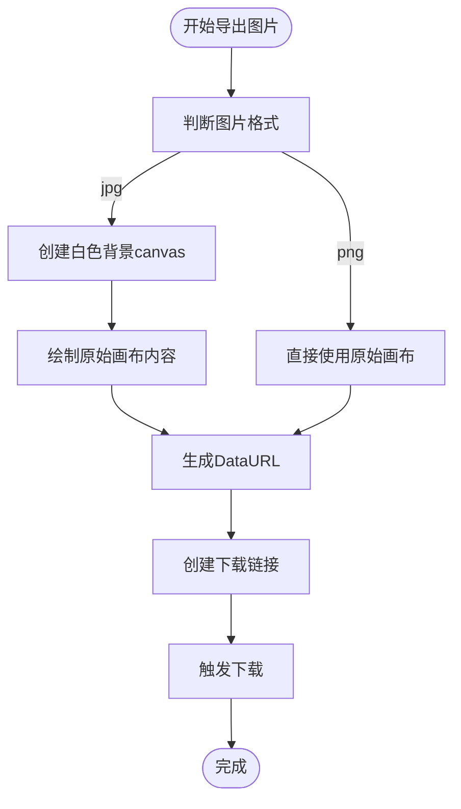
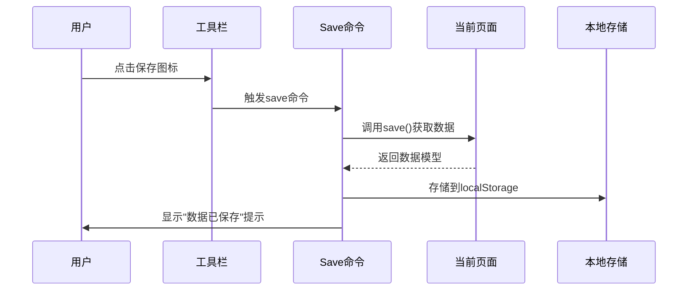

# 数据持久化

<cite>
**本文档引用的文件**
- [index.vue](file://src/views/index.vue)
- [mixin.js](file://src/views/mixin.js)
- [g6-editor.md](file://doc/v1/g6-editor.md)
</cite>

## 目录
1. [简介](#简介)
2. [本地存储机制](#本地存储机制)
3. [文件导入导出功能](#文件导入导出功能)
4. [图片下载功能](#图片下载功能)
5. [命令注册与执行流程](#命令注册与执行流程)
6. [异常处理与边界情况](#异常处理与边界情况)

## 简介
本文档深入分析vue-g6-editor的数据持久化机制，涵盖本地存储、文件导入导出和图片下载三大核心功能。系统阐述了数据保存、恢复和共享的完整工作流程，重点解析了自定义save命令的注册过程、JSON文件的序列化与反序列化机制，以及不同格式图片导出的技术实现细节。

## 本地存储机制

### save命令的自定义注册
系统通过G6Editor.Command.registerCommand方法注册了名为"save"的自定义命令，该命令具有特殊的队列管理配置。通过设置queue: false，确保保存操作不会进入命令队列，从而避免了不必要的撤销/重做记录，保证了数据持久化的原子性和独立性。

**Section sources**
- [index.vue](file://src/views/index.vue#L274-L324)

### 数据保存流程
当执行save命令时，系统首先调用editor.getCurrentPage().save()方法获取当前画布的完整数据模型，该模型包含所有节点和边的配置信息。获取到的数据被序列化为JSON字符串后，通过localStorage.setItem("flowData", JSON.stringify(needSaveData))存入浏览器的本地存储中，实现了数据的持久化保存。

**Section sources**
- [index.vue](file://src/views/index.vue#L274-L324)

## 文件导入导出功能

### JSON文件导出（saveAsFile）
系统实现了将画布数据导出为JSON文件的功能。通过调用this.editor.getCurrentPage().save()获取数据模型，将其序列化为JSON字符串后，使用new Blob([jsonString])创建Blob对象。随后通过URL.createObjectURL(blob)生成临时URL，并创建隐藏的下载链接元素，触发浏览器的文件下载机制，最终实现数据.json文件的另存为功能。

**Section sources**
- [index.vue](file://src/views/index.vue#L464-L478)

### 文件上传与数据恢复（readUploadData）
系统提供了从JSON文件导入数据的功能。通过动态创建文件输入元素并触发点击事件，用户可以选择.json格式的文件。系统使用FileReader读取文件内容，在onload回调中将文本内容解析为JSON对象，然后调用this.editor.getCurrentPage().read(text)方法将数据模型重新加载到画布中，完成画布状态的完全还原。

**Section sources**
- [index.vue](file://src/views/index.vue#L479-L498)

## 图片下载功能

### 图片格式处理策略
系统支持将画布导出为不同格式的图片，针对不同格式采用了差异化的处理策略。对于jpg格式，由于其不支持透明背景，系统创建一个新的canvas元素，先填充白色背景，再将原始画布内容绘制到新canvas上；对于png格式，直接使用原始画布内容，保留了透明背景特性。

**Diagram sources**
- [index.vue](file://src/views/index.vue#L434-L466)

**Section sources**
- [index.vue](file://src/views/index.vue#L434-L466)

### DataURL生成机制
系统通过调用this.editor.getCurrentPage().saveImage()获取画布对应的canvas元素，然后调用canvas.toDataURL()方法生成Base64编码的DataURL。该URL被设置为下载链接的href属性，通过动态创建和触发点击下载链接元素的方式，实现图片的自动下载保存。

## 命令注册与执行流程

### save命令配置分析
save命令的完整配置包括：queue属性设置为false以避免进入命令队列；enable方法始终返回true确保命令可用；execute方法包含完整的数据获取和存储逻辑；back方法作为反向命令占位；shortcutCodes配置了"Ctrl+S"和"Command+S"两种快捷键组合，适配不同操作系统的用户习惯。

**Diagram sources**
- [index.vue](file://src/views/index.vue#L274-L324)

**Section sources**
- [index.vue](file://src/views/index.vue#L274-L324)

## 异常处理与边界情况

### 历史数据读取异常处理
系统在读取历史数据时实现了完善的异常处理机制。通过readHistoryData方法从localStorage获取"flowData"键值，首先进行空值判断，当数据为空字符串、空对象或null时，显示"无历史数据"的警告提示并终止后续操作。只有在数据有效的情况下，才会进行JSON解析并调用read()方法恢复画布状态。

**Section sources**
- [index.vue](file://src/views/index.vue#L464-L478)

### 边界情况处理
系统考虑了多种边界情况：文件导入时限制accept=".json"确保文件类型正确；图片下载时根据格式动态调整文件名后缀；localStorage存储前进行JSON序列化确保数据完整性；命令执行后提供用户反馈提示增强用户体验。这些处理确保了数据持久化功能在各种使用场景下的稳定性和可靠性。

**Section sources**
- [index.vue](file://src/views/index.vue#L434-L513)
- [index.vue](file://src/views/index.vue#L464-L478)