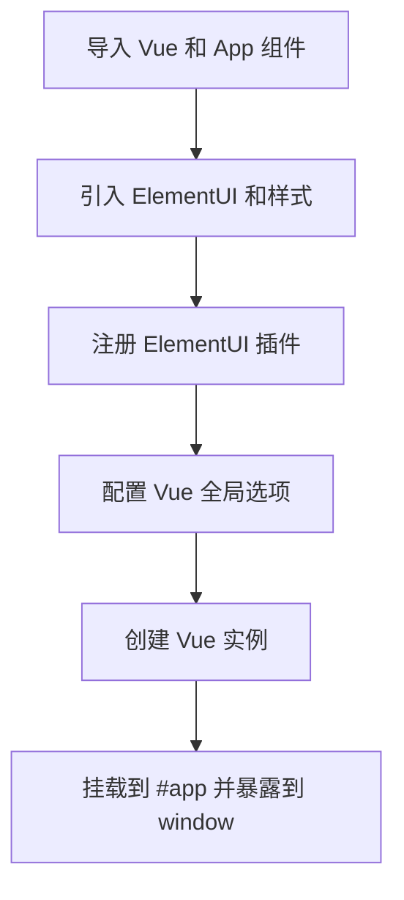

# 快速开始

<cite>
**本文档中引用的文件**  
- [README.md](file://README.md)
- [package.json](file://package.json)
- [src/main.js](file://src/main.js)
- [src/App.vue](file://src/App.vue)
- [public/index.html](file://public/index.html)
- [src/views/index.vue](file://src/views/index.vue)
- [vue.config.js](file://vue.config.js)
</cite>

## 目录
1. [简介](#简介)
2. [项目克隆与环境准备](#项目克隆与环境准备)
3. [依赖安装与运行](#依赖安装与运行)
4. [核心文件解析](#核心文件解析)
5. [最小化集成示例](#最小化集成示例)
6. [常见问题排查](#常见问题排查)
7. [总结](#总结)

## 简介
本指南旨在帮助新手开发者快速上手 `vue-g6-editor` 项目。通过从零开始的步骤说明，您将学会如何克隆项目、安装依赖、启动开发服务器以及构建生产版本。同时，我们将深入解析项目的核心结构，包括 Vue 实例初始化、根组件渲染机制和页面入口文件的作用，确保您在10分钟内完成环境搭建并成功运行图编辑器。

## 项目克隆与环境准备
首先，确保您的开发环境中已安装 Git 和 Node.js（建议版本 10.x 及以上）。然后执行以下命令克隆项目仓库：

```bash
git clone https://github.com/blueju/vue-g6-editor.git
cd vue-g6-editor
```

该项目基于 Vue CLI 构建，使用了 Element UI 组件库和 AntV G6Editor 图编辑框架，适用于流程图、拓扑图等可视化编辑场景。

**Section sources**  
- [README.md](file://README.md#L0-L41)

## 依赖安装与运行
### 安装依赖
在项目根目录下运行以下命令安装所有依赖包：

```bash
npm install
```

该命令会根据 `package.json` 文件自动下载项目所需的所有依赖，包括：
- `@antv/g6-editor`: 核心图编辑引擎
- `element-ui`: UI 组件库
- `vue`: 前端框架
- 其他辅助工具和插件

### 启动开发服务器
安装完成后，使用以下命令启动本地开发服务器：

```bash
npm run dev
```

此命令对应 `package.json` 中的 `"dev": "vue-cli-service serve"` 脚本，启动后默认监听 `http://localhost:8080`。

### 构建生产版本
当需要发布时，运行以下命令生成静态资源文件：

```bash
npm run build
```

构建产物将输出至 `dist/` 目录，可直接部署到任意静态服务器。

**Section sources**  
- [package.json](file://package.json#L0-L30)
- [README.md](file://README.md#L33)

## 核心文件解析
### src/main.js：Vue 实例初始化流程
`src/main.js` 是应用的入口文件，负责创建 Vue 实例并挂载到 DOM。其核心逻辑如下：

1. 引入 Vue 框架和根组件 `App.vue`
2. 导入并注册 ElementUI 组件库及字体图标
3. 配置全局 Vue 设置（如关闭生产提示）
4. 创建 Vue 实例并挂载到 `#app` 容器

特别地，为方便调试，Vue 实例被挂载到 `window.blueju` 上。



**Diagram sources**  
- [src/main.js](file://src/main.js#L0-L18)

**Section sources**  
- [src/main.js](file://src/main.js#L0-L18)

### App.vue：根组件与编辑器引入
`App.vue` 作为 Vue 应用的根组件，其职责是引入并渲染核心编辑器组件 `VueG6Editor`。

- **模板部分**：仅包含一个 `<div id="app">` 容器，并嵌入 `<VueG6Editor />` 子组件
- **脚本部分**：通过 `import VueG6Editor from "./views/index";` 引入编辑器组件，并在 `components` 中注册

该组件结构简洁，体现了 Vue 的组件化设计理念。

**Section sources**  
- [src/App.vue](file://src/App.vue#L0-L16)

### public/index.html：页面入口结构
`public/index.html` 是单页应用的 HTML 入口文件，主要作用包括：

- 定义基本 HTML 结构和元信息
- 提供 `<div id="app"></div>` 作为 Vue 应用的挂载点
- 自动注入构建后的 JS/CSS 资源

其中 `<%= htmlWebpackPlugin.options.title %>` 为模板变量，由 Webpack 插件动态填充。

```mermaid
html
<!DOCTYPE html>
<html lang="en">
<head>
<meta charset="utf-8">
<meta http-equiv="X-UA-Compatible" content="IE=edge">
<meta name="viewport" content="width=device-width,initial-scale=1.0">
<link rel="icon" href="<%= BASE_URL %>favicon.ico">
<title><%= htmlWebpackPlugin.options.title %></title>
</head>
<body>
<noscript>需要启用 JavaScript</noscript>
<div id="app"></div>
</body>
</html>
```

**Diagram sources**  
- [public/index.html](file://public/index.html#L0-L17)

**Section sources**  
- [public/index.html](file://public/index.html#L0-L17)

## 最小化集成示例
要将 `VueG6Editor` 嵌入到其他 Vue 项目中，只需以下几步：

1. 安装必要依赖：
```bash
npm install @antv/g6-editor element-ui vue
```

2. 创建一个新组件 `MyG6Editor.vue`：
```vue
<template>
  <div id="my-editor">
    <VueG6Editor />
  </div>
</template>

<script>
import VueG6Editor from "@/path/to/vue-g6-editor/src/views/index.vue";

export default {
  components: { VueG6Editor }
};
</script>

<style>
#my-editor { height: 100vh; }
</style>
```

3. 在主应用中引入并使用该组件即可。

此方式实现了模块化复用，便于在多个项目中集成图编辑功能。

**Section sources**  
- [src/views/index.vue](file://src/views/index.vue#L0-L281)
- [src/App.vue](file://src/App.vue#L0-L16)

## 常见问题排查
### 端口占用
若启动时报错 `address already in use`，说明 8080 端口被占用。可通过以下方式解决：
- 修改 `vue.config.js` 中的 `devServer.port`
- 终止占用进程：`lsof -i :8080`（macOS/Linux）或 `netstat -ano | findstr :8080`（Windows）

### 依赖缺失
若安装失败，请尝试：
- 清除缓存：`npm cache clean --force`
- 使用国内镜像：`npm config set registry https://registry.npmmirror.com`

### 跨域限制
开发环境下如需请求外部 API，可在 `vue.config.js` 中配置代理：
```js
module.exports = {
  devServer: {
    proxy: {
      '/api': {
        target: 'http://your-api-domain.com',
        changeOrigin: true
      }
    }
  }
};
```

**Section sources**  
- [vue.config.js](file://vue.config.js#L0-L6)
- [package.json](file://package.json#L0-L30)

## 总结
通过本指南，您已掌握 `vue-g6-editor` 的完整入门流程：从项目克隆、依赖安装到本地运行。我们解析了 `main.js` 的初始化机制、`App.vue` 的组件引入方式以及 `index.html` 的页面结构作用，并提供了最小化集成方案和常见问题解决方案。现在，您可以顺利在本地运行该项目，并将其功能集成到自己的 Vue 应用中。