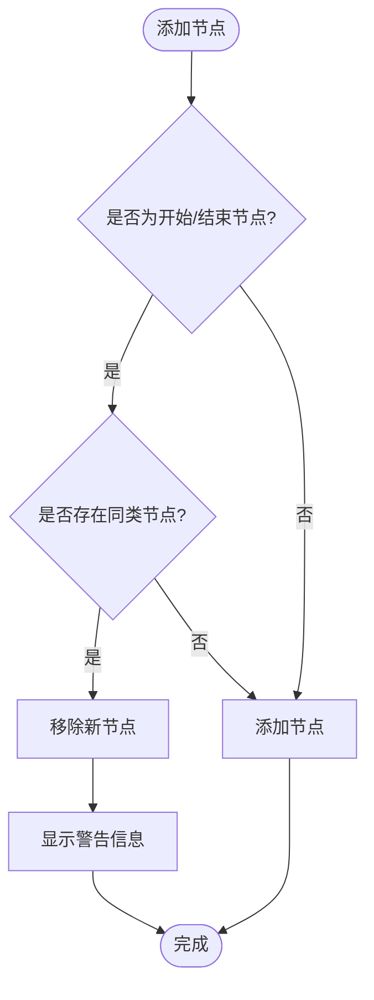

# Flow流程图

<cite>
**Referenced Files in This Document**  
- [index.vue](file://src/views/index.vue)
- [mixin.js](file://src/views/mixin.js)
- [g6-editor.md](file://doc/v1/g6-editor.md)
</cite>

## 目录
1. [画布初始化与DOM绑定](#画布初始化与dom绑定)
2. [对齐与网格配置](#对齐与网格配置)
3. [边类型全局设置](#边类型全局设置)
4. [Flow实例注册机制](#flow实例注册机制)
5. [事件监听体系](#事件监听体系)
6. [节点唯一性校验](#节点唯一性校验)
7. [画布配置参数表](#画布配置参数表)

## 画布初始化与DOM绑定

`G6Editor.Flow`组件通过`graph`配置项中的`container`属性与ID为`page`的DOM容器进行绑定，从而构建可视化画布。在`src/views/index.vue`文件中，通过`new G6Editor.Flow()`实例化流程图组件，并将其`graph.container`设置为`"page"`，实现了画布与指定DOM元素的关联。

该机制确保了图形渲染目标的明确性，使得所有节点和边的绘制都发生在`

`这个容器内。画布的初始化是整个流程图编辑器的核心，为后续的图形操作提供了基础环境。

**Section sources**
- [index.vue](file://src/views/index.vue#L274-L324)

## 对齐与网格配置

`align`和`grid`配置项显著提升了用户体验和图形布局的规范性。`align`配置启用了对齐辅助线功能，当用户拖动节点时，系统会显示对齐线帮助用户精确对齐。配置中`line.stroke`定义了对齐线颜色为`#FA8C16`，`line.lineWidth`设置线宽为1像素，`item`开启全方位对齐，`grid`启用网格对齐。

`grid`配置则定义了画布的网格系统，`cell`值为18表示网格尺寸为18×18像素。网格不仅作为视觉参考，还影响节点的移动和定位，使节点自动吸附到最近的网格点，确保图形布局的整齐有序。

**Section sources**
- [index.vue](file://src/views/index.vue#L300-L324)
- [g6-editor.md](file://doc/v1/g6-editor.md#L536-L636)

## 边类型全局设置

`flow.getGraph().edge()`方法用于全局设置默认边类型。在代码中，通过调用`flow.getGraph().edge({ shape: "flow-polyline" })`，将所有新创建的边的默认形状设置为`flow-polyline`（流程图折线）。这一设置在图形渲染中起到关键作用，确保了边的样式一致性，无需在每个边的创建时单独指定形状。

当用户从元素面板拖拽节点并创建连接时，系统会自动应用此默认设置，生成折线连接。这种全局配置方式简化了开发流程，提高了代码的可维护性。

**Section sources**
- [index.vue](file://src/views/index.vue#L370-L373)

## Flow实例注册机制

`Flow`实例如何通过`editor.add()`方法注册到主编辑器实例，参与整体组件生命周期。在`src/views/index.vue`中，首先创建`G6Editor`实例，然后创建`G6Editor.Flow`实例，最后通过`editor.add(flow)`将流程图组件注册到编辑器中。

这一注册机制使得`Flow`组件能够与其他组件（如工具栏、元素面板等）协同工作，共享编辑器的状态和命令系统。注册后的`Flow`实例成为编辑器的一部分，能够响应编辑器的全局命令，如撤销、重做、保存等，实现了组件间的无缝集成。

**Section sources**
- [index.vue](file://src/views/index.vue#L375-L385)

## 事件监听体系

`currentPage`事件监听体系中的`afterchange`和`afteritemselected`事件在`Flow`上下文中具有特定行为。`afterchange`事件在任何画布变更后触发，可用于监听节点添加、删除等操作。`afteritemselected`事件在选择对象后触发，可用于更新属性面板。

这些事件构成了`Flow`组件的响应式机制，使得UI能够根据用户操作实时更新。例如，当选择一个节点时，`afteritemselected`事件触发，系统会读取节点的属性并填充到右侧的属性栏中，实现所见即所得的编辑体验。

**Section sources**
- [index.vue](file://src/views/index.vue#L387-L402)
- [g6-editor.md](file://doc/v1/g6-editor.md#L660-L696)

## 节点唯一性校验

在节点添加时，系统实现了严格的唯一性校验逻辑，特别是对开始节点和结束节点的限制。通过监听`afterchange`事件，当检测到添加操作且新节点类型为`startNode`或`endNode`时，系统会遍历当前画布上的所有节点。

如果发现已存在相同类型的节点，则自动移除新添加的节点，并通过`this.$message.warning("只能有一个开始节点或结束节点")`向用户发出警告。这一机制确保了流程图的语义正确性，防止了逻辑错误的发生。

**Diagram sources**
- [index.vue](file://src/views/index.vue#L387-L398)

## 画布配置参数表

下表详细说明了画布初始化时的配置参数，包括`container`、`align`、`grid`、`shortcut`等选项的使用场景。

| 配置项 | 子配置项 | 类型 | 默认值 | 说明 | 使用场景 |
|--------|----------|------|--------|------|----------|
| graph | container | string | - | 指定画布容器的DOM元素ID | 必须设置为"page"以匹配HTML结构 |
| align | line.stroke | string | #FA8C16 | 对齐线颜色 | 提供视觉反馈，帮助用户对齐元素 |
| align | line.lineWidth | number | 1 | 对齐线粗细 | 控制对齐线的视觉权重 |
| align | item | boolean | true | 元素对齐开关 | 开启全方位对齐，提升布局精度 |
| align | grid | boolean | true | 网格对齐开关 | 使元素自动吸附到网格 |
| grid | cell | number | 18 | 网孔尺寸 | 定义网格的精细程度，影响布局密度 |
| shortcut | save | boolean | true | 保存命令快捷键开关 | 开启Ctrl+S快捷保存功能 |

**Section sources**
- [index.vue](file://src/views/index.vue#L274-L324)
- [g6-editor.md](file://doc/v1/g6-editor.md#L536-L636)