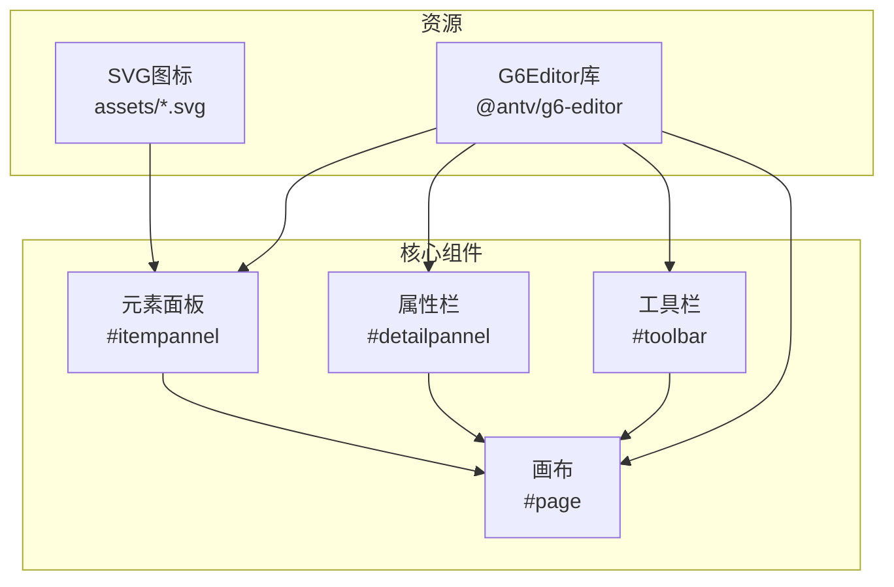
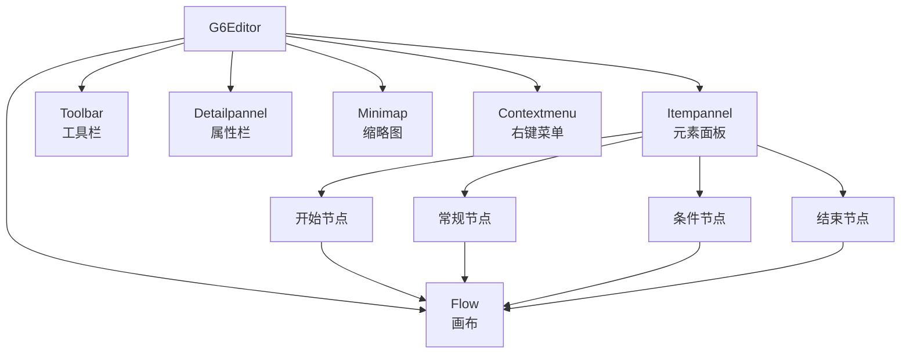
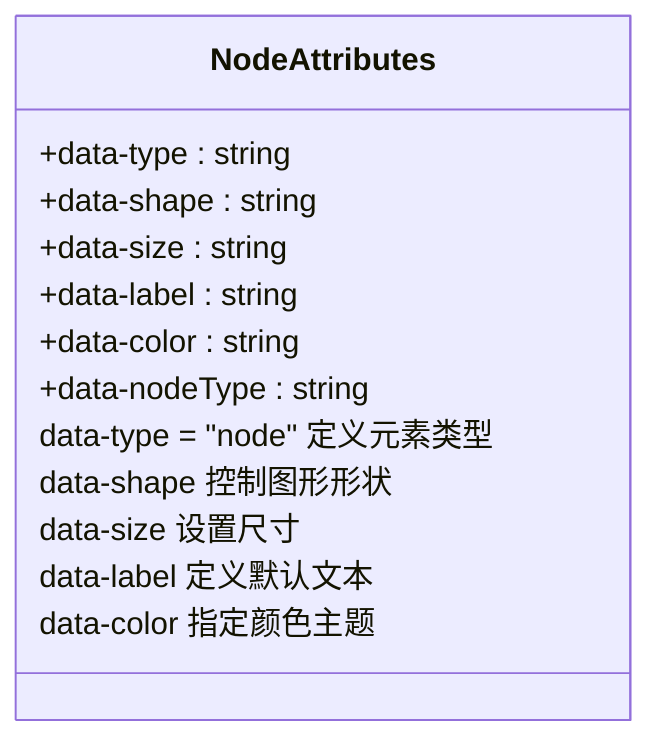
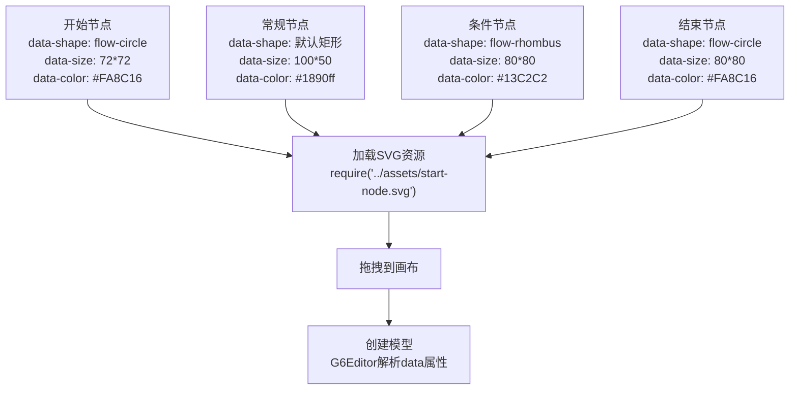
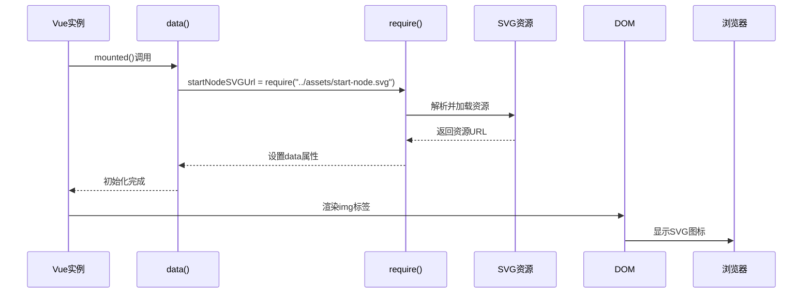
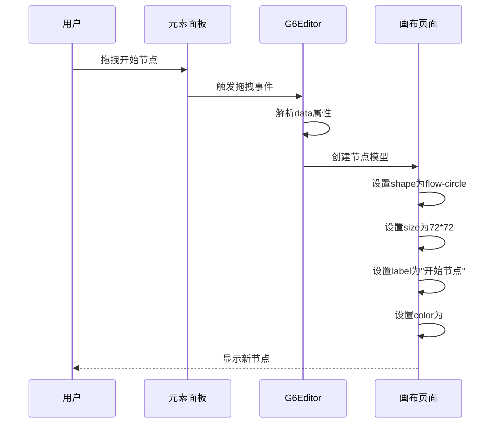
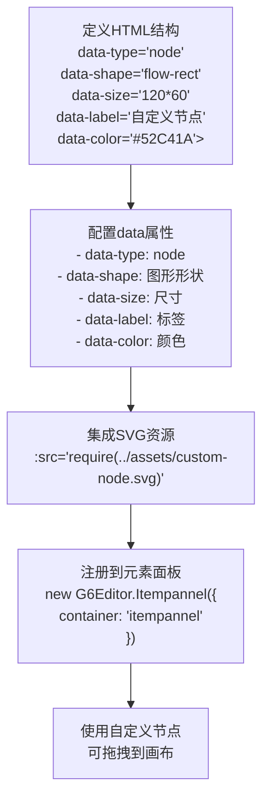

# Itempannel元素面板

<cite>
**本文档引用文件**  
- [index.vue](file://src/views/index.vue)
- [g6-editor.md](file://doc/v1/g6-editor.md)
</cite>

## 目录
1. [项目结构](#项目结构)
2. [核心组件](#核心组件)
3. [架构概述](#架构概述)
4. [详细组件分析](#详细组件分析)
5. [依赖分析](#依赖分析)
6. [性能考虑](#性能考虑)
7. [故障排除指南](#故障排除指南)
8. [结论](#结论)

## 项目结构
项目采用Vue.js框架构建，结合Element UI组件库和AntV G6Editor图形编辑器。主要目录结构包含：
- `src/views/index.vue`：主视图文件，包含元素面板、画布、属性栏等核心组件
- `src/assets/`：存放本地SVG资源文件
- `doc/v1/g6-editor.md`：G6Editor框架使用文档
- `demo/`：包含独立的ItemPanel和Toolbar演示示例



**Diagram sources**
- [index.vue](file://src/views/index.vue#L91-L150)
- [g6-editor.md](file://doc/v1/g6-editor.md#L89-L110)

**Section sources**
- [index.vue](file://src/views/index.vue#L0-L515)
- [g6-editor.md](file://doc/v1/g6-editor.md#L0-L799)

## 核心组件
`Itempannel`元素面板是图形编辑器的核心组成部分，负责提供可拖拽的节点元素。通过`new G6Editor.Itempannel({ container: 'itempannel' })`初始化，绑定到ID为`itempannel`的DOM容器。面板包含四种预设节点：开始、常规、条件、结束节点，每个节点通过data属性体系定义其图形特征。

**Section sources**
- [index.vue](file://src/views/index.vue#L233-L281)
- [g6-editor.md](file://doc/v1/g6-editor.md#L112-L163)

## 架构概述
系统采用模块化架构，G6Editor作为核心编辑器协调各个组件。元素面板、工具栏、属性栏、缩略图和右键菜单等组件通过`editor.add()`方法注册到编辑器实例中。画布组件`G6Editor.Flow`负责渲染和交互，元素面板提供可拖拽的节点模板。



**Diagram sources**
- [index.vue](file://src/views/index.vue#L320-L370)
- [index.vue](file://src/views/index.vue#L366-L402)

## 详细组件分析

### Itempannel元素面板分析
元素面板通过data属性体系定义节点特征，这些属性被G6Editor识别并转换为可拖拽的图形元素。

#### data属性体系


**Diagram sources**
- [index.vue](file://src/views/index.vue#L49-L96)
- [g6-editor.md](file://doc/v1/g6-editor.md#L165-L197)

#### 节点类型分析


**Diagram sources**
- [index.vue](file://src/views/index.vue#L23-L51)
- [index.vue](file://src/views/index.vue#L233-L281)

#### SVG资源加载机制


**Diagram sources**
- [index.vue](file://src/views/index.vue#L233-L281)
- [index.vue](file://src/views/index.vue#L49-L96)

### 交互机制分析
用户拖拽节点到画布时，G6Editor解析data属性创建对应模型。



**Diagram sources**
- [index.vue](file://src/views/index.vue#L320-L370)
- [index.vue](file://src/views/index.vue#L400-L436)

### 自定义节点示例


**Diagram sources**
- [g6-editor.md](file://doc/v1/g6-editor.md#L112-L163)
- [index.vue](file://src/views/index.vue#L23-L51)

**Section sources**
- [index.vue](file://src/views/index.vue#L23-L96)
- [g6-editor.md](file://doc/v1/g6-editor.md#L89-L197)

## 依赖分析
系统依赖于AntV G6Editor框架和Element UI组件库，通过npm包管理器进行依赖管理。

```mermaid
graph LR
A[VueG6Editor] --> B[@antv/g6-editor]
A --> C[element-ui]
A --> D[font-awesome]
B --> E[G6图形引擎]
C --> F[Element组件]
D --> G[图标字体]
style A fill:#409EFF,stroke:#333
style B fill:#67C23A,stroke:#333
style C fill:#E6A23C,stroke:#333
```

**Diagram sources**
- [package.json](file://package.json)
- [main.js](file://src/main.js#L0-L17)

## 性能考虑
元素面板的性能主要受SVG资源加载和节点渲染影响。建议使用轻量级SVG图标，避免过大文件影响加载速度。G6Editor的网格对齐功能（grid: true）和辅助对齐线可提高布局效率。

[无具体文件分析，提供通用性能建议]

## 故障排除指南
常见问题及解决方案：

1. **无法拖拽元素到画布**
   - 检查元素div是否包含`class="getItem"`
   - 确认`data-type="node"`属性存在
   - 验证img标签`draggable="false"`

2. **SVG图标不显示**
   - 检查require路径是否正确
   - 确认SVG文件存在于指定位置
   - 验证网络连接（对于远程SVG）

3. **画布ID错误**
   - 确认画布div的id为`page`
   - 检查CSS中是否设置了画布高度

**Section sources**
- [g6-editor.md](file://doc/v1/g6-editor.md#L3.2.1)
- [g6-editor.md](file://doc/v1/g6-editor.md#L2.3.3)

## 结论
Itempannel元素面板通过标准化的data属性体系和SVG资源加载机制，实现了灵活的节点模板管理。G6Editor框架自动解析data属性并创建对应的图形模型，支持用户通过拖拽方式快速构建流程图。系统架构清晰，组件职责分明，为流程图编辑提供了完整的解决方案。

[无具体文件分析，提供总结性结论]