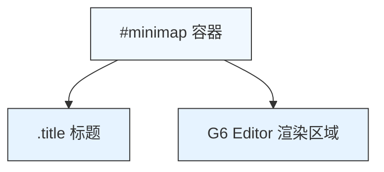
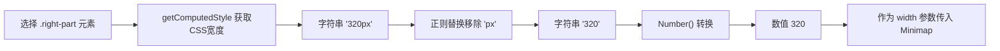

# Minimap缩略图

<cite>
**Referenced Files in This Document**  
- [index.vue](file://src/views/index.vue)
- [index.less](file://src/views/index.less)
</cite>

## 目录
1. [Minimap缩略图](#minimap缩略图)
2. [实现细节](#实现细节)
3. [容器结构与样式](#容器结构与样式)
4. [动态宽度计算逻辑](#动态宽度计算逻辑)
5. [同步机制与用户体验](#同步机制与用户体验)
6. [生命周期管理](#生命周期管理)
7. [配置建议与限制](#配置建议与限制)

## 实现细节

Minimap缩略图组件在[src/views/index.vue](file://src/views/index.vue#L360-L367)中通过`new G6Editor.Minimap()`完成初始化。该组件作为主画布的概览视图，集成于G6 Editor框架，旨在为用户提供在复杂流程图中的快速定位和导航能力。其核心功能是实时反映主画布的状态，并实现双向同步控制。

**Section sources**
- [index.vue](file://src/views/index.vue#L360-L367)

## 容器结构与样式

缩略图的容器结构在模板中明确定义，包含一个标题区域和G6 Editor的渲染区域。其HTML结构如下：
```html
<div id="minimap">
  <div class="title">缩略图</div>
</div>
```
样式由[index.less](file://src/views/index.less#L118-L132)文件定义，确保其具有统一的视觉风格。容器背景为浅色（`@backgroundColor`），顶部和左侧有边框（`1px solid #ccc`）。标题区域高度为34px，居中显示加粗的“缩略图”文字，并带有底部边框。整个`.right-part`容器（包含属性栏和缩略图）的高度为`calc(100vh - 41px - 37px)`，采用`flex-direction: column`布局，使属性栏占据剩余空间（`flex-grow: 1`），而缩略图位于其下方。



**Diagram sources**
- [index.vue](file://src/views/index.vue#L258-L260)
- [index.less](file://src/views/index.less#L118-L132)

**Section sources**
- [index.vue](file://src/views/index.vue#L258-L260)
- [index.less](file://src/views/index.less#L118-L132)

## 动态宽度计算逻辑

Minimap的宽度（`width`参数）并非静态值，而是通过动态计算得出，以确保其宽度与右侧属性栏容器的宽度完全一致。其计算逻辑在[src/views/index.vue](file://src/views/index.vue#L360-L361)中实现：

1.  使用`document.querySelector(".right-part")`获取右侧区域的DOM元素。
2.  调用`getComputedStyle()`方法获取该元素计算后的CSS样式，从中提取`width`属性值。此值为一个包含单位的字符串（如`"320px"`）。
3.  使用正则表达式`/px$/`移除字符串末尾的`"px"`单位。
4.  使用`Number()`函数将处理后的字符串转换为纯数值。

此逻辑确保了缩略图能够自适应页面布局的变化，保持与属性栏相同的宽度，从而实现视觉上的对齐和一致性。



**Diagram sources**
- [index.vue](file://src/views/index.vue#L360-L361)

**Section sources**
- [index.vue](file://src/views/index.vue#L360-L361)

## 同步机制与用户体验

Minimap缩略图的核心价值在于其与主画布的实时双向同步机制。任何在主画布上的操作，如平移（pan）和缩放（zoom），都会自动、即时地反映在缩略图上，使用户能够清晰地看到当前视口在整体流程图中的位置。反之，用户可以通过在缩略图上拖拽其视口框（viewport）来快速导航到主画布的任意区域，极大地提升了在处理大型、复杂流程图时的导航效率和用户体验。这种“鸟瞰图”功能有效解决了在大图中迷失方向的问题。

**Section sources**
- [index.vue](file://src/views/index.vue#L362-L367)

## 生命周期管理

创建的`minimap`实例通过`editor.add()`方法注册到主编辑器实例中。这一操作至关重要，它将缩略图组件纳入G6 Editor的生命周期管理。这意味着编辑器会负责管理缩略图的初始化、更新和销毁，确保其状态与主画布及其他组件（如工具栏、属性栏）保持同步，并能正确响应编辑器的全局事件。

**Section sources**
- [index.vue](file://src/views/index.vue#L370)

## 配置建议与限制

根据代码实现，Minimap的配置建议如下：
- **宽度（width）**：建议保持当前的动态计算逻辑，以实现最佳的自适应布局。若需修改，可直接在`new G6Editor.Minimap()`时传入固定数值。
- **高度（height）**：当前实现中高度被硬编码为`200`像素，这是一个明确的实现限制。若需调整高度，必须修改源码中的`height: 200`这一行。
- **位置**：缩略图位于右侧区域的底部。若需改变其位置（如置于顶部或独立窗口），需调整`.right-part`的flex布局或修改DOM结构。
- **样式**：所有样式均在[index.less](file://src/views/index.less#L118-L132)中定义，可根据设计需求进行定制，如修改背景色、边框、标题字体等。

**Section sources**
- [index.vue](file://src/views/index.vue#L364)
- [index.less](file://src/views/index.less#L118-L132)