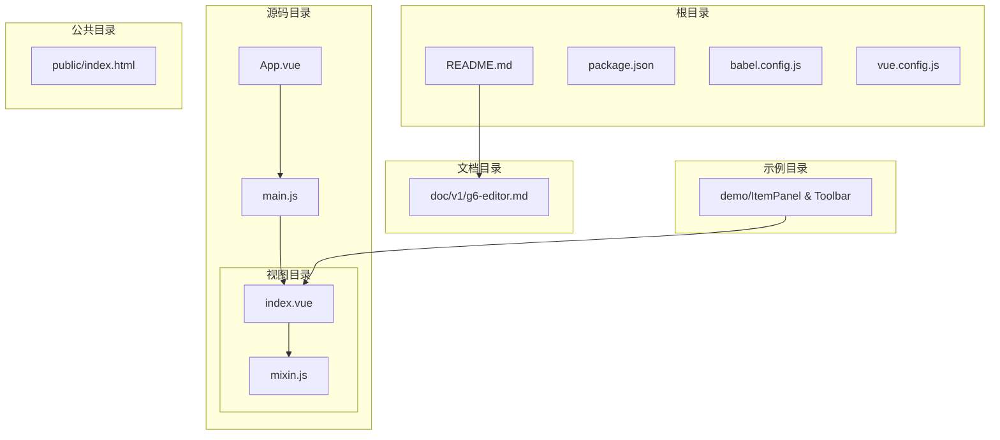
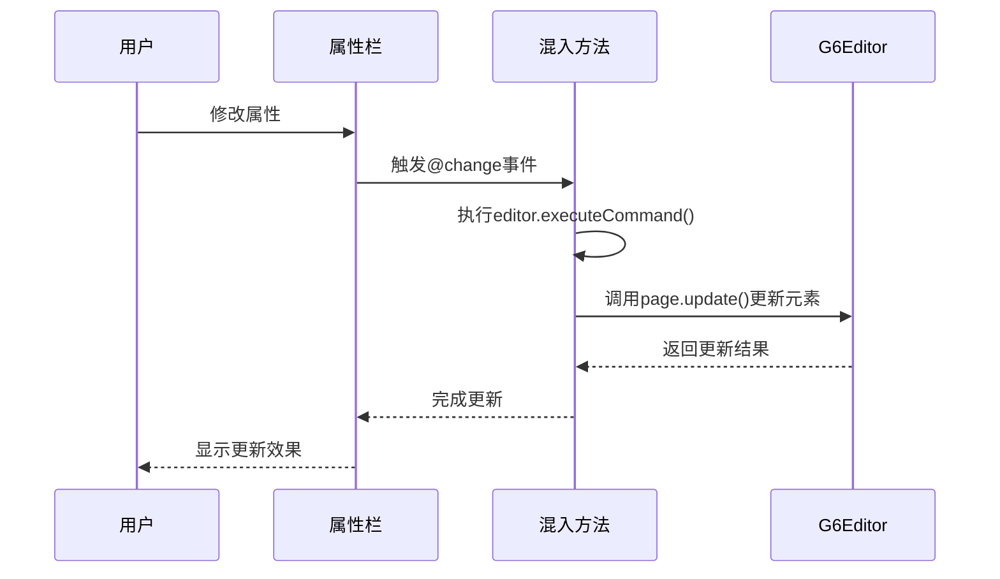
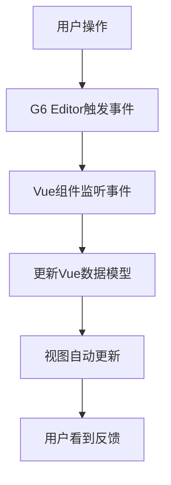
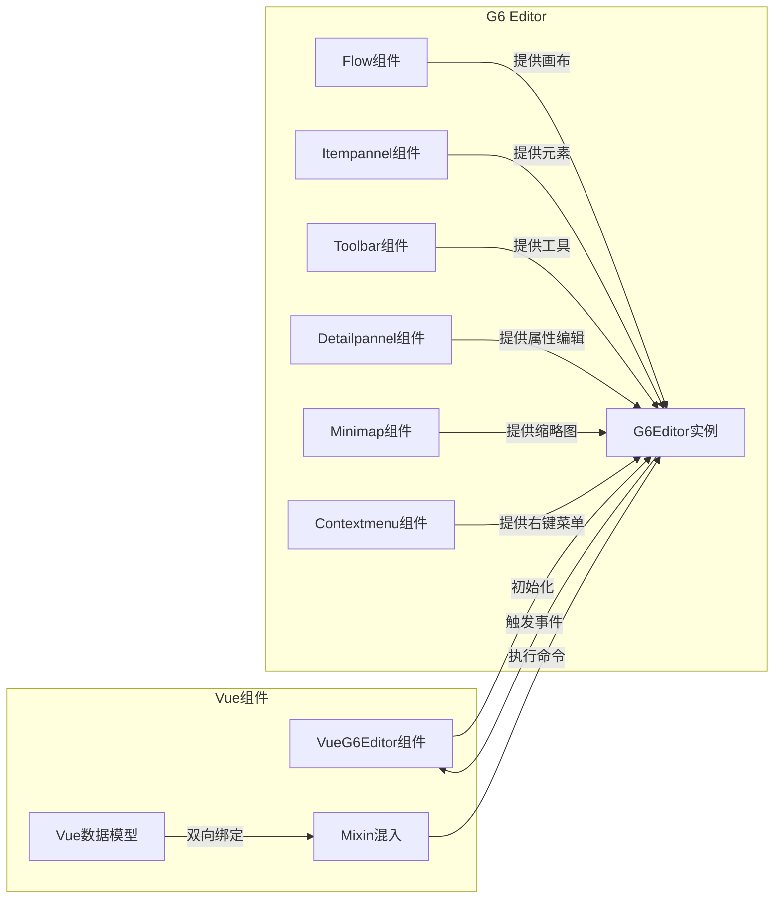

# 核心组件架构

<cite>
**本文档中引用的文件**  
- [index.vue](file://src/views/index.vue)
- [mixin.js](file://src/views/mixin.js)
- [g6-editor.md](file://doc/v1/g6-editor.md)
</cite>

## 目录
1. [项目结构](#项目结构)
2. [核心组件集成架构](#核心组件集成架构)
3. [数据响应机制与混入逻辑](#数据响应机制与混入逻辑)
4. [模板结构与命令系统关联](#模板结构与命令系统关联)
5. [事件监听体系与状态更新](#事件监听体系与状态更新)
6. [组件通信图示](#组件通信图示)
7. [生命周期钩子分析](#生命周期钩子分析)

## 项目结构

**图源**  
- [index.vue](file://src/views/index.vue)
- [main.js](file://src/main.js)
- [App.vue](file://src/App.vue)

## 核心组件集成架构

`src/views/index.vue` 作为核心编辑器组件，通过集成 G6 Editor 的六大子组件构建完整的可视化编辑界面。该组件采用 Element UI 布局系统，将界面划分为工具栏、元素面板、画布、属性栏和缩略图等区域。

组件通过 `mounted` 钩子初始化 G6 Editor 实例，并依次创建以下子组件：
- **Flow**：流程图组件，负责画布渲染与交互
- **Itempannel**：元素面板，提供可拖拽的节点元素
- **Toolbar**：工具栏，提供常用操作命令
- **Detailpannel**：属性栏，显示和编辑元素属性
- **Minimap**：缩略图，提供画布概览
- **Contextmenu**：右键菜单，提供上下文操作

这些组件通过 `editor.add()` 方法注册到主编辑器实例中，形成统一的编辑环境。

**组件源**  
- [index.vue](file://src/views/index.vue#L276-L402)

## 数据响应机制与混入逻辑

组件通过 `mixin.js` 实现属性更新的混入逻辑，建立 Vue 数据模型与 G6 Editor 节点/边属性之间的双向绑定。

混入机制的核心是 `saveNodeAttribute` 和 `saveEdgeAttribute` 方法：
- 当用户在属性栏修改节点或边的属性时，触发 `@change` 事件
- 混入方法通过 `editor.executeCommand()` 执行更新命令
- 命令内部调用 `page.update()` 方法更新 G6 Editor 中对应元素的属性
- 更新操作被记录在命令队列中，支持撤销/重做功能

这种设计确保了 Vue 状态与 G6 Editor 内部状态的实时同步，同时保持了操作的可追溯性。

**图源**  
- [mixin.js](file://src/views/mixin.js#L2-L32)
- [index.vue](file://src/views/index.vue#L150-L175)

## 模板结构与命令系统关联

模板中的 `data-command` 属性与 G6 Editor 的命令系统直接关联，实现用户操作与功能执行的映射。

关键属性机制：
- **data-command**：定义元素触发的命令名称，如 `save`、`undo`、`delete` 等
- **data-status**：控制属性栏和右键菜单的显示状态，如 `node-selected`、`edge-selected` 等

组件还注册了自定义的 `save` 命令，扩展了 G6 Editor 的功能：
- 命令不进入队列（`queue: false`），避免影响撤销/重做操作
- 执行时保存当前画布数据到 `localStorage`
- 支持快捷键 `Ctrl+S` 或 `Cmd+S`

这种设计既利用了 G6 Editor 的原生命令机制，又实现了项目特定的持久化需求。

**组件源**  
- [index.vue](file://src/views/index.vue#L0-L230)

## 事件监听体系与状态更新

组件通过监听 G6 Editor 的事件系统，实现用户操作到 UI 反馈的闭环。

核心事件监听包括：
- **afterchange**：监听任何改变发生后，用于限制开始/结束节点的数量
- **afteritemselected**：监听元素选择后，更新属性栏显示对应属性
- **afterdelete**：监听删除操作后，执行相关清理逻辑

事件处理流程：
1. G6 Editor 触发事件
2. Vue 组件监听并处理事件
3. 更新 Vue 数据模型
4. 视图自动响应数据变化

这种事件驱动的架构确保了 UI 状态与编辑器状态的高度一致性。

**组件源**  
- [index.vue](file://src/views/index.vue#L366-L402)

## 组件通信图示

**图源**  
- [index.vue](file://src/views/index.vue)
- [mixin.js](file://src/views/mixin.js)

## 生命周期钩子分析

组件的关键生命周期钩子确保了正确的初始化和资源管理。

**mounted 钩子**：
- 创建 G6Editor 实例
- 注册自定义 `save` 命令
- 初始化 Flow、Itempannel 等六大子组件
- 设置画布对齐线、网格等配置
- 绑定事件监听器

**destroyed 钩子**（虽未显式定义，但应实现）：
- 销毁 G6Editor 实例，释放内存
- 移除所有事件监听器
- 清理定时器和异步操作
- 防止内存泄漏

正确的生命周期管理对于复杂组件的性能和稳定性至关重要，特别是在频繁创建/销毁编辑器实例的场景下。

**组件源**  
- [index.vue](file://src/views/index.vue#L276-L281)