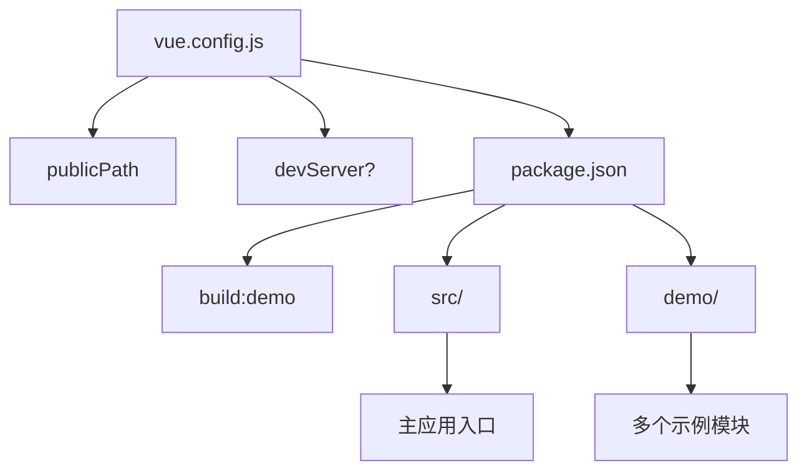

# 构建配置

<cite>
**本文档引用文件**  
- [vue.config.js](file://vue.config.js)
- [package.json](file://package.json)
- [public/index.html](file://public/index.html)
</cite>

## 目录
1. [简介](#简介)
2. [项目结构](#项目结构)
3. [核心构建配置项分析](#核心构建配置项分析)
4. [publicPath 配置详解](#publicpath-配置详解)
5. [开发服务器配置与代理设置](#开发服务器配置与代理设置)
6. [构建配置与运行时边界说明](#构建配置与运行时边界说明)
7. [常见配置问题与修复建议](#常见配置问题与修复建议)
8. [结论](#结论)

## 简介

本文档系统梳理 Vue 应用的构建配置项，重点围绕 `vue.config.js` 文件中的 `publicPath`、开发服务器代理设置等关键参数。通过分析项目实际配置，解释各配置项的作用范围与实际影响，并提供调整建议与问题排查方法，帮助开发者正确理解构建时配置与运行时行为的边界。

## 项目结构

本项目为基于 Vue CLI 的前端工程，采用模块化结构组织多个演示示例（如 ItemPanel、Toolbar），主应用位于根目录 `src/` 下。核心构建配置由根目录的 `vue.config.js` 统一管理，`package.json` 定义了构建脚本。



**Diagram sources**  
- [vue.config.js](file://vue.config.js)
- [package.json](file://package.json)

**Section sources**  
- [vue.config.js](file://vue.config.js)
- [package.json](file://package.json)

## 核心构建配置项分析

Vue CLI 项目通过 `vue.config.js` 文件进行构建配置。该文件是一个可选的配置文件，如果项目根目录存在此文件，Vue CLI 会自动加载并应用其中的配置。核心配置项包括 `publicPath`、`devServer`、`outputDir` 等，它们直接影响项目的打包输出和开发服务器行为。

**Section sources**  
- [vue.config.js](file://vue.config.js)

## publicPath 配置详解

`publicPath` 是 Vue 构建配置中最关键的选项之一，用于指定应用包中静态资源的公共基础路径。

### 作用与影响

- **资源引用前缀**：所有由 webpack 处理的静态资源（JS、CSS、图片等）在生成的 HTML 中的引用路径都会加上 `publicPath` 作为前缀。
- **部署灵活性**：当应用需要部署在非根目录的子路径下（如 `https://example.com/my-app/`）时，必须将 `publicPath` 设置为对应的子路径（如 `/my-app/`），否则浏览器将无法正确加载资源，导致 404 错误。
- **CDN 部署**：可直接设置为 CDN 地址，实现静态资源的远程托管。

### 项目中的实际配置

本项目中的 `publicPath` 采用函数形式动态返回：

```js
publicPath: (function() {
  if (process.env.NODE_ENV === "demo") {
    return "https://blueju.github.io/vue-g6-editor/dist/";
  }
})
```

此配置表明：
- 当构建模式为 `demo` 时（通过 `npm run build:demo` 触发），`publicPath` 被设置为一个完整的 CDN URL。
- 在其他模式（如 `development` 或默认 `production`）下，该函数未返回值，默认等同于 `'/'`。

### 配置示例

```js
// 部署在根目录
publicPath: '/'

// 部署在子目录 /app/
publicPath: '/app/'

// 部署在 CDN
publicPath: 'https://cdn.example.com/assets/'
```

**Section sources**  
- [vue.config.js](file://vue.config.js#L1-L7)
- [package.json](file://package.json#L6-L8)

## 开发服务器配置与代理设置

`devServer` 配置项用于定制 Vue CLI 内置的开发服务器（基于 webpack-dev-server），常用于解决开发环境下的跨域请求问题。

### 代理设置（proxy）

通过 `devServer.proxy` 可以配置一个 HTTP 代理，将前端开发服务器接收到的 API 请求转发到后端服务，从而绕过浏览器的同源策略限制。

**标准配置示例**：
```js
module.exports = {
  devServer: {
    proxy: {
      '/api': {
        target: 'http://localhost:3000',
        changeOrigin: true,
        pathRewrite: { '^/api': '' }
      }
    }
  }
}
```

### 本项目现状

在当前项目中，`vue.config.js` 文件**并未定义** `devServer` 配置项。这意味着开发服务器将使用默认设置，不包含任何代理规则。开发者若需在本地开发时连接后端 API，需要手动添加 `devServer.proxy` 配置。

**Section sources**  
- [vue.config.js](file://vue.config.js)

## 构建配置与运行时边界说明

必须明确区分**构建时配置**与**运行时配置**：

- **构建时配置**（如 `vue.config.js` 中的 `publicPath`、`devServer`）：在项目打包（`npm run build`）或启动开发服务器（`npm run dev`）时生效。它们决定了最终生成的静态文件的结构和开发服务器的行为。
- **运行时配置**：指应用在浏览器中运行时通过 JavaScript 代码动态读取或计算的配置，例如 G6 Editor 的实例化参数、画布尺寸、节点样式等。

**关键点**：`vue.config.js` 中的配置**与 G6 Editor 的运行时功能完全无关**。它仅影响 Vue 项目的打包过程和开发服务，不会改变 G6 Editor 图形渲染、交互逻辑或数据处理等任何运行时行为。混淆这两者可能导致错误的调试方向。

**Section sources**  
- [vue.config.js](file://vue.config.js)
- [src/main.js](file://src/main.js)

## 常见配置问题与修复建议

### 1. 资源加载 404 错误

- **原因**：`publicPath` 设置错误。例如，应用部署在 `/app/` 路径下，但 `publicPath` 仍为 `'/'`，导致浏览器尝试从根目录加载资源。
- **修复**：根据实际部署路径正确设置 `publicPath`。

### 2. 开发环境 API 请求跨域失败

- **原因**：未配置 `devServer.proxy`，前端请求直接发往后端服务，触发浏览器 CORS 限制。
- **修复**：在 `vue.config.js` 中添加 `devServer.proxy` 配置，将 API 请求代理到后端地址。

### 3. 热重载（Hot Reload）失效

- **原因**：可能与 `devServer` 的 `host`、`port` 或网络配置有关，或项目结构复杂导致 webpack 无法正确监听文件变化。
- **修复**：检查 `devServer` 配置，确保 `hot: true`，并确认开发服务器能正常访问。

**Section sources**  
- [vue.config.js](file://vue.config.js)
- [package.json](file://package.json)

## 结论

`vue.config.js` 是 Vue 应用构建过程的核心配置文件。正确理解和配置 `publicPath` 对于应用的正确部署至关重要，而 `devServer.proxy` 是解决开发环境跨域问题的有效手段。开发者应清晰认识到这些配置属于构建时范畴，与 G6 Editor 等库的运行时功能无直接关联。通过合理配置，可以确保应用在不同环境下的稳定构建与开发体验。