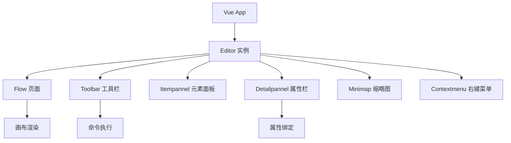
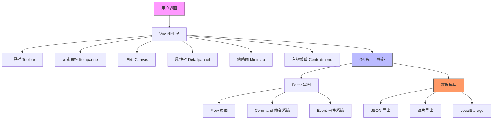

# 项目概述

<cite>
**本文档引用文件**  
- [README.md](file://README.md)
- [g6-editor.md](file://doc/v1/g6-editor.md)
- [main.js](file://src/main.js)
- [App.vue](file://src/App.vue)
- [index.vue](file://src/views/index.vue)
- [mixin.js](file://src/views/mixin.js)
- [Toolbar.vue](file://demo/Toolbar/src/components/Toolbar.vue)
- [ItemPanel.vue](file://demo/ItemPanel/src/components/ItemPanel.vue)
</cite>

## 目录

1. [项目定位与核心功能](#项目定位与核心功能)  
2. [应用场景](#应用场景)  
3. [架构风格与技术特点](#架构风格与技术特点)  
4. [项目结构解析](#项目结构解析)  
5. [关键功能优势](#关键功能优势)  
6. [学习路径与先决知识](#学习路径与先决知识)  
7. [社区支持与项目现状](#社区支持与项目现状)  
8. [架构示意图建议](#架构示意图建议)

## 项目定位与核心功能

vue-g6-editor 是一个基于 Vue.js 框架与 AntV G6 Editor 图编辑引擎构建的可视化流程图编辑器。该项目旨在为开发者提供一个可嵌入、可扩展的图形化编辑解决方案，支持通过拖拽方式构建复杂的流程图、工作流和数据模型。

根据项目文档，G6 Editor 主要支持三类图形的构建：
- **基础流程图**：用于表示线性或分支的业务流程
- **模型流程图**：适用于系统建模与架构设计
- **思维导图（脑图）**：支持知识结构化与创意发散

此外，项目实际应用中还可扩展用于网络拓扑图、BPMN 设计等场景，展现出较强的通用性。

**Section sources**  
- [README.md](file://README.md#L1-L41)  
- [g6-editor.md](file://doc/v1/g6-editor.md#L45-L79)

## 应用场景

vue-g6-editor 适用于多种需要可视化建模的业务场景，主要包括：

- **工作流引擎**：构建可配置的审批流、任务流等业务流程
- **BPMN 设计**：支持业务流程建模与分析
- **数据流建模**：可视化数据处理管道与ETL流程
- **系统架构图**：绘制微服务架构、组件依赖关系
- **网络拓扑图**：展示服务器、设备间的连接关系
- **知识图谱**：构建概念间的关联网络

这些场景均能通过其提供的节点拖拽、连线、属性编辑等功能实现高效建模。

**Section sources**  
- [g6-editor.md](file://doc/v1/g6-editor.md#L45-L79)

## 架构风格与技术特点

该项目采用典型的 MVVM 架构模式，结合 Vue 的组件化设计理念与 G6 Editor 的事件驱动机制，形成了一套高效协同的开发架构。

### 技术架构特点

- **MVVM 模式**：通过 Vue 的数据绑定机制实现视图与模型的自动同步
- **组件化设计**：将工具栏、元素面板、属性栏等拆分为独立 Vue 组件
- **事件驱动机制**：基于 G6 Editor 的事件系统实现组件间通信
- **命令模式**：通过 Command 注册机制实现可撤销/重做的操作历史

在实现上，项目通过 Vue 的 `mounted` 钩子初始化 G6 Editor 实例，并将各类组件（工具栏、元素面板、缩略图等）注册到编辑器中，形成完整的编辑环境。

**Diagram sources**  
- [index.vue](file://src/views/index.vue#L274-L370)  
- [mixin.js](file://src/views/mixin.js#L1-L32)

**Section sources**  
- [index.vue](file://src/views/index.vue#L274-L370)  
- [mixin.js](file://src/views/mixin.js#L1-L32)

## 项目结构解析

项目采用标准的 Vue CLI 项目结构，主要目录和文件作用如下：

- **src/**：核心源码目录
  - `views/index.vue`：主编辑器组件，包含完整 UI 布局
  - `views/mixin.js`：混入对象，封装节点与边的属性更新逻辑
  - `App.vue`：根组件，引入主编辑器
  - `main.js`：入口文件，初始化 Vue 实例并引入 ElementUI

- **demo/**：演示示例
  - `Toolbar/`：独立的工具栏组件示例
  - `ItemPanel/`：独立的元素面板组件示例

- **doc/**：文档目录
  - `v1/g6-editor.md`：G6 Editor 详细使用文档
  - `reference/`：图编辑框架选型参考

- **配置文件**
  - `package.json`：项目依赖与脚本定义
  - `vue.config.js`：Vue CLI 配置
  - `babel.config.js`：Babel 编译配置

这种结构清晰分离了核心功能、示例代码和文档，便于维护和扩展。

**Section sources**  
- [project_structure](file://#L1-L30)  
- [App.vue](file://src/App.vue#L1-L15)  
- [main.js](file://src/main.js#L1-L18)

## 关键功能优势

vue-g6-editor 具备多项关键优势，使其成为可视化编辑的理想选择：

- **可嵌入性**：作为 Vue 组件可轻松集成到现有系统
- **节点拖拽**：支持从元素面板拖拽节点到画布
- **属性动态绑定**：通过 Vue 数据绑定实现实时属性更新
- **数据持久化**：支持将画布数据保存到 localStorage 或导出为 JSON 文件
- **丰富的 UI 组件**：集成 ElementUI 组件库，提供美观的表单控件
- **多格式导出**：支持将流程图导出为图片（JPG/PNG）或数据文件
- **快捷键支持**：实现 Ctrl+S 保存等常用快捷操作
- **事件监听**：提供完善的事件系统，如节点选择、删除、变更等

特别值得一提的是，项目通过 `executeCommand` 方法确保操作可撤销，增强了用户体验。

**Section sources**  
- [index.vue](file://src/views/index.vue#L274-L402)  
- [mixin.js](file://src/views/mixin.js#L1-L32)

## 学习路径与先决知识

为有效使用和二次开发 vue-g6-editor，建议掌握以下先决知识：

- **Vue 基础**：理解 Vue 组件、数据绑定、生命周期等核心概念
- **ES6+ 语法**：熟悉 import/export、箭头函数、解构赋值等现代 JavaScript 特性
- **G6 Editor 概念**：了解其组件体系（Editor、Page、Toolbar 等）和事件机制
- **ElementUI 使用**：掌握常用组件如 el-form、el-input、el-color-picker 的用法
- **前端工程化**：了解 Vue CLI、Webpack 等构建工具的基本使用

学习路径建议：
1. 首先阅读 `doc/v1/g6-editor.md` 了解 G6 Editor 核心概念
2. 运行项目查看 `demo/` 中的独立组件示例
3. 分析 `src/views/index.vue` 理解主编辑器的集成方式
4. 通过浏览器开发者工具调试，观察组件间交互

**Section sources**  
- [g6-editor.md](file://doc/v1/g6-editor.md#L1-L44)  
- [index.vue](file://src/views/index.vue#L233-L281)

## 社区支持与项目现状

根据项目 README.md 文件，该项目源于公司遗留系统的实际需求，作者在实践中整理了 G6 Editor 的使用文档并结合 Vue 实现了示例。

值得注意的是，项目作者已在 README 中声明：
> "鉴于 g6-editor 已经不再更新，且公司后续新项目后端架构也改用阿里巴巴蚂蚁金服的 sofa 框架和 seata 解决方案了，因此前端这边也改用了 [gg-editor](https://github.com/alibaba/GGEditor)"

作者已转向维护 [ggeditor-chinese-doc](https://github.com/blueju/ggeditor-chinese-doc) 项目，但仍然开放 issue 接受关于 vue-g6-editor 的问题咨询。

尽管项目可能不再频繁更新，但其代码结构清晰、文档详实，仍具有较高的学习和参考价值。

**Section sources**  
- [README.md](file://README.md#L1-L20)

## 架构示意图建议

为帮助开发者快速建立整体认知，建议创建以下架构示意图：

该示意图清晰展示了从用户界面到核心引擎再到数据持久化的完整架构，有助于理解各组件间的协作关系。

**Diagram sources**  
- [index.vue](file://src/views/index.vue#L274-L370)  
- [g6-editor.md](file://doc/v1/g6-editor.md#L447-L489)