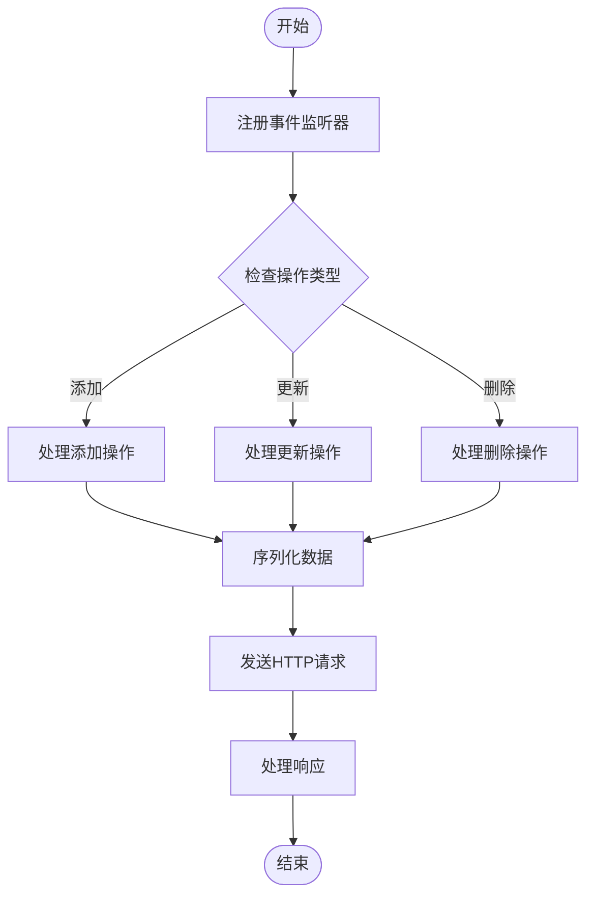
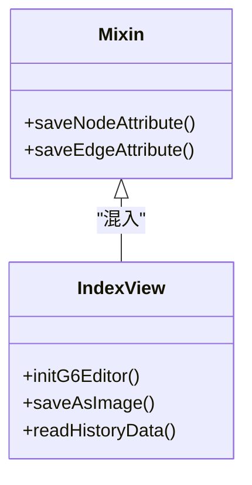
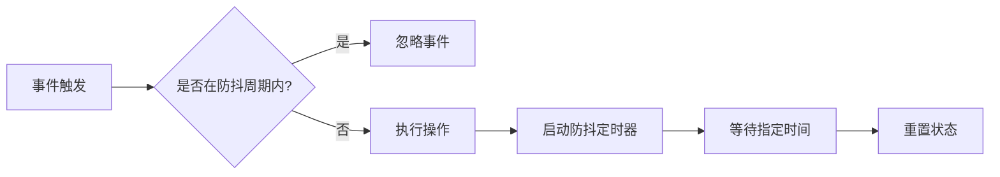
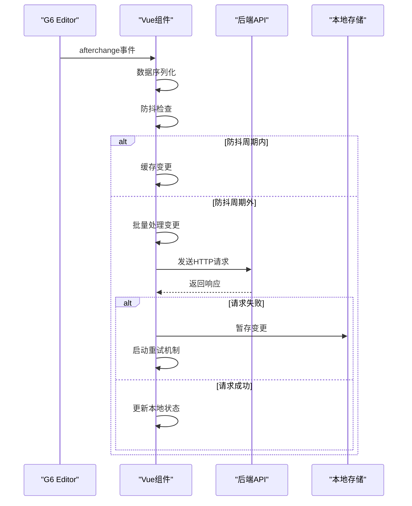

# 后端数据同步

<cite>
**本文档引用的文件**
- [index.vue](file://src/views/index.vue)
- [mixin.js](file://src/views/mixin.js)
- [g6-editor.md](file://doc/v1/g6-editor.md)
</cite>

## 目录
1. [简介](#简介)
2. [事件监听机制](#事件监听机制)
3. [HTTP请求封装](#http请求封装)
4. [mixin扩展方法](#mixin扩展方法)
5. [生产级优化策略](#生产级优化策略)
6. [RESTful接口设计](#restful接口设计)
7. [跨域与认证配置](#跨域与认证配置)
8. [完整代码示例](#完整代码示例)

## 简介
本文档详细说明如何将vue-g6-editor与后端服务进行实时数据同步。基于G6 Editor提供的事件系统，通过监听节点和边的增删改操作，实现与后端API的自动同步。文档涵盖从事件监听、HTTP请求封装到生产级优化的完整解决方案。

## 事件监听机制

vue-g6-editor通过G6Editor的事件系统监听画布变化。在`src/views/index.vue`中，通过currentPage的on方法注册事件监听器，捕获用户对节点和边的操作。

G6 Editor提供了丰富的事件类型，其中与数据同步相关的核心事件包括：
- `afterchange`: 任何改变发生后触发
- `afterdelete`: 元素删除后触发
- `afteritemselected`: 元素被选中后触发



**Diagram sources**
- [index.vue](file://src/views/index.vue#L274-L324)

**Section sources**
- [index.vue](file://src/views/index.vue#L274-L324)
- [g6-editor.md](file://doc/v1/g6-editor.md#L660-L696)

## HTTP请求封装

为实现与后端的数据同步，需要封装HTTP请求逻辑。建议使用Axios作为HTTP客户端，创建统一的API服务层来处理所有与后端的通信。

HTTP请求应包含适当的错误处理机制，包括：
- 网络连接错误处理
- 超时处理
- 状态码处理（4xx、5xx）
- 重试机制

请求应遵循RESTful原则，使用标准的HTTP方法对应CRUD操作：
- POST: 创建节点/边
- PUT/PATCH: 更新节点/边
- DELETE: 删除节点/边

## mixin扩展方法

通过`mixin.js`文件扩展Vue组件的方法，实现数据序列化和错误响应的统一处理。mixin提供了一种优雅的方式来复用组件逻辑。

在`src/views/mixin.js`中定义的方法可以被多个组件共享，确保数据处理逻辑的一致性。主要扩展方法包括：
- `saveNodeAttribute`: 保存节点属性变更
- `saveEdgeAttribute`: 保存边属性变更

这些方法通过`this.editor.executeCommand`执行G6 Editor命令，确保操作的可撤销性。



**Diagram sources**
- [mixin.js](file://src/views/mixin.js#L0-L31)
- [index.vue](file://src/views/index.vue#L274-L324)

**Section sources**
- [mixin.js](file://src/views/mixin.js#L0-L31)

## 生产级优化策略

为确保数据同步的性能和可靠性，需要实施以下生产级优化策略：

### 请求防抖
对频繁触发的事件（如节点移动、属性编辑）实施防抖策略，避免短时间内发送大量请求。



### 批量提交
将多个小的变更操作合并为批量请求，减少网络开销。当检测到连续的变更操作时，暂存变更数据，达到一定数量或时间间隔后一次性提交。

### 请求重试机制
实现智能重试机制，对失败的请求进行重试。重试策略应包括：
- 指数退避算法
- 最大重试次数限制
- 网络状态检测

### 离线支持
在无法连接后端时，将变更数据暂存于本地存储（如localStorage），待网络恢复后自动同步。

## RESTful接口设计

设计合理的RESTful API是实现高效数据同步的关键。建议的接口设计如下：

### 接口版本控制
在URL路径中包含版本号，便于API的演进和兼容：
```
/api/v1/diagrams/{diagramId}/nodes
/api/v1/diagrams/{diagramId}/edges
```

### 状态码处理
遵循HTTP状态码标准：
- 200 OK: 请求成功
- 201 Created: 资源创建成功
- 400 Bad Request: 请求参数错误
- 401 Unauthorized: 认证失败
- 403 Forbidden: 权限不足
- 404 Not Found: 资源不存在
- 500 Internal Server Error: 服务器内部错误

### 请求/响应格式
统一使用JSON格式，请求体和响应体结构清晰：
```json
{
  "data": {
    "id": "node-1",
    "type": "node",
    "attributes": {
      "label": "开始节点",
      "position": { "x": 100, "y": 200 },
      "size": "72*72",
      "color": "#FA8C16"
    }
  }
}
```

## 跨域与认证配置

### CORS配置
在开发环境中，需要正确配置跨域资源共享（CORS），允许前端应用访问后端API。

Vue CLI项目中，可在`vue.config.js`中配置代理：
```javascript
module.exports = {
  devServer: {
    proxy: {
      '/api': {
        target: 'http://localhost:3000',
        changeOrigin: true
      }
    }
  }
}
```

### 认证头注入
使用拦截器统一注入认证信息，如JWT令牌：
```javascript
axios.interceptors.request.use(config => {
  const token = localStorage.getItem('authToken');
  if (token) {
    config.headers.Authorization = `Bearer ${token}`;
  }
  return config;
});
```

这确保了所有请求都携带必要的认证信息，无需在每个请求中手动添加。

## 完整代码示例

以下为完整的数据同步实现示例，整合了上述所有最佳实践：



**Diagram sources**
- [index.vue](file://src/views/index.vue#L274-L324)
- [mixin.js](file://src/views/mixin.js#L0-L31)

**Section sources**
- [index.vue](file://src/views/index.vue#L274-L324)
- [mixin.js](file://src/views/mixin.js#L0-L31)
- [g6-editor.md](file://doc/v1/g6-editor.md#L660-L696)