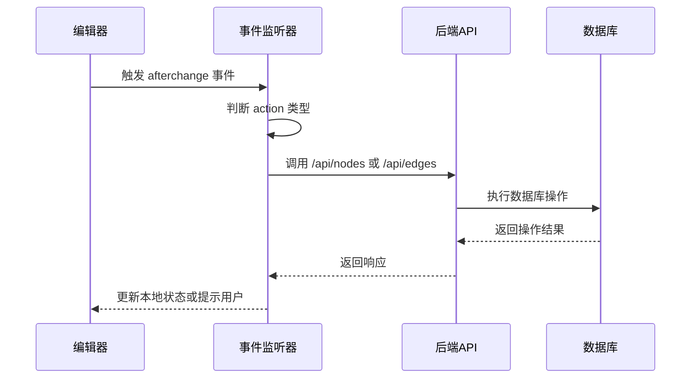
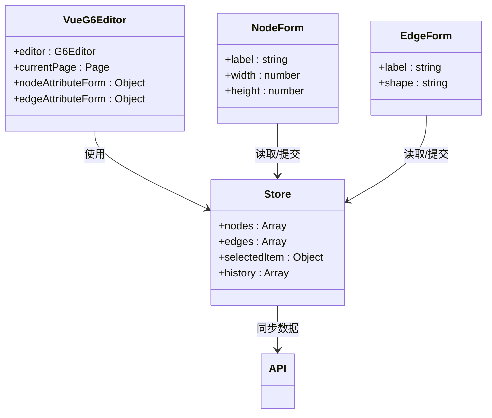

# 外部系统集成

<cite>
**本文档中引用的文件**  
- [mixin.js](file://src/views/mixin.js)
- [index.vue](file://src/views/index.vue)
- [main.js](file://src/main.js)
- [g6-editor.md](file://doc/v1/g6-editor.md)
</cite>

## 目录

1. [引言](#引言)  
2. [事件监听与数据同步](#事件监听与数据同步)  
3. [全局状态管理集成](#全局状态管理集成)  
4. [外部系统桥接机制](#外部系统桥接机制)  
5. [实时协作编辑架构](#实时协作编辑架构)  
6. [生产级集成考量](#生产级集成考量)  
7. [安全最佳实践](#安全最佳实践)  
8. [总结](#总结)

## 引言

`vue-g6-editor` 是一个基于 Vue 和 AntV G6 Editor 的可视化流程图编辑器，支持流程图、思维导图等图结构的构建与编辑。在实际生产环境中，该编辑器通常需要与后端服务、状态管理库（如 Vuex、Pinia）、第三方工具等外部系统进行深度集成，以实现数据持久化、状态同步、实时协作等高级功能。

本文档旨在为开发者提供一套完整的外部系统集成方案，涵盖事件驱动的数据同步、全局状态管理、mixin 桥接机制、WebSocket 实时协作设计，并结合生产环境中的跨域、认证、错误重试、离线缓存等关键问题，提供可落地的代码实践与安全建议。

**Section sources**  
- [g6-editor.md](file://doc/v1/g6-editor.md#L0-L44)

## 事件监听与数据同步

G6 Editor 提供了丰富的事件系统，允许开发者在图结构发生变化时执行自定义逻辑。通过监听 `afterchange`、`afteradditem`、`afterupdateitem` 等事件，可实现与后端服务的实时数据同步。

在 `index.vue` 中，已通过 `currentPage.on("afterchange", ...)` 监听画布变更事件。该事件在任何节点或边的增删改操作后触发，`e.action` 可判断操作类型（如 `"add"`、`"update"`、`"delete"`），`e.model` 包含变更元素的数据模型。



**Diagram sources**  
- [index.vue](file://src/views/index.vue#L366-L402)

**Section sources**  
- [g6-editor.md](file://doc/v1/g6-editor.md#L644-L696)  
- [index.vue](file://src/views/index.vue#L366-L402)

## 全局状态管理集成

为实现编辑器内外状态的一致性，推荐使用 Vuex 或 Pinia 进行全局状态管理。通过将 G6 Editor 的数据模型（nodes、edges）映射到 Vuex store 中，可实现组件间共享、持久化、撤销重做等高级功能。

在 `index.vue` 的 `data()` 中定义了 `nodeAttributeForm`、`edgeAttributeForm` 等表单数据，这些数据可迁移至 Vuex store，由编辑器和外部表单组件共同访问。通过 `dispatch` 提交 mutation，确保所有状态变更均通过统一入口，便于调试与追踪。



**Diagram sources**  
- [index.vue](file://src/views/index.vue#L233-L281)

**Section sources**  
- [index.vue](file://src/views/index.vue#L233-L281)

## 外部系统桥接机制

`mixin.js` 提供了 `saveNodeAttribute` 和 `saveEdgeAttribute` 方法，用于将表单数据同步到 G6 Editor 的节点或边上。该机制可作为桥接外部系统（如配置中心、表单系统）的通用模式。

通过在 `mixin` 中封装通用操作逻辑，可在多个组件中复用。例如，外部配置中心可通过 `$emit` 或 Vuex 修改 `nodeAttributeForm`，调用 `saveNodeAttribute()` 即可更新画布元素，实现配置驱动的图形更新。

```mermaid
flowchart TD
A[外部配置中心] --> B[更新 nodeAttributeForm]
B --> C{调用 saveNodeAttribute()}
C --> D[执行 editor.executeCommand()]
D --> E[获取当前页 currentPage]
E --> F[获取选中元素 selectedItem]
F --> G[调用 page.update()]
G --> H[画布元素更新]
```

**Diagram sources**  
- [mixin.js](file://src/views/mixin.js#L1-L32)

**Section sources**  
- [mixin.js](file://src/views/mixin.js#L1-L32)

## 实时协作编辑架构

为实现多用户实时协作编辑，可基于 WebSocket 构建实时通信层。每个客户端连接到 WebSocket 服务器，当本地发生 `afterchange` 事件时，将变更数据（操作类型、元素ID、属性）广播给其他客户端，其他客户端解析并应用变更，保持画布同步。

服务器端需维护会话状态、冲突检测（如 OT 算法或 CRDT）、操作队列等。前端通过 `WebSocket.onmessage` 监听远程变更，并调用 `page.update()` 或 `page.add()` 应用更新。

```mermaid
graph TB
subgraph Client A
A1[VueG6Editor]
A2[WebSocket]
end
subgraph Client B
B1[VueG6Editor]
B2[WebSocket]
end
subgraph Server
S1[WebSocket Server]
S2[Conflict Resolution]
S3[Operation Queue]
end
A1 --> A2: afterchange -> send op
A2 --> S1: 发送操作
S1 --> S2: 检测冲突
S2 --> S3: 排队处理
S3 --> B2: 广播操作
B2 --> B1: 应用变更
```

**Diagram sources**  
- [index.vue](file://src/views/index.vue#L366-L402)

## 生产级集成考量

### 跨域通信与认证授权

前端与后端 API 通信需配置 CORS 策略，允许指定域名访问。所有 API 请求应携带认证令牌（如 JWT），在请求头 `Authorization: Bearer <token>` 中传递。G6 Editor 的 `save` 命令可扩展为异步 API 调用，失败时提示用户并支持重试。

### 错误重试机制

网络请求失败时，应实现指数退避重试策略。可使用 `axios-retry` 或自定义逻辑，在 `afterchange` 事件中捕获错误并重试，最多尝试 3-5 次，避免数据丢失。

### 离线缓存策略

利用 `localStorage` 或 `IndexedDB` 缓存画布数据。在 `index.vue` 中已有 `localStorage.setItem("flowData", ...)` 实现本地保存。可扩展为自动定时保存，并在页面加载时优先读取本地缓存，再尝试同步到服务器。

**Section sources**  
- [index.vue](file://src/views/index.vue#L464-L513)

## 安全最佳实践

1. **输入验证**：后端必须验证所有来自 G6 Editor 的节点和边数据，防止 XSS 或非法结构。
2. **权限控制**：根据用户角色限制编辑权限（如只读、可编辑）。
3. **API 限流**：防止频繁的 `afterchange` 触发导致 DDoS。
4. **敏感信息过滤**：避免在日志或前端暴露数据库结构。
5. **WebSocket 安全**：使用 `wss://` 加密连接，验证连接身份。

**Section sources**  
- [index.vue](file://src/views/index.vue#L274-L324)

## 总结

通过合理利用 G6 Editor 的事件系统、结合 Vuex/Pinia 状态管理、扩展 `mixin` 桥接外部系统，并设计基于 WebSocket 的实时协作架构，可实现 `vue-g6-editor` 与各类外部系统的深度集成。生产环境中需重点关注跨域、认证、错误处理与数据一致性，确保系统的稳定性与安全性。