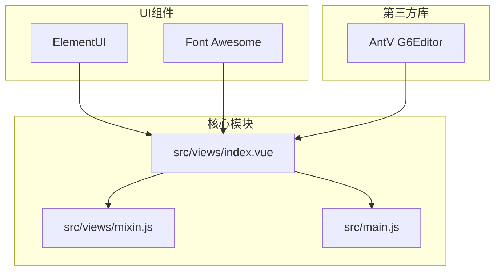
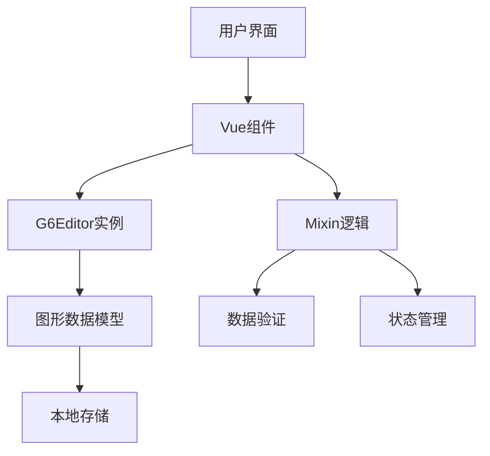
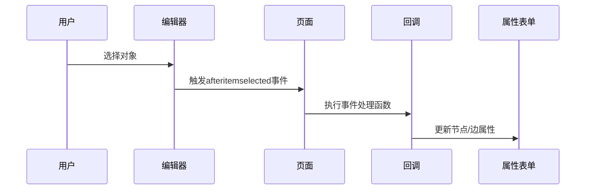
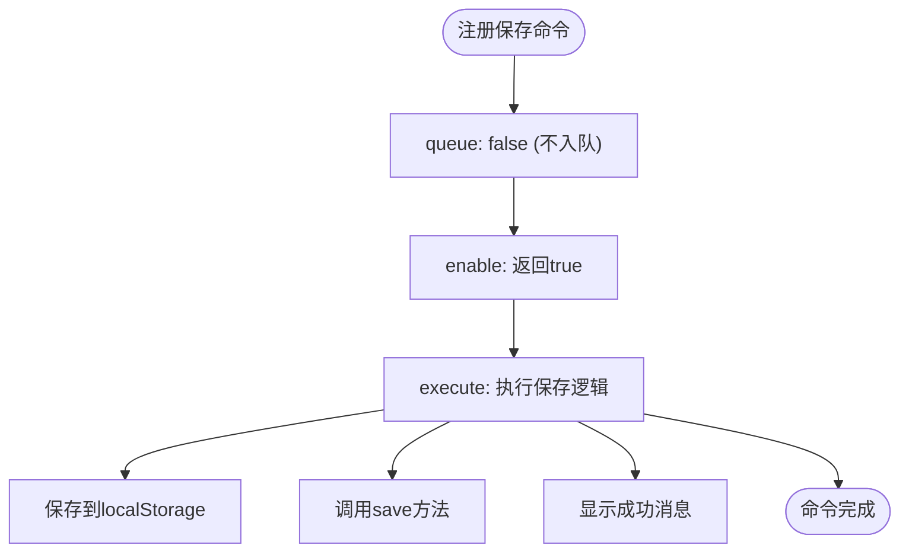
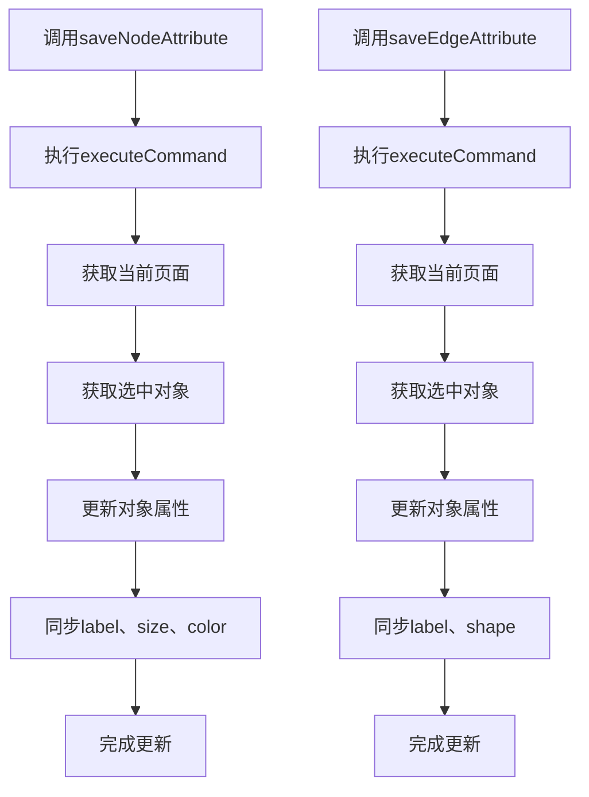
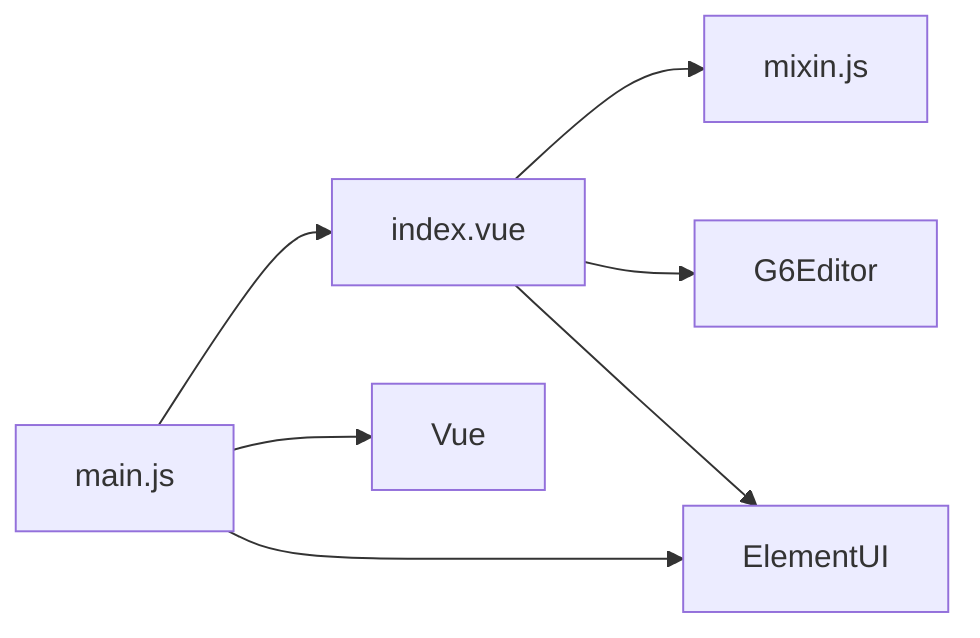

# 安全通信与生产集成

<cite>
**本文档引用文件**  
- [index.vue](file://src/views/index.vue)
- [mixin.js](file://src/views/mixin.js)
- [main.js](file://src/main.js)
</cite>

## 目录
1. [引言](#引言)
2. [项目结构](#项目结构)
3. [核心组件](#核心组件)
4. [架构概述](#架构概述)
5. [详细组件分析](#详细组件分析)
6. [依赖分析](#依赖分析)
7. [性能考量](#性能考量)
8. [故障排查指南](#故障排查指南)
9. [结论](#结论)

## 引言
本文档旨在阐述在生产环境中集成vue-g6-editor时的安全通信最佳实践。涵盖HTTPS强制启用、API请求的JWT令牌认证、敏感操作的权限校验（如通过data-status控制可编辑性）。说明如何在src/views/index.vue中拦截关键事件并插入鉴权逻辑，在mixin.js中实现数据脱敏与输入验证。介绍CSRF防护、XSS过滤（尤其针对节点label内容）、请求签名等安全机制。同时提供离线缓存策略（localStorage加密存储）、错误日志上报、性能监控埋点等运维支持方案。

## 项目结构
本项目采用典型的Vue.js单页应用结构，核心编辑器功能集中在`src/views/index.vue`中，通过mixin机制复用逻辑。项目包含多个演示模块（ItemPanel、Toolbar），主应用入口为`src/main.js`，使用ElementUI作为UI框架，并集成AntV G6Editor实现图形化编辑能力。

**图示来源**  
- [index.vue](file://src/views/index.vue)
- [main.js](file://src/main.js)

**本节来源**  
- [index.vue](file://src/views/index.vue)
- [main.js](file://src/main.js)

## 核心组件
核心组件包括图形编辑器主界面（index.vue）、混入逻辑（mixin.js）和应用入口（main.js）。index.vue负责UI渲染与事件处理，mixin.js封装了属性保存等通用方法，main.js完成Vue实例化与全局配置。

**本节来源**  
- [index.vue](file://src/views/index.vue#L1-L515)
- [mixin.js](file://src/views/mixin.js#L1-L33)

## 架构概述
系统采用Vue.js框架构建，基于组件化设计，通过G6Editor提供图形化编辑能力。整体架构分为视图层、逻辑层和数据层，通过事件驱动机制实现交互。

**图示来源**  
- [index.vue](file://src/views/index.vue#L1-L515)
- [mixin.js](file://src/views/mixin.js#L1-L33)

## 详细组件分析
### index.vue 分析
该文件是图形编辑器的主视图组件，包含工具栏、元素面板、画布、属性栏和右键菜单等UI元素。通过监听G6Editor事件实现状态同步。

#### 事件监听机制

**图示来源**  
- [index.vue](file://src/views/index.vue#L350-L400)

#### 命令注册机制

**图示来源**  
- [index.vue](file://src/views/index.vue#L274-L300)

**本节来源**  
- [index.vue](file://src/views/index.vue#L1-L515)

### mixin.js 分析
该文件定义了可复用的方法，主要包含节点和边属性的保存逻辑。

#### 属性保存流程

**图示来源**  
- [mixin.js](file://src/views/mixin.js#L1-L33)

**本节来源**  
- [mixin.js](file://src/views/mixin.js#L1-L33)

## 依赖分析
项目依赖关系清晰，主视图组件依赖mixin提供业务逻辑，全局依赖G6Editor核心库和ElementUI组件库。

**图示来源**  
- [index.vue](file://src/views/index.vue#L233-L235)
- [main.js](file://src/main.js#L1-L17)

**本节来源**  
- [index.vue](file://src/views/index.vue)
- [main.js](file://src/main.js)

## 性能考量
- 使用`executeCommand`包装更新操作，确保操作可撤销
- 通过`localStorage`实现本地数据持久化
- 事件监听器合理绑定，避免内存泄漏
- 图片导出时创建临时canvas，避免阻塞主线程

## 故障排查指南
- **画布不显示**：检查`#page`元素是否存在且有固定高度
- **命令无效**：确认`Command.registerCommand`正确注册
- **属性不更新**：检查`data-status`属性与当前状态匹配
- **右键菜单异常**：确保`display:none`初始隐藏，由G6Editor控制显示

**本节来源**  
- [index.vue](file://src/views/index.vue)
- [doc/v1/g6-editor.md](file://doc/v1/g6-editor.md)

## 结论
vue-g6-editor提供了一套完整的图形化编辑解决方案，通过合理的架构设计和事件机制，实现了灵活的流程图编辑能力。在生产环境中集成时，应重点关注安全通信、权限控制和数据持久化等关键环节，确保系统的稳定性和安全性。