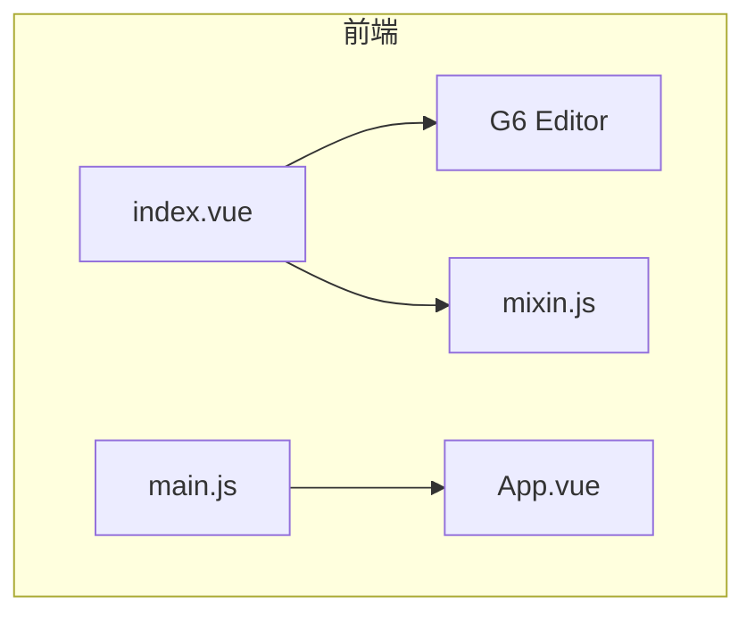
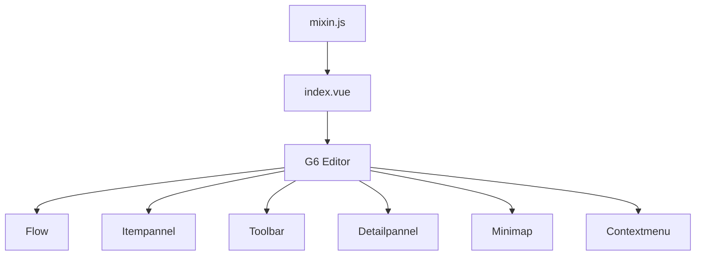
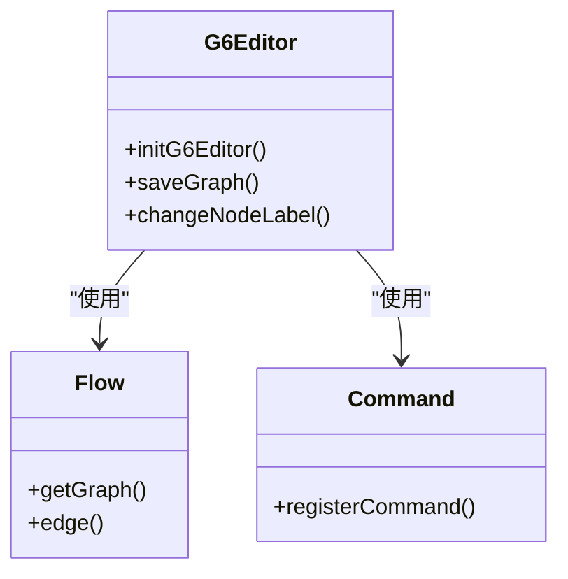
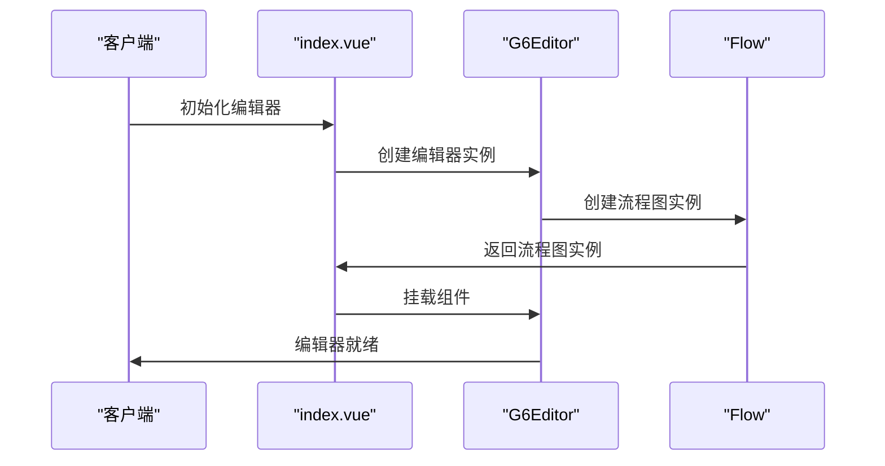
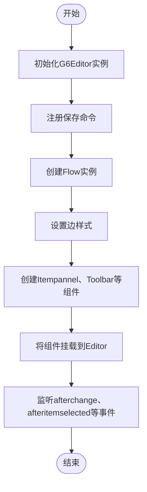
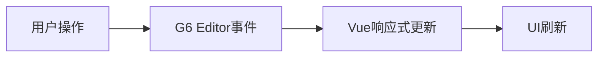

# 实时协作编辑

<cite>
**本文档中引用的文件**  
- [index.vue](file://src/views/index.vue)
- [mixin.js](file://src/views/mixin.js)
- [main.js](file://src/main.js)
</cite>

## 目录
1. [简介](#简介)
2. [项目结构](#项目结构)
3. [核心组件](#核心组件)
4. [架构概述](#架构概述)
5. [详细组件分析](#详细组件分析)
6. [依赖分析](#依赖分析)
7. [性能考虑](#性能考虑)
8. [故障排除指南](#故障排除指南)
9. [结论](#结论)
10. [附录](#附录)（如有必要）

## 简介
本文档旨在设计一个基于WebSocket的实时协作编辑架构，使多个用户能够同时操作同一流程图。通过利用`src/views/index.vue`中G6 Editor的变更事件捕获操作行为，并通过WebSocket广播增量更新（如新增节点、移动位置），实现多用户实时协同编辑。在`mixin.js`中实现操作合并与冲突检测逻辑（如OT算法或CRDT基础思路），并说明如何维护客户端光标位置、用户标识、操作时序同步等协作要素。同时提供心跳机制、断线重连、消息队列缓存等可靠性保障策略。

## 项目结构
该项目采用典型的Vue.js单页应用结构，主要功能集中在`src/views/index.vue`文件中，该文件集成了G6 Editor用于流程图编辑。`mixin.js`提供了属性更新的通用方法，而`main.js`负责Vue实例的初始化和ElementUI组件的引入。



**Diagram sources**
- [index.vue](file://src/views/index.vue#L0-L515)
- [mixin.js](file://src/views/mixin.js#L0-L32)
- [main.js](file://src/main.js#L0-L17)

**Section sources**
- [index.vue](file://src/views/index.vue#L0-L515)
- [mixin.js](file://src/views/mixin.js#L0-L32)
- [main.js](file://src/main.js#L0-L17)

## 核心组件
`index.vue`是核心编辑界面，集成了G6 Editor的多个组件，包括工具栏、元素面板、画布、属性栏、缩略图和右键菜单。通过监听`afterchange`、`afteritemselected`和`afterdelete`等事件，实现对流程图元素的动态响应和状态管理。

**Section sources**
- [index.vue](file://src/views/index.vue#L383-L418)

## 架构概述
系统架构以G6 Editor为核心，通过Vue组件进行封装和扩展。`index.vue`作为主视图，集成G6 Editor的各个功能模块，并通过事件监听机制实现用户交互的响应。`mixin.js`提供可复用的方法，用于更新节点和边的属性。



**Diagram sources**
- [index.vue](file://src/views/index.vue#L366-L402)
- [mixin.js](file://src/views/mixin.js#L0-L32)

## 详细组件分析

### 组件A分析
`index.vue`中的G6 Editor初始化过程包括创建编辑器实例、注册自定义命令（如保存）、创建流程图实例、设置边样式、创建元素面板、工具栏、属性栏、缩略图和右键菜单，并将这些组件挂载到编辑器上。

#### 对于面向对象的组件：


**Diagram sources**
- [index.vue](file://src/views/index.vue#L366-L402)

#### 对于API/服务组件：


**Diagram sources**
- [index.vue](file://src/views/index.vue#L366-L402)

#### 对于复杂逻辑组件：


**Diagram sources**
- [index.vue](file://src/views/index.vue#L366-L402)

**Section sources**
- [index.vue](file://src/views/index.vue#L366-L402)

### 概念概述
G6 Editor提供了一套完整的流程图编辑解决方案，通过模块化的设计，使得开发者可以灵活地集成和扩展其功能。事件驱动的架构确保了用户交互的实时响应，而Vue的响应式系统则保证了UI的自动更新。



## 依赖分析
项目依赖于`@antv/g6-editor`、`element-ui`、`font-awesome`等库，通过Vue的mixins机制复用代码，降低了组件间的耦合度。

```mermaid
graph LR
A[index.vue] --> B[@antv/g6-editor]
A --> C[element-ui]
A --> D[font-awesome]
E[mixin.js] --> A
```

**Diagram sources**
- [package.json](file://package.json#L0-L29)
- [index.vue](file://src/views/index.vue#L0-L515)

**Section sources**
- [package.json](file://package.json#L0-L29)
- [index.vue](file://src/views/index.vue#L0-L515)

## 性能考虑
由于G6 Editor基于Canvas渲染，对于大规模流程图可能存在性能瓶颈。建议通过虚拟滚动、懒加载等技术优化渲染性能。此外，频繁的事件监听和DOM操作也可能影响性能，应合理使用防抖和节流。

## 故障排除指南
- **问题：无法保存流程图数据**
  - 检查`localStorage`是否可用
  - 确认`editor.getCurrentPage().save()`方法是否正确调用
- **问题：属性更新不生效**
  - 确保`editor.executeCommand()`被正确使用
  - 检查`page.update()`的参数是否正确

**Section sources**
- [index.vue](file://src/views/index.vue#L383-L418)
- [mixin.js](file://src/views/mixin.js#L0-L32)

## 结论
通过集成G6 Editor和Vue.js，实现了功能丰富的流程图编辑器。利用事件监听和Vue的响应式系统，确保了用户交互的流畅性。未来可进一步扩展实时协作功能，提升多用户编辑体验。