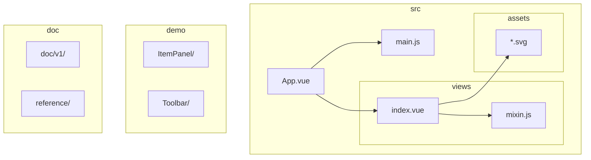
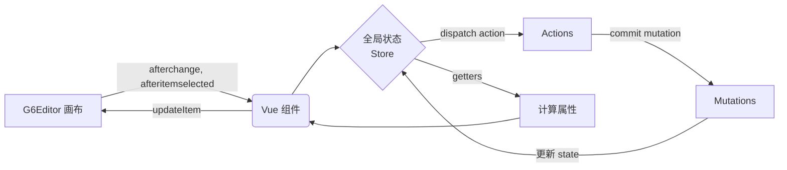
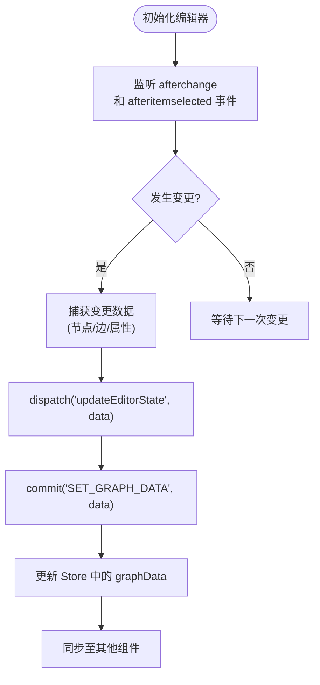
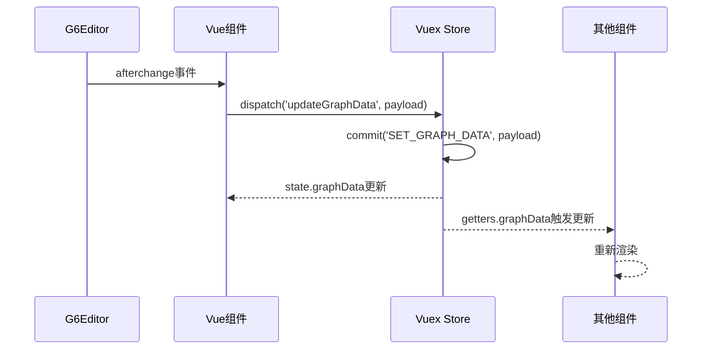
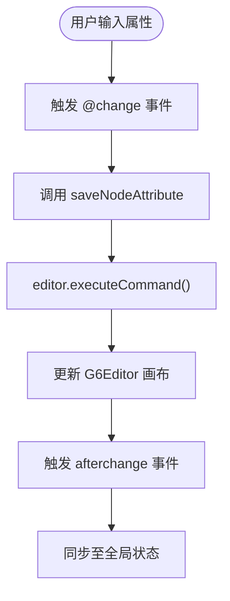
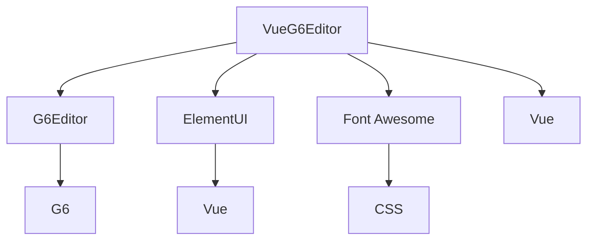

# 状态管理集成

<cite>
**本文档中引用的文件**  
- [index.vue](file://src/views/index.vue)
- [mixin.js](file://src/views/mixin.js)
- [App.vue](file://src/App.vue)
- [main.js](file://src/main.js)
</cite>

## 目录

1. [简介](#简介)
2. [项目结构](#项目结构)
3. [核心组件](#核心组件)
4. [架构概览](#架构概览)
5. [详细组件分析](#详细组件分析)
6. [依赖分析](#依赖分析)
7. [性能考虑](#性能考虑)
8. [故障排除指南](#故障排除指南)
9. [结论](#结论)

## 简介

本文档旨在指导开发者如何将 `vue-g6-editor` 与 Vuex 或 Pinia 集成，实现画布状态与应用全局状态的统一管理。通过 `src/views/index.vue` 中的事件监听机制，将图编辑器的变更同步至全局状态；并通过 `mixin.js` 提供的 `updateItem` 方法，响应外部状态变化。文档将说明如何定义模块化的状态结构来存储节点、边、选中状态等数据，确保单向数据流。同时提供完整的 Vuex 模式：actions 封装异步操作、getters 计算衍生数据、mutations 保证状态可追踪，并附带类型安全的 TypeScript 示例建议。

## 项目结构

项目采用典型的 Vue 单页应用结构，核心编辑器功能集中在 `src/views/index.vue`，通过 Mixin 复用逻辑，组件化管理 UI 元素。

**Diagram sources**
- [index.vue](file://src/views/index.vue)
- [mixin.js](file://src/views/mixin.js)
- [App.vue](file://src/App.vue)

**Section sources**
- [index.vue](file://src/views/index.vue)
- [mixin.js](file://src/views/mixin.js)

## 核心组件

核心组件包括 `index.vue` 中的图编辑器实例、工具栏、元素面板、属性栏和右键菜单。`index.vue` 负责初始化 G6Editor 实例，绑定事件监听器，并通过 `mixin.js` 提供属性更新方法。`mixin.js` 封装了节点和边属性的保存逻辑，通过 `editor.executeCommand` 执行更新命令，确保操作可撤销。

**Section sources**
- [index.vue](file://src/views/index.vue#L233-L281)
- [mixin.js](file://src/views/mixin.js#L1-L32)

## 架构概览

系统采用 Vue + G6Editor 的组合，Vue 负责 UI 渲染和状态管理，G6Editor 负责图的渲染和交互。通过事件监听机制实现双向同步：G6Editor 的变更事件触发 Vue 状态更新，Vue 的状态变更通过 Mixin 方法反向更新 G6Editor。

**Diagram sources**
- [index.vue](file://src/views/index.vue#L274-L324)
- [mixin.js](file://src/views/mixin.js#L5-L25)

## 详细组件分析

### 编辑器状态同步分析

`index.vue` 在 `initG6Editor` 方法中通过监听 `afterchange` 和 `afteritemselected` 事件，捕获画布的任何变更和元素选中事件。这些事件应被用来触发 Vuex 的 action，将变更同步到全局状态。

#### 事件监听流程图

**Diagram sources**
- [index.vue](file://src/views/index.vue#L274-L324)

#### 状态更新序列图

**Diagram sources**
- [index.vue](file://src/views/index.vue#L274-L324)
- [mixin.js](file://src/views/mixin.js#L5-L25)

### Mixin 方法分析

`mixin.js` 提供了 `saveNodeAttribute` 和 `saveEdgeAttribute` 方法，用于响应属性栏的输入变更。这些方法通过 `editor.executeCommand` 安全地更新画布元素，是反向同步的关键入口。

#### 属性更新流程图

**Diagram sources**
- [mixin.js](file://src/views/mixin.js#L5-L25)
- [index.vue](file://src/views/index.vue#L100-L120)

**Section sources**
- [mixin.js](file://src/views/mixin.js#L1-L32)
- [index.vue](file://src/views/index.vue#L100-L150)

## 依赖分析

项目依赖 AntV G6Editor 作为核心图编辑引擎，ElementUI 作为 UI 组件库，Font Awesome 作为图标库。Vue 作为框架，通过 Mixin 机制实现逻辑复用。

**Diagram sources**
- [main.js](file://src/main.js#L1-L18)
- [index.vue](file://src/views/index.vue#L233-L281)

**Section sources**
- [main.js](file://src/main.js#L1-L18)
- [package.json](file://package.json)

## 性能考虑

- **事件节流**：`afterchange` 事件可能频繁触发，建议使用防抖（debounce）或节流（throttle）机制，避免频繁更新状态。
- **状态结构优化**：Store 中的图数据应保持扁平化，避免深层嵌套，以提高更新和查找效率。
- **批量更新**：对于连续的多个变更，考虑合并为一次状态更新，减少 mutation 提交次数。
- **只读视图优化**：在只读场景下，可移除不必要的事件监听，降低性能开销。

## 故障排除指南

- **状态不同步**：检查 `afterchange` 事件是否正确绑定，确保 dispatch 的 action 能正确 commit mutation。
- **更新无反应**：确认 `editor.executeCommand` 是否被正确调用，检查 G6Editor 实例是否已初始化。
- **循环更新**：避免在 mutation 中直接触发 G6Editor 更新，应通过组件的 computed 或 watch 响应式地更新。
- **类型错误**：在 TypeScript 环境下，为 state、actions、mutations 定义清晰的接口，确保类型安全。

**Section sources**
- [index.vue](file://src/views/index.vue#L274-L324)
- [mixin.js](file://src/views/mixin.js#L5-L25)

## 结论

通过合理利用 `index.vue` 的事件监听和 `mixin.js` 的更新方法，可以实现 `vue-g6-editor` 与 Vuex/Pinia 的深度集成。关键在于建立清晰的单向数据流：UI 事件 -> 全局状态 -> 画布渲染。遵循此模式，可构建出状态一致、易于维护的复杂图编辑应用。建议在实际项目中结合 TypeScript 定义状态结构，以提升代码的健壮性和可维护性。