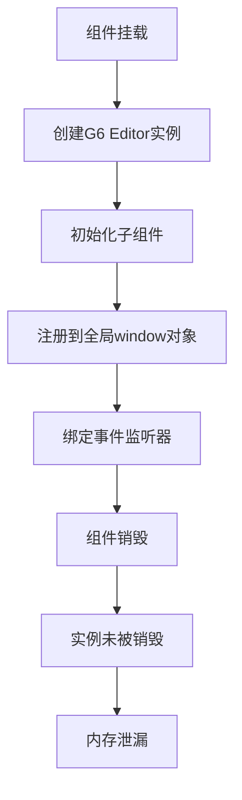
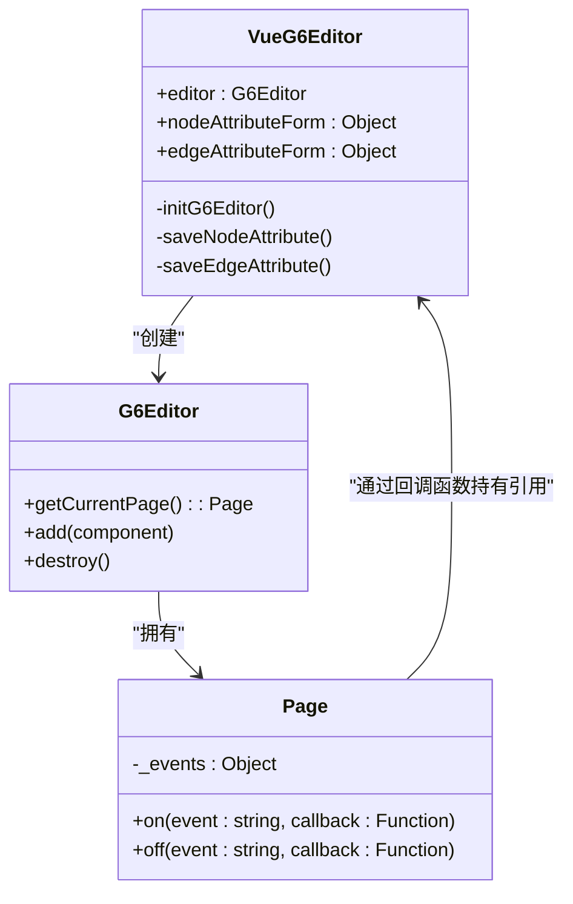
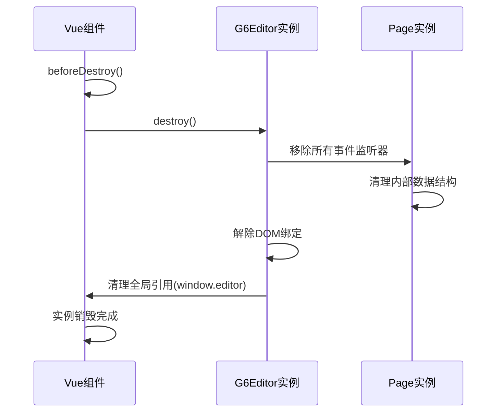

# 内存管理

<cite>
**Referenced Files in This Document**   
- [index.vue](file://src/views/index.vue)
- [mixin.js](file://src/views/mixin.js)
- [g6-editor.md](file://doc/v1/g6-editor.md)
</cite>

## 目录
1. [引言](#引言)
2. [G6 Editor实例管理与内存泄漏风险](#g6-editor实例管理与内存泄漏风险)
3. [事件监听导致的内存引用问题分析](#事件监听导致的内存引用问题分析)
4. [WeakMap与WeakSet在内存优化中的实践](#weakmap与weakset在内存优化中的实践)
5. [G6 Editor实例销毁机制](#g6-editor实例销毁机制)
6. [内存占用监控与Chrome DevTools使用指南](#内存占用监控与chrome-devtools使用指南)
7. [生产环境内存溢出问题排查与解决方案](#生产环境内存溢出问题排查与解决方案)
8. [总结与最佳实践](#总结与最佳实践)

## 引言

在现代前端应用中，图形编辑器如G6 Editor因其强大的可视化能力被广泛应用于流程图、拓扑图等复杂场景。然而，这类组件通常伴随着较高的内存消耗和潜在的内存泄漏风险，特别是在长时间运行的应用中。本文档系统性地介绍内存泄漏预防和内存占用优化策略，重点围绕`index.vue`中的G6 Editor实例管理展开，深入讲解如何及时销毁无用的G6 Editor实例及相关对象，避免闭包导致的内存泄漏。同时，分析`currentPage`事件监听可能产生的内存引用问题，并提供使用`WeakMap`、`WeakSet`等现代JavaScript特性优化内存管理的实践方案。此外，文档还将指导开发者如何通过Chrome DevTools进行内存快照分析，识别并解决生产环境中常见的内存溢出问题，确保应用的长期稳定运行。

## G6 Editor实例管理与内存泄漏风险

### 实例创建与生命周期

在`index.vue`文件中，G6 Editor实例通过`new G6Editor()`在`initG6Editor`方法中被创建，并赋值给组件的`editor`数据属性。该实例随后被用于初始化多个子组件，包括`Flow`（画布）、`Itempannel`（元素面板）、`Toolbar`（工具栏）、`Detailpannel`（属性栏）、`Minimap`（缩略图）和`Contextmenu`（右键菜单）。这些子组件通过`editor.add()`方法被注册到主编辑器实例中，形成一个完整的图编辑环境。

**Section sources**
- [index.vue](file://src/views/index.vue#L274-L370)

### 内存泄漏风险点

当前实现存在显著的内存泄漏风险，主要体现在以下方面：

1. **未实现实例销毁逻辑**：组件在`mounted`钩子中创建G6 Editor实例，但未在`beforeDestroy`或`unmounted`（Vue 3）钩子中提供相应的清理逻辑。当组件被销毁时，G6 Editor实例及其关联的DOM元素、事件监听器和内部数据结构将无法被垃圾回收机制回收，导致内存持续增长。

2. **全局引用**：代码中存在`window.editor = editor`和`window.flow = flow`的全局赋值操作。这些全局引用会阻止JavaScript引擎对相关对象进行垃圾回收，是典型的内存泄漏诱因。

3. **闭包引用**：在事件监听器的回调函数中，使用了`const _this = this`来捕获Vue组件实例。这种模式创建了闭包，使得组件实例被事件处理器长期持有，即使组件已被销毁，也无法被释放。



**Diagram sources**
- [index.vue](file://src/views/index.vue#L274-L370)

## 事件监听导致的内存引用问题分析

### currentPage事件监听机制

`index.vue`文件中，通过`editor.getCurrentPage()`获取当前页面实例，并使用`.on()`方法为其绑定了多个事件监听器，如`afterchange`和`afteritemselected`。这些监听器用于响应画布上的用户操作，例如添加节点或选择元素。

**Section sources**
- [index.vue](file://src/views/index.vue#L370-L402)

### 内存引用问题

事件监听机制是内存泄漏的常见来源。当一个对象（如`currentPage`）持有一个函数（事件处理器）的引用时，只要事件监听器未被显式移除，该函数及其闭包作用域内的所有变量（包括`this`上下文）都将保持活跃状态。

在当前代码中，`afterchange`和`afteritemselected`的回调函数都直接引用了`this`（通过`_this`），这导致了Vue组件实例被`currentPage`对象长期持有。当Vue组件被销毁时，由于`currentPage`仍然持有对它的引用，垃圾回收器无法回收该组件实例，从而造成内存泄漏。

此外，`g6-editor.md`文档中列出了大量的事件类型（如`aftercommandexecute`、`click`、`mousedown`等），表明`currentPage`对象维护了一个复杂的事件系统。如果这些事件监听器没有被正确清理，它们所占用的内存将累积。



**Diagram sources**
- [index.vue](file://src/views/index.vue#L370-L402)
- [g6-editor.md](file://doc/v1/g6-editor.md#L644-L696)

## WeakMap与WeakSet在内存优化中的实践

### WeakMap与WeakSet简介

`WeakMap`和`WeakSet`是ES6引入的特殊集合类型，其键（对于`WeakMap`）或值（对于`WeakSet`）是弱引用的。这意味着它们不会阻止垃圾回收器回收这些对象。一旦对象的其他强引用被移除，该对象就可以被回收，`WeakMap`或`WeakSet`中的对应条目也会自动消失。

### 在G6 Editor中的应用策略

虽然当前代码库中未直接使用`WeakMap`或`WeakSet`，但可以设计一种优化方案来管理组件与G6 Editor实例之间的映射关系，从而避免循环引用。

例如，可以创建一个`WeakMap`来存储Vue组件实例与其对应的G6 Editor实例的映射：

```javascript
// 全局WeakMap，用于存储组件与编辑器实例的弱引用映射
const editorMap = new WeakMap();

// 在组件的initG6Editor方法中
initG6Editor() {
  const editor = new G6Editor();
  // 使用WeakMap建立弱引用，而不是直接在组件上存储
  editorMap.set(this, editor);
  // ... 其他初始化逻辑
}

// 在需要访问编辑器实例时
getEditor() {
  return editorMap.get(this);
}
```

通过这种方式，当Vue组件实例被销毁时，`WeakMap`不会阻止其被回收。`WeakMap`中的条目会自动被清除，从而避免了因直接持有引用而导致的内存泄漏。

**Section sources**
- [index.vue](file://src/views/index.vue#L274-L402)

## G6 Editor实例销毁机制

### 内置销毁方法

根据`g6-editor.md`文档，`G6Editor`类提供了一个名为`destroy`的方法，其功能是“销毁编辑器”。这是解决内存泄漏问题的关键。

**Section sources**
- [g6-editor.md](file://doc/v1/g6-editor.md#L417-L446)

### 实现销毁逻辑

为了正确管理内存，必须在Vue组件的生命周期钩子中调用`destroy`方法。对于Vue 2，应在`beforeDestroy`钩子中执行清理操作。



**Diagram sources**
- [index.vue](file://src/views/index.vue)
- [g6-editor.md](file://doc/v1/g6-editor.md#L417-L446)

### 推荐的销毁代码

```javascript
// 在index.vue中添加
beforeDestroy() {
  if (this.editor) {
    // 1. 调用G6 Editor的销毁方法
    this.editor.destroy();
    // 2. 清理全局引用
    window.editor = null;
    window.flow = null;
    // 3. 将组件内的引用置为null
    this.editor = null;
  }
}
```

此代码确保了G6 Editor实例被正确销毁，其内部的事件监听器、定时器和DOM引用被清理，从而允许垃圾回收器回收相关内存。

## 内存占用监控与Chrome DevTools使用指南

### 监控G6 Editor内存占用

要监控G6 Editor实例的内存占用，可以使用Chrome DevTools的内存（Memory）面板。主要方法包括：

1.  **堆快照（Heap Snapshots）**：在应用的不同状态（如初始化后、添加大量节点后、销毁组件后）拍摄堆快照。通过比较快照，可以识别出哪些对象没有被释放。
2.  **记录堆分配（Record Heap Allocations）**：实时记录内存分配情况，可以观察到G6 Editor在执行特定操作（如添加节点）时的内存增长趋势。
3.  **性能（Performance）面板**：录制一段时间内的性能数据，可以查看内存使用量（Memory）曲线，判断是否存在内存持续增长的情况。

### 分析步骤

1.  打开Chrome DevTools，切换到“Memory”面板。
2.  点击“Take heap snapshot”按钮，拍摄第一个快照（Snapshot 1）。
3.  在应用中执行操作，例如打开`index.vue`组件并创建一个复杂的流程图。
4.  再次拍摄堆快照（Snapshot 2）。
5.  切换到“Comparison”视图，将Snapshot 2与Snapshot 1进行比较。
6.  查看“Objects allocated between Snapshot 1 and Snapshot 2”列表，重点关注`G6Editor`、`Page`、`Flow`等构造函数创建的对象实例数量。如果这些实例在组件销毁后仍然存在，说明存在内存泄漏。

**Section sources**
- [index.vue](file://src/views/index.vue)

## 生产环境内存溢出问题排查与解决方案

### 常见问题

在生产环境中，长时间运行的G6 Editor应用可能会遇到以下内存溢出问题：
- **重复创建实例**：用户在不同路由间切换时，每次都创建新的G6 Editor实例，而旧实例未被销毁。
- **事件监听器堆积**：动态添加的事件监听器未被移除，导致`_events`对象无限增长。
- **缓存未清理**：G6 Editor内部可能维护了节点、边的缓存，这些缓存未随实例销毁而清除。

### 解决方案

1.  **确保单例模式或正确销毁**：如果应用只需要一个编辑器实例，应将其设计为单例。否则，必须确保每次组件销毁时都调用`destroy`方法。
2.  **使用`off`方法移除事件监听器**：在调用`destroy`之前，可以显式地使用`currentPage.off(event, callback)`来移除关键事件监听器，作为双重保险。
3.  **避免全局变量**：彻底移除`window.editor`和`window.flow`等全局引用。
4.  **代码审查与自动化测试**：建立代码审查流程，确保所有G6 Editor实例都有对应的销毁逻辑。编写单元测试来验证`beforeDestroy`钩子的行为。

## 总结与最佳实践

为有效预防内存泄漏并优化内存占用，开发者应遵循以下最佳实践：

1.  **生命周期配对**：始终遵循“创建即销毁”的原则。在`mounted`中创建的实例，必须在`beforeDestroy`中进行清理。
2.  **优先使用内置销毁方法**：利用`G6Editor.destroy()`方法来释放所有内部资源，这是最安全、最彻底的清理方式。
3.  **警惕闭包和全局引用**：避免在事件处理器中创建不必要的闭包，并杜绝将大型对象存储在全局作用域。
4.  **主动监控**：在开发和测试阶段，定期使用Chrome DevTools进行内存分析，及早发现潜在的泄漏点。
5.  **考虑弱引用**：对于需要建立对象间映射但又不希望阻止垃圾回收的场景，优先考虑使用`WeakMap`或`WeakSet`。

通过系统性地应用这些策略，可以显著提升基于G6 Editor的应用的内存效率和长期运行的稳定性。