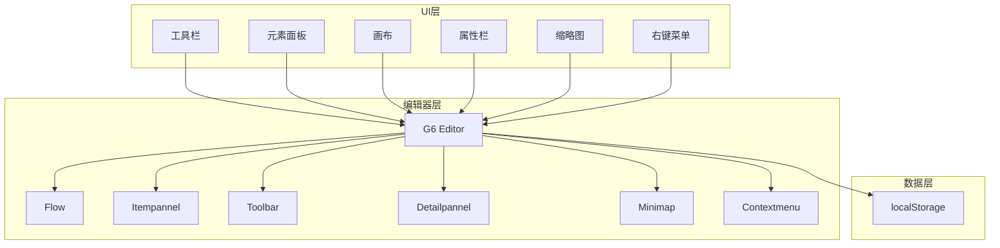
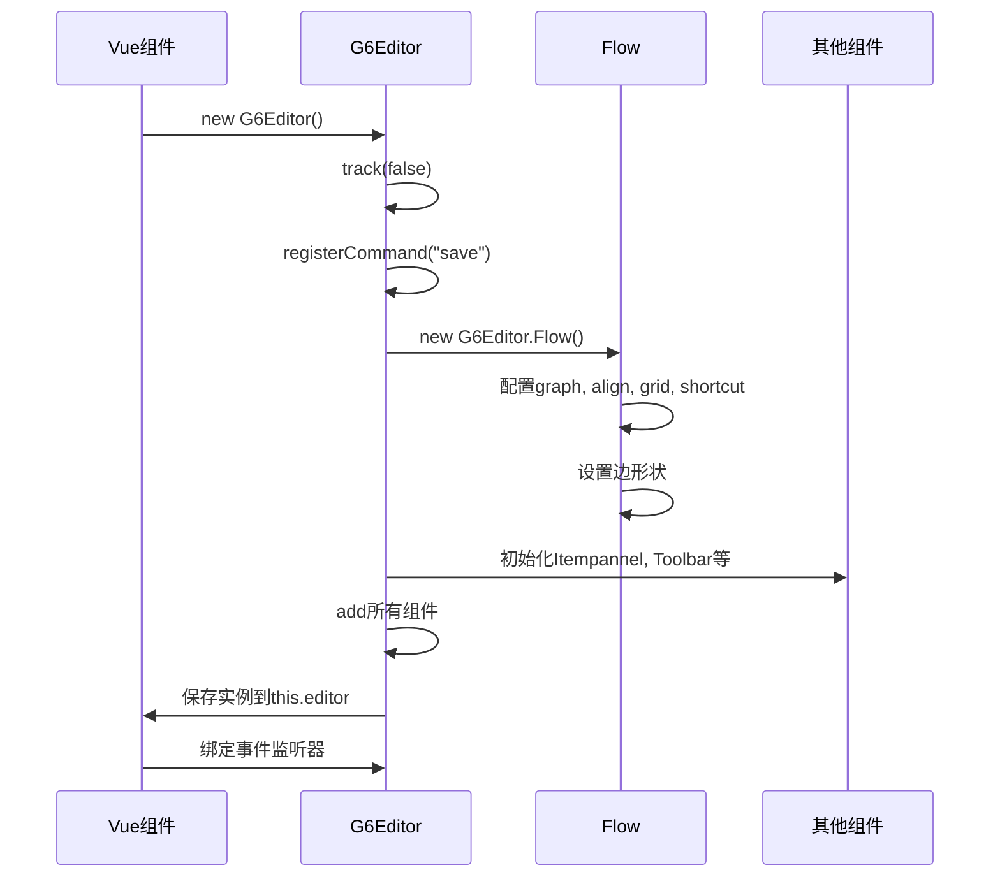
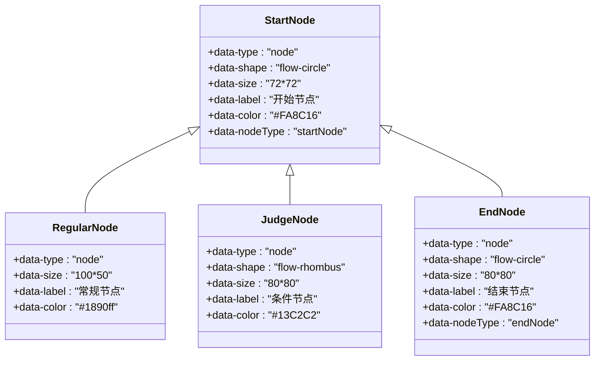
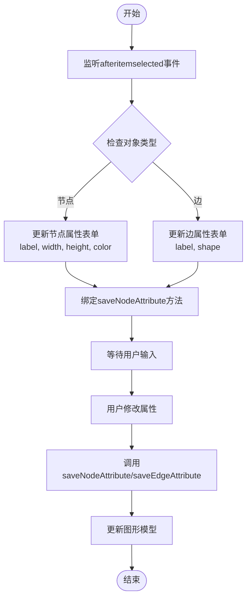
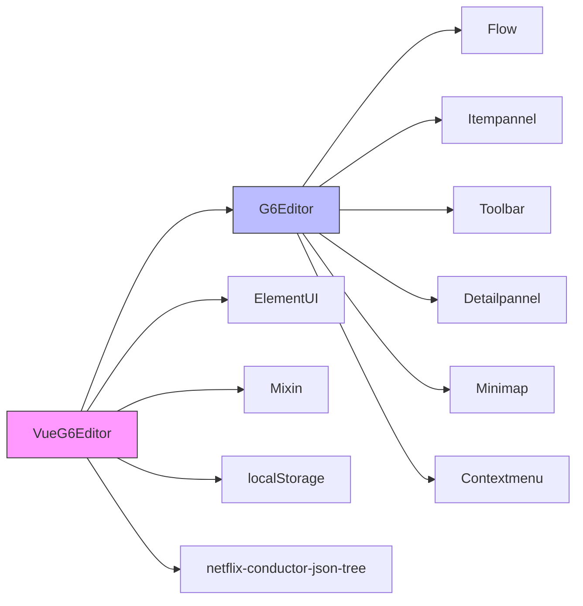

# 渲染优化

<cite>
**本文档引用的文件**
- [index.vue](file://src/views/index.vue)
- [index.less](file://src/views/index.less)
- [g6-editor.md](file://doc/v1/g6-editor.md)
</cite>

## 目录
1. [项目结构](#项目结构)
2. [核心组件](#核心组件)
3. [架构概述](#架构概述)
4. [详细组件分析](#详细组件分析)
5. [依赖分析](#依赖分析)
6. [性能考量](#性能考量)
7. [故障排除指南](#故障排除指南)
8. [结论](#结论)

## 项目结构
本项目采用典型的Vue.js单页应用结构，主要包含以下目录：
- `demo/`：包含独立的演示组件（ItemPanel和Toolbar）
- `doc/`：文档目录，包含框架选型参考和技术文档
- `public/`：公共静态资源
- `src/`：源代码目录，包含视图、组件和主应用文件
- 根目录包含构建配置文件（package.json、vue.config.js等）

项目以`src/views/index.vue`为核心文件，实现了基于G6 Editor的流程图编辑器，集成了工具栏、元素面板、画布、属性栏和缩略图等完整功能模块。

**Section sources**
- [index.vue](file://src/views/index.vue#L0-L515)

## 核心组件
项目的核心功能集中在`index.vue`文件中，实现了基于AntV G6 Editor的可视化流程图编辑器。主要组件包括：
- 工具栏：提供保存、撤销、重做、缩放等基本操作
- 元素面板：包含开始节点、常规节点、条件节点和结束节点等可拖拽元素
- 画布区域：核心的流程图编辑区域
- 属性栏：提供节点、边、群组、画布等不同对象的属性编辑功能
- 缩略图：提供画布的全局视图
- 右键菜单：提供上下文相关的操作选项

这些组件通过G6 Editor框架协同工作，形成了完整的流程图编辑解决方案。

**Section sources**
- [index.vue](file://src/views/index.vue#L0-L515)

## 架构概述
系统采用Vue.js作为前端框架，集成AntV G6 Editor作为图形编辑核心。整体架构分为三层：
1. **UI层**：基于Element UI组件库构建用户界面
2. **编辑器层**：使用G6 Editor提供图形编辑能力
3. **数据层**：通过localStorage实现数据持久化

**Diagram sources**
- [index.vue](file://src/views/index.vue#L0-L515)

## 详细组件分析

### 流程图编辑器初始化分析
`index.vue`中的`initG6Editor`方法是整个应用的核心，负责初始化G6 Editor实例并配置各项功能。

**Diagram sources**
- [index.vue](file://src/views/index.vue#L274-L402)

### 元素面板配置分析
元素面板通过HTML结构定义了四种可拖拽的节点类型：开始节点、常规节点、条件节点和结束节点。每个节点通过data属性定义其类型、形状、尺寸、标签和颜色等元数据。

**Diagram sources**
- [index.vue](file://src/views/index.vue#L45-L140)

### 属性栏交互流程分析
属性栏根据选中对象的类型动态显示相应的编辑界面，通过事件监听实现双向数据绑定。

**Diagram sources**
- [index.vue](file://src/views/index.vue#L390-L420)

## 依赖分析
项目的主要依赖关系如下：

**Diagram sources**
- [package.json](file://package.json#L0-L29)
- [index.vue](file://src/views/index.vue#L0-L515)

## 性能考量
根据`g6-editor.md`文档中的提示，SVG渲染存在较严重的性能问题，不推荐使用。在大规模流程图场景下，应考虑以下优化策略：
- 减少图形复杂度
- 启用简化渲染模式
- 使用虚拟滚动和节点懒加载
- 避免不必要的重绘和回流
- 利用CSS硬件加速提升动画性能

虽然当前代码中未直接实现这些优化，但为未来的性能优化提供了理论基础和方向指引。

**Section sources**
- [g6-editor.md](file://doc/v1/g6-editor.md#L487-L518)

## 故障排除指南
### 常见问题及解决方案
1. **画布ID问题**：画布标签的ID必须为"page"，否则会报错
2. **元素拖拽问题**：元素的class名称必须包含"getItem"，否则无法拖拽到画板
3. **右键菜单显示问题**：默认右键菜单是显示的，需要在CSS中设置display:none来隐藏
4. **图片拖拽问题**：元素图片必须设置draggable="false"，否则拖拽后需要二次点击才能取消选中状态
5. **开始/结束节点限制**：通过事件监听实现了只能有一个开始节点和一个结束节点的业务规则

**Section sources**
- [index.vue](file://src/views/index.vue#L378-L388)
- [g6-editor.md](file://doc/v1/g6-editor.md#L286-L319)

## 结论
该项目成功实现了一个基于Vue.js和AntV G6 Editor的流程图编辑器，具备完整的图形编辑功能。通过合理的组件划分和事件处理机制，实现了良好的用户体验。未来可在性能优化方面进一步改进，特别是在处理大规模流程图时，可引入虚拟滚动、懒加载等技术提升渲染性能。