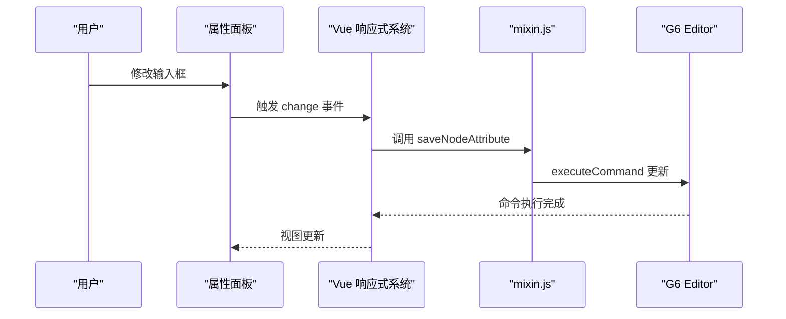
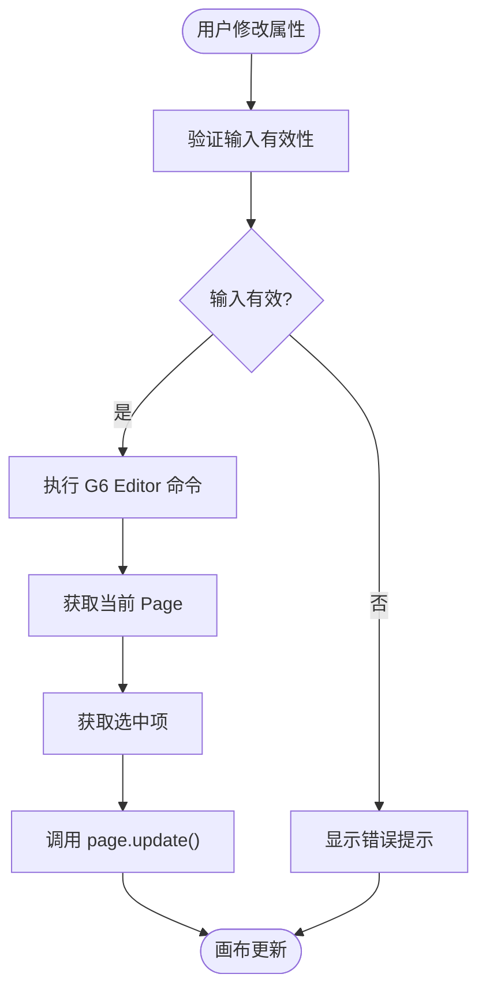
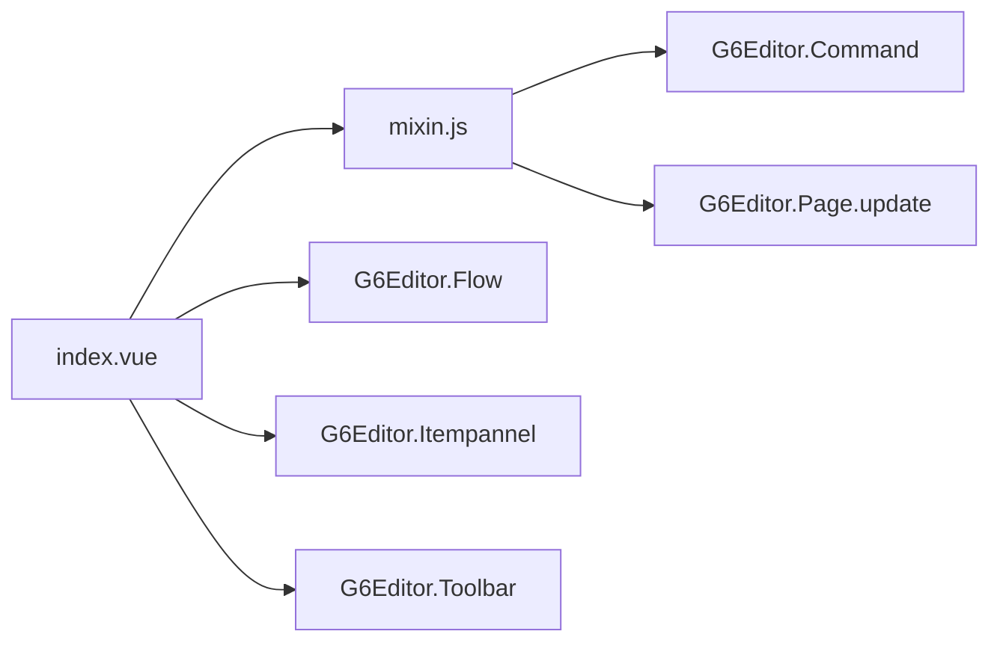

# 属性绑定机制

<cite>
**本文档中引用的文件**   
- [mixin.js](file://src/views/mixin.js)
- [index.vue](file://src/views/index.vue)
</cite>

## 目录
1. [简介](#简介)
2. [项目结构](#项目结构)
3. [核心组件](#核心组件)
4. [架构概述](#架构概述)
5. [详细组件分析](#详细组件分析)
6. [依赖分析](#依赖分析)
7. [性能考虑](#性能考虑)
8. [故障排除指南](#故障排除指南)
9. [结论](#结论)

## 简介
本文档系统阐述了基于 `mixin.js` 中 `updateItemAttribute` 方法实现的属性双向绑定机制，解析其在 `index.vue` 中的调用流程与事件响应逻辑。说明如何通过 Vue 的响应式系统与 G6 Editor 的 item API 实现属性面板的动态更新。展示对复杂数据结构（如嵌套对象、数组）的支持方案，包括递归绑定、路径映射与变更检测优化。提供可复用的绑定封装模式，支持动态表单生成与条件显示逻辑。包含性能优化建议（如防抖、批量更新）、常见问题（如绑定丢失、类型错乱）的排查与解决方案。

## 项目结构
本项目采用典型的 Vue.js 单页应用结构，核心功能集中在 `src/views` 目录下。`index.vue` 作为主视图组件，负责整体布局与业务逻辑，`mixin.js` 提供可复用的方法，实现节点与边的属性更新。`demo` 目录包含示例应用，`doc` 目录存放项目文档。

```mermaid
graph TB
subgraph "源码"
indexVue[index.vue]
mixinJs[mixin.js]
end
subgraph "示例"
demo[Demo]
end
subgraph "文档"
doc[Doc]
end
indexVue --> mixinJs : "使用"
indexVue --> demo : "演示"
indexVue --> doc : "参考"
```

**Diagram sources**
- [index.vue](file://src/views/index.vue)
- [mixin.js](file://src/views/mixin.js)

**Section sources**
- [index.vue](file://src/views/index.vue)
- [mixin.js](file://src/views/mixin.js)

## 核心组件
核心组件包括 `index.vue` 和 `mixin.js`。`index.vue` 定义了视图模板、数据模型和主要方法，通过 `mixins` 选项引入 `mixin.js` 中的方法。`mixin.js` 封装了与 G6 Editor 交互的通用逻辑，特别是 `saveNodeAttribute` 和 `saveEdgeAttribute` 方法，实现了属性的持久化更新。

**Section sources**
- [index.vue](file://src/views/index.vue#L1-L515)
- [mixin.js](file://src/views/mixin.js#L1-L33)

## 架构概述
系统架构基于 Vue.js 的响应式原理和 G6 Editor 的命令模式。当用户在属性面板修改表单值时，Vue 的 `v-model` 触发数据更新，进而调用绑定的 `@change` 事件处理器。处理器调用 `mixin.js` 中的方法，通过 `editor.executeCommand` 执行一个原子操作，该操作获取当前选中项并调用 `page.update` API 更新画布上的元素。



**Diagram sources**
- [index.vue](file://src/views/index.vue#L150-L180)
- [mixin.js](file://src/views/mixin.js#L2-L15)

## 详细组件分析

### 属性双向绑定机制分析
该机制的核心是 Vue 的数据绑定与 G6 Editor 的命令执行的结合。`index.vue` 中的 `nodeAttributeForm` 和 `edgeAttributeForm` 对象作为数据源，通过 `v-model` 与表单元素双向绑定。当用户交互时，数据模型自动更新。`@change` 事件监听器作为“写回”通道，将变更同步到 G6 Editor 的数据模型中。

#### 对于属性更新逻辑:


**Diagram sources**
- [index.vue](file://src/views/index.vue#L150-L180)
- [mixin.js](file://src/views/mixin.js#L2-L15)

**Section sources**
- [index.vue](file://src/views/index.vue#L150-L180)
- [mixin.js](file://src/views/mixin.js#L2-L15)

### 复杂数据结构支持方案
虽然当前代码未直接处理嵌套对象或数组，但其设计模式为扩展复杂数据结构支持提供了基础。`page.update` 方法接受一个属性对象，理论上可以传递任意深度的嵌套结构。未来的实现可以通过递归遍历表单数据，构建包含嵌套路径的更新对象，例如 `page.update(itemId, { style: { fill: '#1890ff', stroke: '#000' } })`。变更检测优化可通过 Vue 的 `watch` 选项或 `computed` 属性来实现，避免不必要的 `executeCommand` 调用。

## 依赖分析
系统主要依赖 Vue.js 框架和 AntV G6 Editor 库。`index.vue` 依赖 `mixin.js` 提供业务逻辑，同时依赖 G6 Editor 的 `Flow`、`Itempannel`、`Toolbar` 等组件来构建编辑器界面。`mixin.js` 作为纯逻辑模块，依赖 G6 Editor 的核心 API 进行数据操作。



**Diagram sources**
- [index.vue](file://src/views/index.vue#L10-L50)
- [mixin.js](file://src/views/mixin.js#L1-L33)

**Section sources**
- [index.vue](file://src/views/index.vue#L10-L50)
- [mixin.js](file://src/views/mixin.js#L1-L33)

## 性能考虑
当前实现中，每次 `@change` 事件都会触发一次 `executeCommand`，这可能会导致频繁的命令入队和视图重绘。为了优化性能，建议引入防抖（debounce）机制，将短时间内多次的属性更新合并为一次命令执行。此外，`executeCommand` 内部的 `page.update` 是批量更新操作，应确保在一次命令中更新所有相关属性，而不是为每个属性单独调用。

## 故障排除指南
常见问题包括绑定丢失和类型错乱。绑定丢失通常发生在 `editor` 实例未正确初始化或 `getCurrentPage()` 返回 `null` 时，应确保 `initG6Editor` 方法成功执行。类型错乱可能源于表单输入与 G6 Editor 期望的数据类型不匹配，例如颜色值应为十六进制字符串。解决方案是在 `save*Attribute` 方法中添加类型检查和格式化逻辑。

**Section sources**
- [index.vue](file://src/views/index.vue#L200-L250)
- [mixin.js](file://src/views/mixin.js#L2-L15)

## 结论
本文档详细解析了基于 `mixin.js` 和 `index.vue` 的属性双向绑定机制。该机制有效结合了 Vue 的响应式优势和 G6 Editor 的命令式 API，实现了属性面板与画布的实时同步。尽管当前实现较为基础，但其模块化的设计为支持复杂数据结构、动态表单和性能优化提供了良好的扩展性。遵循本文档的指导，可以构建出更健壮、更高效的图形编辑器属性系统。