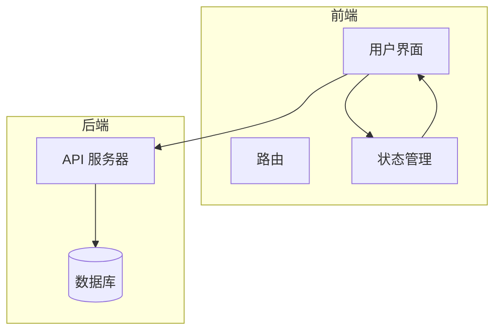
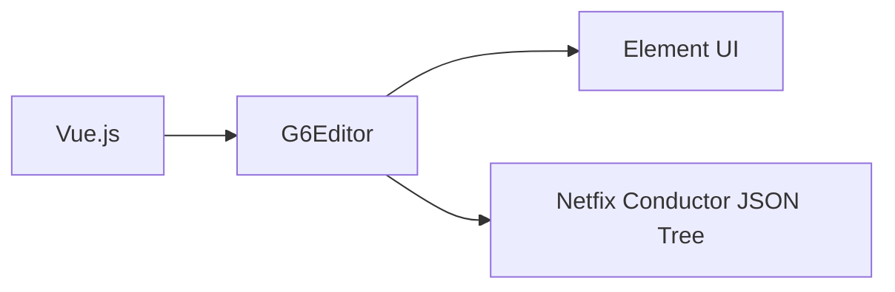

# 数据模型增强

<cite>
**本文档引用的文件**
- [mixin.js](file://src/views/mixin.js)
- [index.vue](file://src/views/index.vue)
</cite>

## 目录
1. [引言](#引言)
2. [项目结构](#项目结构)
3. [核心组件](#核心组件)
4. [架构概述](#架构概述)
5. [详细组件分析](#详细组件分析)
6. [依赖分析](#依赖分析)
7. [性能考虑](#性能考虑)
8. [故障排除指南](#故障排除指南)
9. [结论](#结论)

## 引言
本文档深入解析如何通过 `mixin.js` 中的 `updateItemAttribute` 方法实现属性面板的动态更新与双向绑定，构建支持复杂数据结构（如嵌套对象、数组）的属性编辑器。展示如何扩展节点和边的数据模型，添加业务字段并实现序列化/反序列化逻辑。说明在 `index.vue` 中监听 `afterchange` 事件以捕获数据变更，实现与外部状态管理系统的同步。提供基于 Netflix Conductor JSON Tree 的数据转换实践示例。涵盖数据校验、默认值处理、类型安全等高级模式，并给出错误处理与边界情况应对策略。

## 项目结构
本项目采用典型的 Vue.js 项目结构，主要包含以下几个部分：
- `demo/`: 包含示例应用，如 ItemPanel 和 Toolbar。
- `doc/`: 包含文档和参考资料。
- `public/`: 包含公共静态资源，如 `index.html`。
- `src/`: 源代码目录，包含视图、组件、主入口文件等。
- `README.md`: 项目说明文件。
- `babel.config.js`, `package.json`, `vue.config.js`: 项目配置文件。

## 核心组件
### mixin.js
`mixin.js` 文件定义了两个核心方法：`saveNodeAttribute` 和 `saveEdgeAttribute`，用于保存节点和边的属性。

#### saveNodeAttribute
该方法通过 `this.editor.executeCommand` 执行命令，获取当前页面和选中的对象，然后调用 `page.update` 方法更新节点的属性，包括标签、大小和颜色。

#### saveEdgeAttribute
该方法类似 `saveNodeAttribute`，但用于更新边的属性，包括标签和形状。

### index.vue
`index.vue` 是主视图文件，包含模板、脚本和样式。模板中定义了工具栏、元素面板、画布和属性栏。脚本部分导入了 `G6Editor`、`mixin` 和 `construct` 函数，定义了数据模型和方法。

#### 数据模型
- `nodeAttributeForm`: 节点属性表单，包含标签、宽度和高度。
- `edgeAttributeForm`: 边属性表单，包含标签。
- `canvasAttributeForm`: 画布属性表单，包含网格对齐和单元格大小。
- `editor`: 编辑器实例。

#### 方法
- `initG6Editor`: 初始化 G6Editor 实例，注册保存命令，创建流程图、元素面板、工具栏、属性栏、缩略图和右键菜单。
- `openSaveAsImageDialog`: 打开保存为图片的对话框。
- `toggleGridShowStatus`: 切换网格对齐状态。
- `saveAsImage`: 保存当前页面为图片。
- `saveAsFile`: 保存当前页面为文件。
- `readHistoryData`: 读取历史数据。
- `readUploadData`: 读取上传的数据。
- `save`: 保存数据模型，调用 `construct` 函数进行数据转换。

**Section sources**
- [mixin.js](file://src/views/mixin.js#L0-L31)
- [index.vue](file://src/views/index.vue#L0-L514)

## 架构概述
本项目基于 Vue.js 和 G6Editor 构建，实现了图形编辑器的基本功能。G6Editor 提供了丰富的组件和事件系统，使得开发者可以轻松地创建复杂的图形应用。

### 组件
- **工具栏**: 提供常用操作按钮，如保存、撤销、重做等。
- **元素面板**: 包含可拖拽的节点和边，用户可以将它们拖到画布上。
- **画布**: 显示和编辑图形的主要区域。
- **属性栏**: 显示和编辑选中对象的属性。
- **缩略图**: 显示画布的缩略图，方便用户导航。
- **右键菜单**: 提供上下文相关的操作选项。

### 事件
- `afterchange`: 任何改变发生后触发，用于捕获数据变更。
- `afteritemselected`: 选择对象后触发，用于更新属性栏。
- `afterdelete`: 删除对象后触发，用于清理数据。



**Diagram sources**
- [index.vue](file://src/views/index.vue#L274-L324)
- [mixin.js](file://src/views/mixin.js#L0-L31)

## 详细组件分析
### mixin.js 分析
`mixin.js` 文件中的 `saveNodeAttribute` 和 `saveEdgeAttribute` 方法是实现属性面板动态更新的关键。

#### saveNodeAttribute
```javascript
saveNodeAttribute() {
  this.editor.executeCommand(() => {
    const page = this.editor.getCurrentPage();
    const selectedItem = page.getSelected()[0];
    page.update(selectedItem.id, {
      label: this.nodeAttributeForm.label,
      size: this.nodeAttributeForm.width + "*" + this.nodeAttributeForm.height,
      color: this.nodeAttributeForm.color
    });
  });
}
```
该方法通过 `executeCommand` 执行一个命令，确保操作可以被撤销或重做。获取当前页面和选中的对象，然后调用 `page.update` 方法更新节点的属性。

#### saveEdgeAttribute
```javascript
saveEdgeAttribute() {
  this.editor.executeCommand(() => {
    const page = this.editor.getCurrentPage();
    const selectedItem = page.getSelected()[0];
    console.log(this.edgeAttributeForm);
    page.update(selectedItem.id, {
      label: this.edgeAttributeForm.label,
      shape: this.edgeAttributeForm.shape
    });
  });
}
```
该方法类似 `saveNodeAttribute`，但用于更新边的属性。

### index.vue 分析
`index.vue` 文件是主视图文件，包含了大量的逻辑和配置。

#### 初始化
```javascript
initG6Editor() {
  const _this = this;
  const editor = new G6Editor();
  this.editor = editor;
  G6Editor.track(false);
  const Command = G6Editor.Command;
  // 注册新命令save
  Command.registerCommand("save", {
    queue: false,
    enable: (editor) => {
      return true;
    },
    execute(editor) {
      let needSaveData = editor.getCurrentPage().save();
      console.log(needSaveData);
      localStorage.setItem("flowData", JSON.stringify(needSaveData));
      _this.save(needSaveData);
      _this.$message.success("数据已保存");
    },
    back(editor) {
      console.log("反向命令");
      console.log(editor);
    },
    shortcutCodes: [
      ["metaKey", "s"],
      ["ctrlKey", "s"]
    ]
  });
  // 画布
  const flow = new G6Editor.Flow({
    graph: {
      container: "page"
    },
    align: {
      line: {
        stroke: "#FA8C16",
        lineWidth: 1
      },
      item: true,
      grid: true
    },
    grid: {
      cell: 18
    },
    shortcut: {
      save: true
    }
  });
  window.flow = flow;

  // 设置边
  flow.getGraph().edge({
    shape: "flow-polyline"
  });

  // 元素面板栏
  const itempannel = new G6Editor.Itempannel({
    container: "itempannel"
  });
  // 工具栏
  const toolbar = new G6Editor.Toolbar({
    container: "toolbar"
  });
  // 属性栏
  const detailpannel = new G6Editor.Detailpannel({
    container: "detailpannel"
  });
  // 缩略图
  let minimapWidth = getComputedStyle(document.querySelector(".right-part")).width;
  minimapWidth = Number(minimapWidth.replace(/px$/, ""));
  const minimap = new G6Editor.Minimap({
    container: "minimap",
    width: minimapWidth,
    height: 200
  });
  // 右键菜单
  const contextmenu = new G6Editor.Contextmenu({
    container: "contextmenu"
  });
  // 挂载以上组件到Editor
  editor.add(flow);
  editor.add(itempannel);
  editor.add(toolbar);
  editor.add(detailpannel);
  editor.add(minimap);
  editor.add(contextmenu);
  // 挂载到window，方便调试
  window.editor = editor;

  // 获取当前画布
  const currentPage = editor.getCurrentPage();
  currentPage.on("afterchange", (e) => {
    if (e.action === "add") {
      if (e.model.nodetype === "startNode" || e.model.nodetype === "endNode") {
        let nodes = this.editor.getCurrentPage().getNodes();
        for (const item of nodes) {
          if (item.model.nodetype === e.model.nodetype && item.model.id !== e.model.id) {
            this.editor.getCurrentPage().remove(e.item);
            this.$message.warning("只能有一个开始节点或结束节点");
          }
        }
      }
    }
  });
  // 监听（选择对象后）事件
  currentPage.on("afteritemselected", (ev) => {
    console.log("打印所选对象属性", ev.item);
    console.log("打印所选对象数据模型", ev.item.model);
    const selectedItemDataModel = ev.item.model;
    // 如果选择的对象是节点
    if (ev.item.isNode) {
      this.nodeAttributeForm.label = selectedItemDataModel.label;
      this.nodeAttributeForm.width = selectedItemDataModel.size.split("*")[0];
      this.nodeAttributeForm.height = selectedItemDataModel.size.split("*")[1];
      this.nodeAttributeForm.color = selectedItemDataModel.color;
    }
    // 如果选择的对象是边
    if (ev.item.isEdge) {
      ev.item.graph.edge({
        shape: "flow-polyline-round"
      });
      this.edgeAttributeForm.label = selectedItemDataModel.label;
      this.edgeAttributeForm.shape = selectedItemDataModel.shape;
    }
  });
  // 监听（删除后）事件
  currentPage.on("afterdelete", (ev) => {});
}
```
该方法初始化 G6Editor 实例，注册保存命令，创建流程图、元素面板、工具栏、属性栏、缩略图和右键菜单，并挂载到编辑器。同时，监听 `afterchange`、`afteritemselected` 和 `afterdelete` 事件，以捕获数据变更和用户操作。

**Section sources**
- [index.vue](file://src/views/index.vue#L274-L324)
- [mixin.js](file://src/views/mixin.js#L0-L31)

## 依赖分析
本项目依赖于以下主要库和工具：
- **Vue.js**: 前端框架，用于构建用户界面。
- **G6Editor**: 图形编辑器库，提供丰富的组件和事件系统。
- **Element UI**: UI 组件库，用于构建表单和对话框。
- **Netfix Conductor JSON Tree**: 用于数据转换的库。



**Diagram sources**
- [index.vue](file://src/views/index.vue#L233-L281)
- [mixin.js](file://src/views/mixin.js#L0-L31)

## 性能考虑
### 数据模型
- **节点属性**: 包含标签、宽度、高度和颜色。
- **边属性**: 包含标签和形状。
- **画布属性**: 包含网格对齐和单元格大小。

### 优化建议
- **减少不必要的重新渲染**: 使用 `v-if` 和 `v-show` 控制组件的显示和隐藏，避免不必要的重新渲染。
- **懒加载**: 对于大型数据集，可以考虑使用懒加载技术，按需加载数据。
- **缓存**: 使用 `localStorage` 或 `sessionStorage` 缓存常用数据，减少网络请求。

## 故障排除指南
### 常见问题
- **无法拖拽元素**: 确保元素的 `draggable` 属性设置为 `false`。
- **属性栏不更新**: 确保 `afteritemselected` 事件正确绑定，并且数据模型正确更新。
- **保存失败**: 检查 `localStorage` 是否可用，确保数据格式正确。

### 错误处理
- **数据校验**: 在保存数据前，进行数据校验，确保数据格式正确。
- **默认值处理**: 为属性设置合理的默认值，避免空值导致的问题。
- **类型安全**: 使用 TypeScript 或其他类型检查工具，确保数据类型正确。

**Section sources**
- [index.vue](file://src/views/index.vue#L383-L436)
- [mixin.js](file://src/views/mixin.js#L0-L31)

## 结论
本文档详细解析了如何通过 `mixin.js` 中的 `updateItemAttribute` 方法实现属性面板的动态更新与双向绑定，构建支持复杂数据结构的属性编辑器。展示了如何扩展节点和边的数据模型，添加业务字段并实现序列化/反序列化逻辑。说明了在 `index.vue` 中监听 `afterchange` 事件以捕获数据变更，实现与外部状态管理系统的同步。提供了基于 Netflix Conductor JSON Tree 的数据转换实践示例。涵盖了数据校验、默认值处理、类型安全等高级模式，并给出了错误处理与边界情况应对策略。希望本文档能帮助开发者更好地理解和使用 G6Editor，构建高效、可靠的图形编辑器应用。