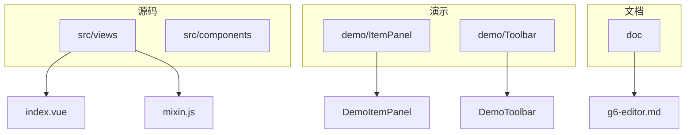
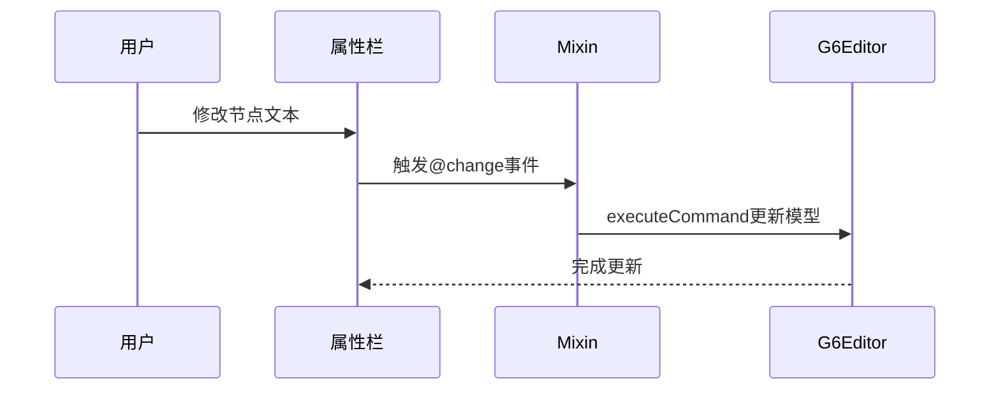
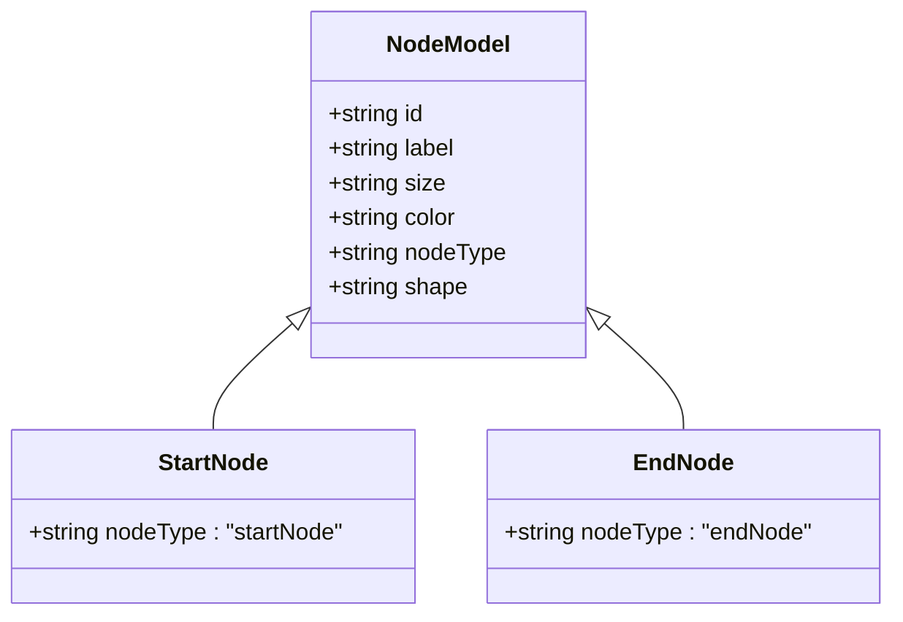
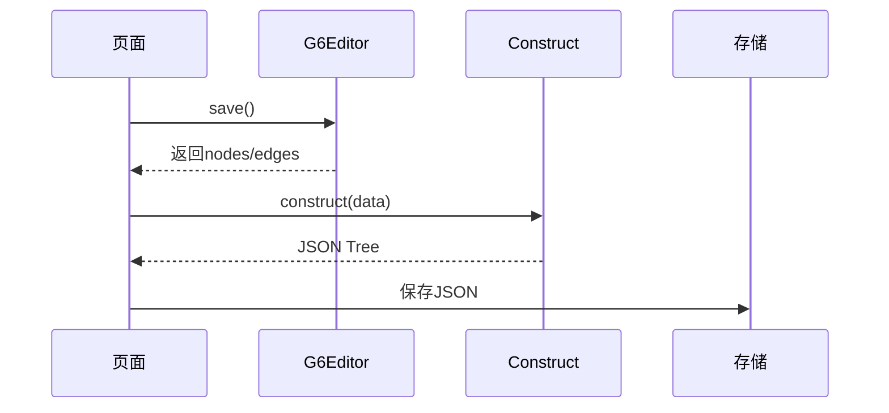
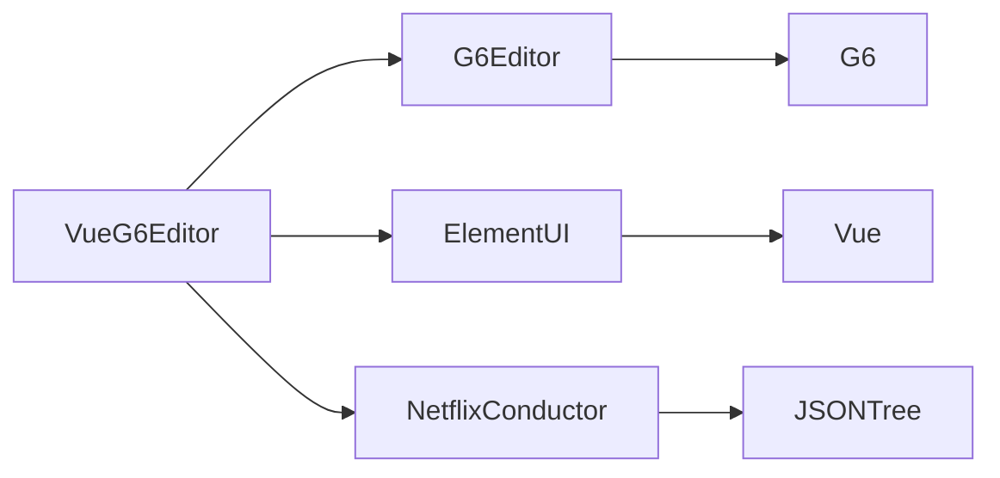

# 节点数据扩展

<cite>
**本文档中引用的文件**  
- [index.vue](file://src/views/index.vue)
- [mixin.js](file://src/views/mixin.js)
- [index.less](file://src/views/index.less)
- [package.json](file://package.json)
- [g6-editor.md](file://doc/v1/g6-editor.md)
</cite>

## 目录
1. [引言](#引言)
2. [项目结构](#项目结构)
3. [核心组件](#核心组件)
4. [架构概述](#架构概述)
5. [详细组件分析](#详细组件分析)
6. [依赖分析](#依赖分析)
7. [性能考虑](#性能考虑)
8. [故障排除指南](#故障排除指南)
9. [结论](#结论)

## 引言
本文档详细说明如何在 `index.vue` 中定义和扩展节点的数据模型，包括添加自定义业务字段（如任务类型、执行人、超时策略等），并通过 G6 Editor 的节点配置实现序列化与反序列化逻辑。结合 `mixin.js` 中的 `updateItemAttribute` 方法，展示如何将扩展字段映射到属性面板进行编辑。提供实际代码示例，演示如何在创建节点时设置默认值、数据类型校验及嵌套结构处理。解释与 Netflix Conductor JSON Tree 的集成方式，确保复杂结构的正确转换。涵盖数据一致性维护、版本兼容性及错误边界处理策略。

## 项目结构
本项目采用 Vue.js 框架构建，结合 AntV G6 Editor 实现可视化流程图编辑功能。主要目录结构包括 `src/views` 存放核心视图组件，`demo` 提供独立功能演示，`doc` 包含开发文档与参考资料。



**Diagram sources**
- [index.vue](file://src/views/index.vue)
- [mixin.js](file://src/views/mixin.js)
- [g6-editor.md](file://doc/v1/g6-editor.md)

**Section sources**
- [index.vue](file://src/views/index.vue)
- [package.json](file://package.json)

## 核心组件
`index.vue` 是主视图文件，集成了 G6Editor 的所有核心组件：工具栏、元素面板、画布、属性栏、缩略图和右键菜单。通过 `mixin.js` 提供通用方法，实现节点与边的属性更新逻辑。`data-*` 属性用于定义节点初始状态，所有自定义属性将自动注入节点数据模型。

**Section sources**
- [index.vue](file://src/views/index.vue#L1-L515)
- [mixin.js](file://src/views/mixin.js#L1-L33)

## 架构概述
系统基于 Vue + G6Editor 构建，采用组件化设计，通过事件监听机制实现数据双向绑定。属性栏通过 `afteritemselected` 事件获取选中项数据，并通过 `v-model` 绑定表单字段，调用 `saveNodeAttribute` 方法持久化变更。



**Diagram sources**
- [index.vue](file://src/views/index.vue#L400-L436)
- [mixin.js](file://src/views/mixin.js#L1-L33)

## 详细组件分析

### 元素面板与节点定义
元素面板通过 `div.getItem` 定义可拖拽节点，`data-*` 属性直接映射为节点数据模型字段。`data-type="node"` 标识为节点类型，`data-size` 定义宽高，`data-label` 设置默认标签，`data-color` 控制颜色。



**Diagram sources**
- [index.vue](file://src/views/index.vue#L49-L96)

**Section sources**
- [index.vue](file://src/views/index.vue#L23-L96)

### 属性栏与数据绑定
属性栏使用 `el-form` 绑定 `nodeAttributeForm`，通过 `v-model` 实现双向数据流。当选择节点时，`afteritemselected` 事件填充表单；修改后触发 `@change` 调用 `saveNodeAttribute` 方法。

```mermaid
flowchart TD
A[选择节点] --> B{是否为节点}
B --> |是| C[填充nodeAttributeForm]
C --> D[用户修改输入]
D --> E[触发@change]
E --> F[调用saveNodeAttribute]
F --> G[执行G6更新命令]
G --> H[更新节点模型]
```

**Diagram sources**
- [index.vue](file://src/views/index.vue#L108-L150)
- [mixin.js](file://src/views/mixin.js#L1-L33)

### 自定义字段扩展机制
通过 `data-*` 扩展机制，可在 HTML 元素上添加任意业务字段（如 `data-taskType`, `data-assignee`），这些字段将自动注入节点模型。在 `nodeAttributeForm` 中增加对应字段并绑定 `v-model`，即可实现可视化编辑。

**Section sources**
- [index.vue](file://src/views/index.vue#L250-L281)

### 序列化与反序列化
G6Editor 提供 `save()` 和 `read(data)` 方法实现数据持久化。结合 `netflix-conductor-json-tree` 的 `construct` 函数，可将图结构转换为符合 Conductor 规范的 JSON Tree 格式，支持复杂嵌套任务结构。



**Diagram sources**
- [index.vue](file://src/views/index.vue#L490-L495)

### 数据一致性与错误处理
通过事件监听 `afterchange` 实现业务规则校验，如限制仅允许一个开始/结束节点。使用 `try-catch` 包裹关键操作，结合 `Element UI` 的 `$message` 组件提供用户反馈。

**Section sources**
- [index.vue](file://src/views/index.vue#L366-L402)

## 依赖分析
项目依赖 `@antv/g6-editor` 作为核心图编辑引擎，`element-ui` 提供 UI 组件，`netflix-conductor-json-tree` 实现流程结构转换。开发依赖包含 Vue CLI 工具链与 ESLint 代码规范。



**Diagram sources**
- [package.json](file://package.json#L1-L31)

**Section sources**
- [package.json](file://package.json#L1-L31)

## 性能考虑
- 使用 `draggable="false"` 防止 SVG 图片误拖拽
- 合理设置 `grid.cell` 提升对齐体验
- 通过 `executeCommand` 批量更新减少渲染次数
- 图片资源本地化避免网络延迟

## 故障排除指南
- **无法拖拽节点**：检查 `class="getItem"` 是否存在
- **属性不更新**：确认 `v-model` 与 `@change` 正确绑定
- **画布不显示**：确保 `#page` 有固定高度
- **data-*未生效**：避免使用保留字段如 `data-type`

**Section sources**
- [index.less](file://src/views/index.less#L1-L147)
- [g6-editor.md](file://doc/v1/g6-editor.md#L1-L809)

## 结论
通过 `index.vue` 和 `mixin.js` 的协同设计，实现了灵活的节点数据扩展机制。利用 G6Editor 的事件系统与命令模式，结合 Vue 的响应式绑定，构建了可维护的可视化编辑器。未来可进一步封装字段配置元数据，实现动态表单生成，提升扩展性。