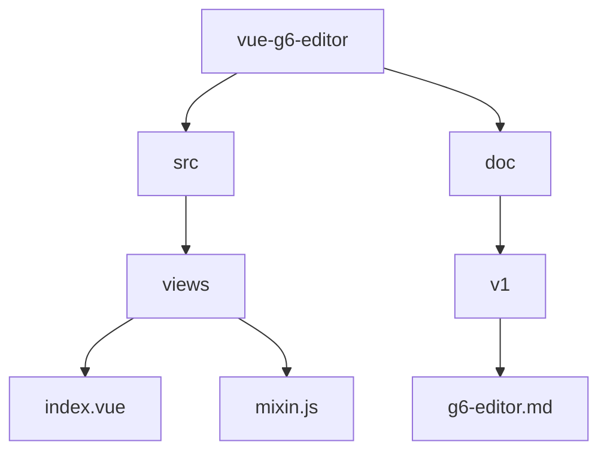
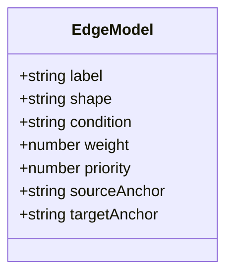
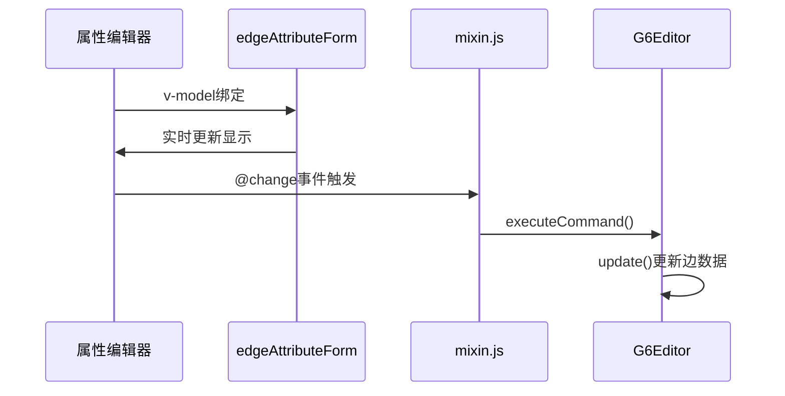
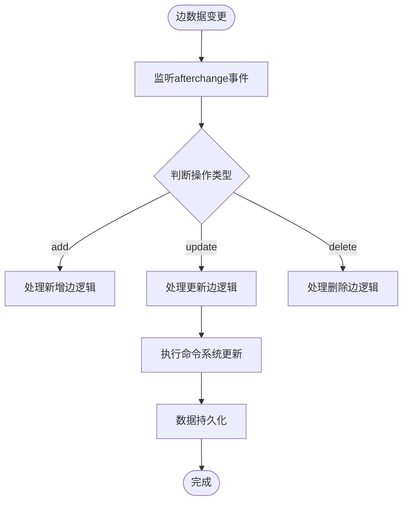
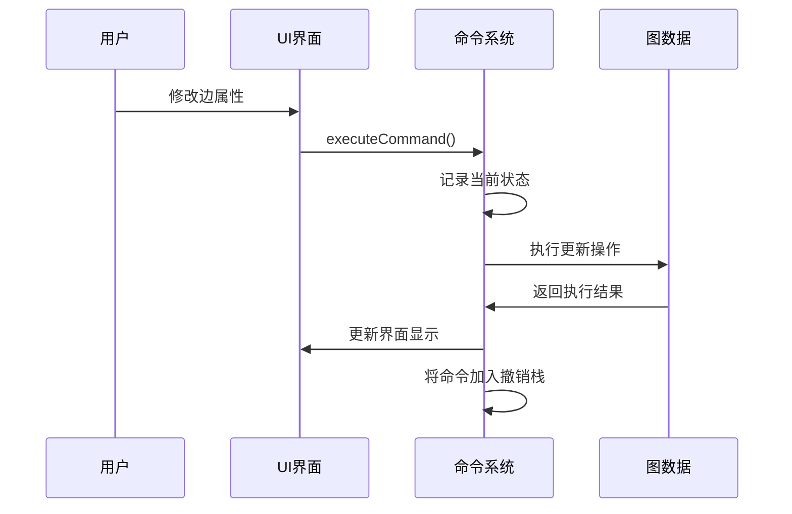
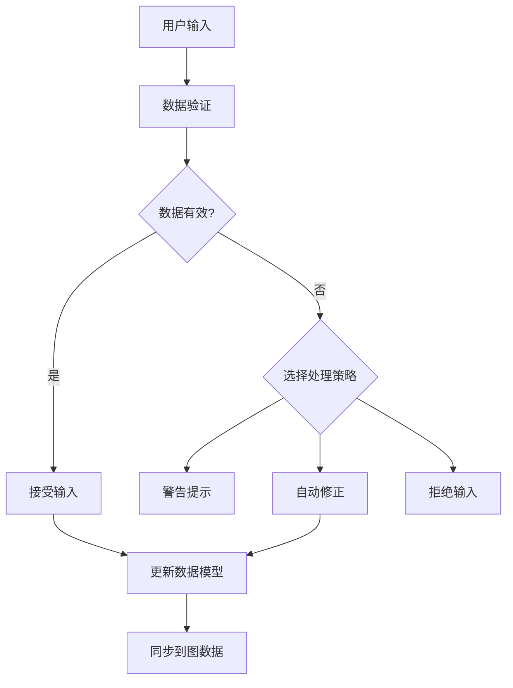
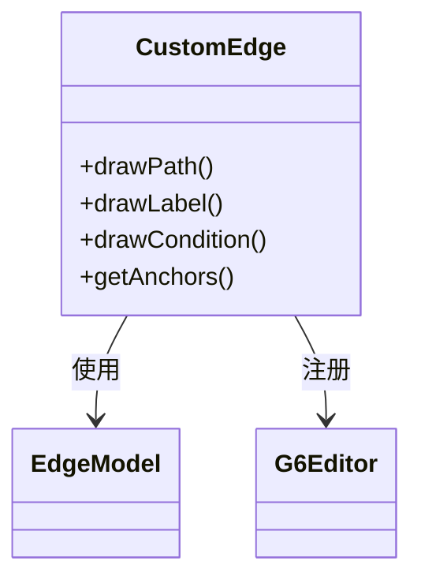
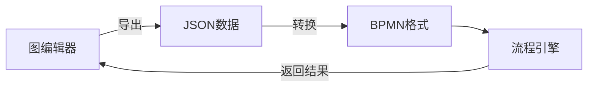

# 边数据扩展

<cite>
**本文档引用文件**  
- [index.vue](file://src/views/index.vue)
- [mixin.js](file://src/views/mixin.js)
</cite>

## 目录
1. [项目结构](#项目结构)
2. [核心组件](#核心组件)
3. [边数据模型扩展](#边数据模型扩展)
4. [属性编辑器实现](#属性编辑器实现)
5. [事件监听与数据持久化](#事件监听与数据持久化)
6. [命令系统与状态同步](#命令系统与状态同步)
7. [数据验证与异常处理](#数据验证与异常处理)
8. [自定义边渲染](#自定义边渲染)
9. [与其他系统集成](#与其他系统集成)

## 项目结构

**Diagram sources**  
- [index.vue](file://src/views/index.vue)
- [mixin.js](file://src/views/mixin.js)

**Section sources**  
- [index.vue](file://src/views/index.vue)
- [mixin.js](file://src/views/mixin.js)

## 核心组件

系统主要由两个核心文件构成：`index.vue` 负责UI界面和事件处理，`mixin.js` 提供属性更新的通用方法。通过Vue的mixin机制实现功能复用，确保节点和边属性编辑的一致性。

**Section sources**  
- [index.vue](file://src/views/index.vue#L233-L281)
- [mixin.js](file://src/views/mixin.js#L0-L31)

## 边数据模型扩展

### 当前边属性结构
当前系统支持的基本边属性包括：
- **label**: 边文本内容
- **shape**: 边的形状类型（flow-polyline, flow-polyline-round, flow-smooth）

### 扩展属性设计
为支持业务需求，建议扩展以下属性：

**Diagram sources**  
- [index.vue](file://src/views/index.vue#L140-L150)

**Section sources**  
- [index.vue](file://src/views/index.vue#L256-L258)

## 属性编辑器实现

### 双向绑定机制
通过mixin.js中的`saveEdgeAttribute`方法实现双向绑定：

**Diagram sources**  
- [mixin.js](file://src/views/mixin.js#L15-L31)
- [index.vue](file://src/views/index.vue#L148-L150)

**Section sources**  
- [mixin.js](file://src/views/mixin.js#L15-L31)

## 事件监听与数据持久化

### afterchange事件机制
在index.vue中通过afterchange事件监听边数据变更：

**Diagram sources**  
- [index.vue](file://src/views/index.vue#L383-L402)

**Section sources**  
- [index.vue](file://src/views/index.vue#L383-L402)

## 命令系统与状态同步

### 安全修改机制
通过G6Editor的命令系统确保边属性修改的安全性和可撤销性：

**Diagram sources**  
- [mixin.js](file://src/views/mixin.js#L15-L31)

**Section sources**  
- [mixin.js](file://src/views/mixin.js#L15-L31)

## 数据验证与异常处理

### 验证规则设计
为确保数据完整性，建议实现以下验证规则：

| 验证项 | 规则说明 | 处理方式 |
|-------|--------|--------|
| 条件表达式 | 必须符合EL表达式语法 | 语法校验，错误时标红提示 |
| 权重值 | 必须为0-100之间的数字 | 范围校验，超出时自动修正 |
| 优先级 | 必须为正整数 | 类型校验，非数字时清空 |
| 边文本 | 长度不超过100字符 | 长度限制，超长时截断 |

### 非法值处理策略

**Section sources**  
- [index.vue](file://src/views/index.vue#L383-L402)

## 自定义边渲染

### 自定义边形状实现
通过G6Editor的registerEdge方法注册自定义边：

**Diagram sources**  
- [index.vue](file://src/views/index.vue#L320-L330)

**Section sources**  
- [index.vue](file://src/views/index.vue#L320-L330)

## 与其他系统集成

### 流程引擎数据对接
实现与外部流程引擎的数据交换：

**Section sources**  
- [index.vue](file://src/views/index.vue#L500-L510)