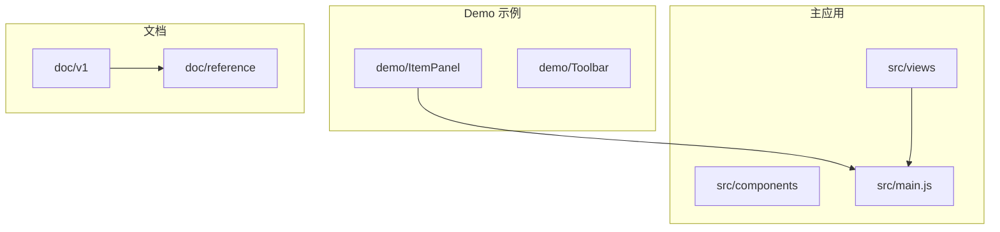
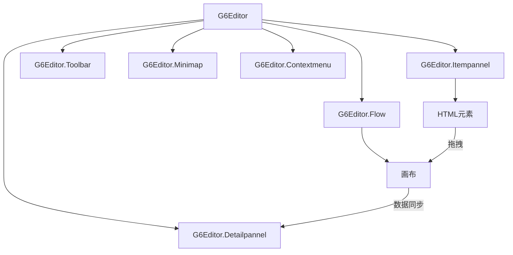
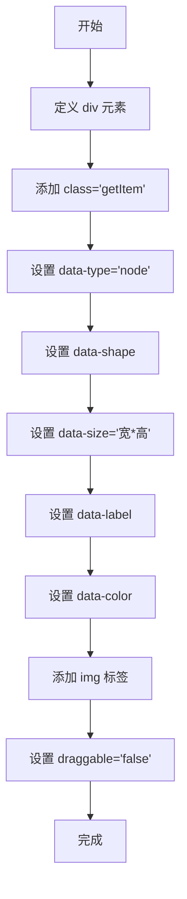
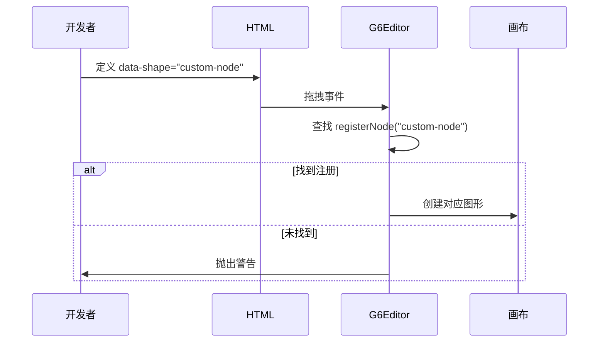
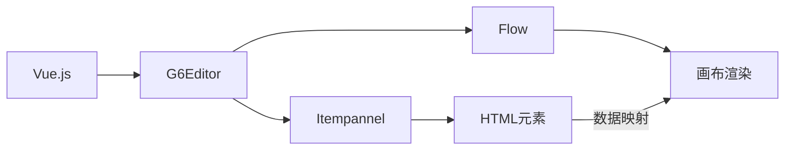

# 元素面板扩展

<cite>
**本文档引用文件**  
- [ItemPanel.vue](file://demo/ItemPanel/src/components/ItemPanel.vue)
- [index.vue](file://src/views/index.vue)
- [g6-editor.md](file://doc/v1/g6-editor.md)
- [mixin.js](file://src/views/mixin.js)
- [g6-editor.js](file://doc/source-code/g6-editor.js)
</cite>

## 目录
1. [引言](#引言)
2. [项目结构](#项目结构)
3. [核心组件](#核心组件)
4. [架构概述](#架构概述)
5. [详细组件分析](#详细组件分析)
6. [依赖分析](#依赖分析)
7. [性能考虑](#性能考虑)
8. [故障排除指南](#故障排除指南)
9. [结论](#结论)

## 引言
本文档系统阐述如何扩展 G6Editor.Itempannel 以支持新增可拖拽节点类型。基于 `demo/ItemPanel` 组件实现，说明如何在 HTML 结构中定义新的 `data-type='node'` 元素，并正确设置 `data-shape`、`data-label`、`data-color` 等元数据字段。讲解元素拖拽至画布时的数据模型映射机制，以及如何确保新节点与 `G6.registerNode` 注册的图形类型匹配。指导开发者动态注入自定义图标、调整布局样式，并处理跨组件通信以同步状态。包含元素无法拖拽、数据模型不匹配、图标加载失败等典型问题的解决方案。

## 项目结构
本项目采用模块化设计，主要分为 `demo` 示例目录和主应用目录。`demo/ItemPanel` 提供了元素面板的基础实现，`src/views/index.vue` 展示了完整的编辑器集成方案。通过 Vue.js 框架结合 AntV G6Editor 实现可视化流程编辑功能。

**图示来源**  
- [项目结构](file://demo/ItemPanel/src/components/ItemPanel.vue)
- [主应用入口](file://src/main.js)

**本节来源**  
- [项目结构](file://demo/ItemPanel/src/components/ItemPanel.vue)
- [主应用入口](file://src/main.js)

## 核心组件
核心组件包括元素面板（ItemPanel）、工具栏（Toolbar）、画布（Page）、属性栏（Detailpannel）、缩略图（Minimap）和右键菜单（Contextmenu）。其中元素面板负责提供可拖拽的节点类型，通过 `data-*` 属性定义节点元数据，是实现自定义节点扩展的关键组件。

**本节来源**  
- [ItemPanel.vue](file://demo/ItemPanel/src/components/ItemPanel.vue)
- [index.vue](file://src/views/index.vue)

## 架构概述
系统采用组件化架构，以 G6Editor 为核心控制器，协调各功能组件工作。元素面板通过 `G6Editor.Itempannel` 实例化并与主编辑器关联，实现拖拽功能。节点数据通过 `data-*` 属性从 DOM 元素映射到 G6 图形模型，确保拖拽创建的节点具有正确的形状、尺寸和样式。

**图示来源**  
- [ItemPanel.vue](file://demo/ItemPanel/src/components/ItemPanel.vue#L15-L30)
- [index.vue](file://src/views/index.vue#L100-L120)

## 详细组件分析

### 元素面板实现分析
元素面板通过定义具有特定 `data-*` 属性的 `div` 元素来声明可拖拽节点。`class="getItem"` 是必需的标识符，用于 G6Editor 识别可拖拽元素。`data-type="node"` 指定元素类型为节点，`data-shape` 对应注册的节点图形，`data-size` 定义初始尺寸，`data-label` 设置默认标签，`data-color` 指定填充颜色。

#### HTML 结构定义

**图示来源**  
- [ItemPanel.vue](file://demo/ItemPanel/src/components/ItemPanel.vue#L2-L10)
- [g6-editor.md](file://doc/v1/g6-editor.md#L200-L250)

### 节点注册与匹配机制
G6Editor 通过 `registerNode` 方法注册自定义节点类型，确保拖拽创建的节点能正确渲染。`data-shape` 值必须与注册的节点名称完全匹配。系统内置了 `flow-rect`、`flow-circle`、`flow-rhombus`、`flow-capsule` 等基础形状，开发者可扩展更多类型。

#### 节点注册流程

**图示来源**  
- [g6-editor.js](file://doc/source-code/g6-editor.js#L22593-L22596)
- [g6-editor.md](file://doc/v1/g6-editor.md#L612-L617)

### 自定义图标注入
支持通过 `img` 标签注入 SVG 图标，建议使用相对路径或 require 语法引入本地资源，避免网络请求失败。`draggable="false"` 属性防止图标自身被拖拽，确保拖拽行为作用于整个节点元素。

**本节来源**  
- [index.vue](file://src/views/index.vue#L30-L50)
- [ItemPanel.vue](file://demo/ItemPanel/src/components/ItemPanel.vue#L5-L10)

## 依赖分析
项目依赖 AntV G6Editor 核心库，通过 Vue.js 进行组件封装。元素面板功能依赖 `@antv/g6-editor` 的 `Itempannel` 组件，节点渲染依赖 G6 的图形系统。`data-*` 属性与 G6 数据模型的映射由 G6Editor 内部机制自动处理。

**图示来源**  
- [package.json](file://package.json)
- [main.js](file://src/main.js)

**本节来源**  
- [package.json](file://package.json)
- [main.js](file://src/main.js)

## 性能考虑
使用 SVG 图标可保证缩放清晰度，减少资源体积。合理设置 `data-size` 避免过度渲染。建议对复杂自定义节点进行性能测试，确保在大量节点场景下的流畅性。避免在元素面板中放置过多大型图标，影响初始加载速度。

## 故障排除指南
常见问题包括元素无法拖拽、节点形状不匹配、图标加载失败等。解决方案：确保 `class="getItem"` 存在；验证 `data-shape` 与 `registerNode` 名称一致；检查图标路径正确性；确认 `draggable="false"` 已设置；查看浏览器控制台错误信息。

**本节来源**  
- [g6-editor.md](file://doc/v1/g6-editor.md#L230-L245)
- [index.vue](file://src/views/index.vue#L200-L220)

## 结论
通过正确配置 `data-*` 属性和实现 `registerNode`，可有效扩展 G6Editor 元素面板功能。关键在于理解 `data-shape` 与注册节点的匹配机制，以及 `getItem` 类名的必要性。结合 Vue.js 的响应式系统，可实现动态更新的元素面板，满足复杂业务场景需求。