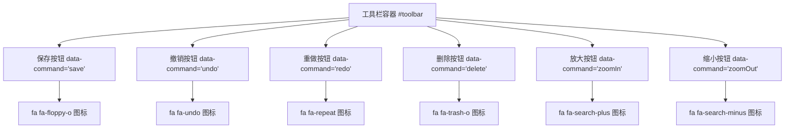
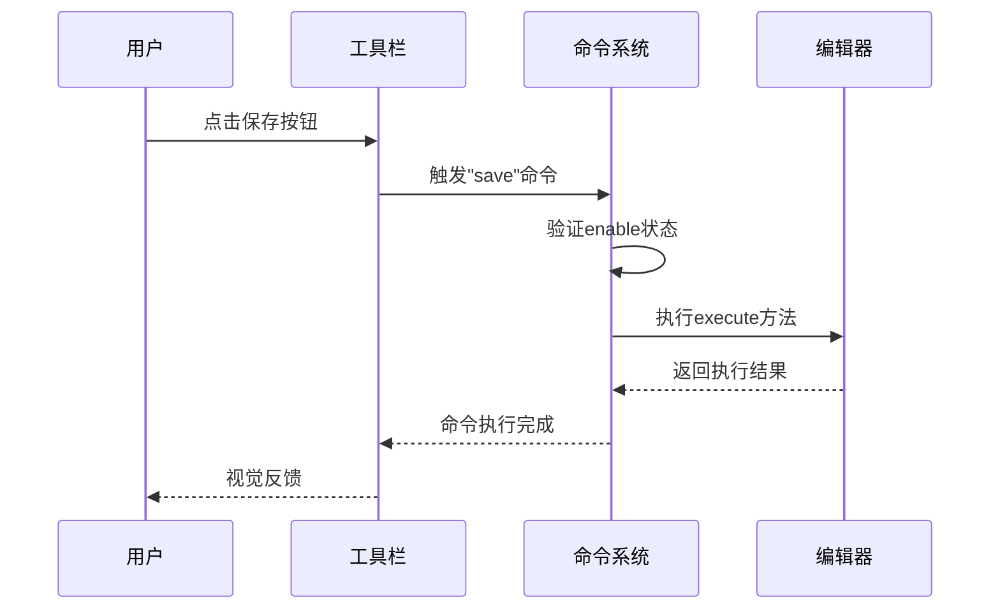
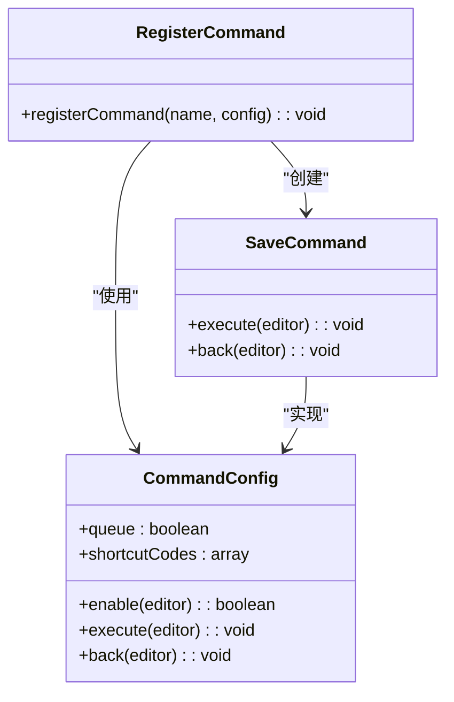
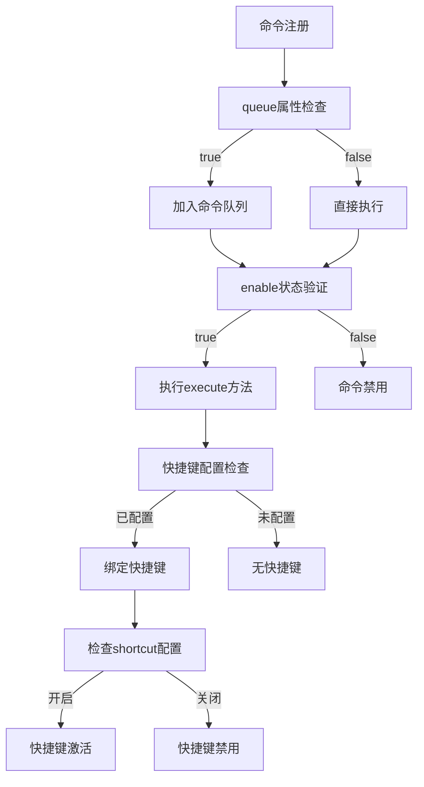
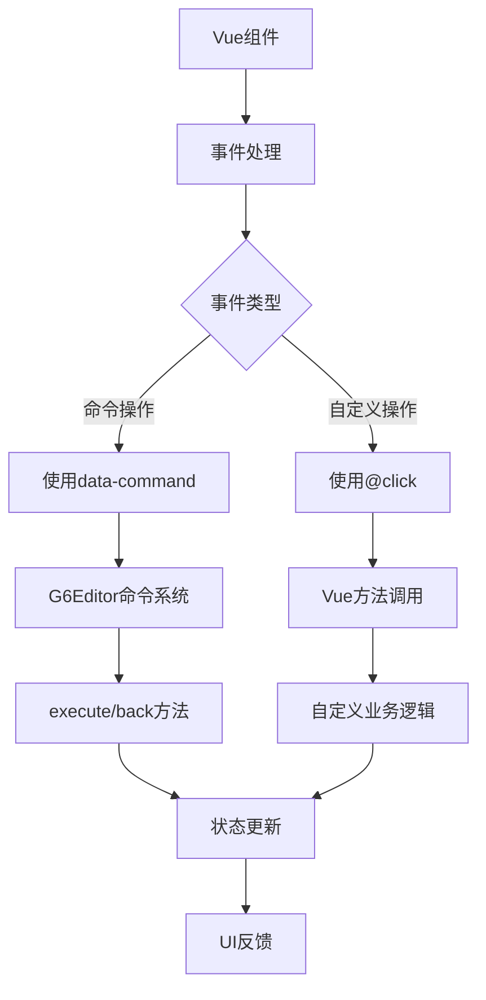
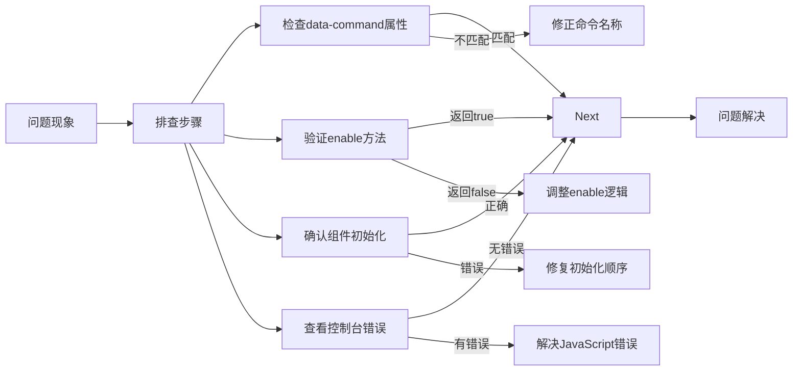

# 工具栏扩展

<cite>
**本文档引用文件**   
- [Toolbar.vue](file://demo/Toolbar/src/components/Toolbar.vue)
- [index.vue](file://src/views/index.vue)
- [g6-editor.md](file://doc/v1/g6-editor.md)
</cite>

## 目录
1. [工具栏基础结构](#工具栏基础结构)
2. [data-command属性绑定机制](#data-command属性绑定机制)
3. [自定义命令注册](#自定义命令注册)
4. [高级配置](#高级配置)
5. [事件集成](#事件集成)
6. [常见问题排查](#常见问题排查)

## 工具栏基础结构

工具栏组件通过HTML标签定义操作按钮，每个按钮必须遵循特定规范。工具栏容器使用`id="toolbar"`标识，内部按钮使用`<i>`或`<button>`标签实现。按钮必须包含`command` CSS类和`data-command`属性。

工具栏按钮采用Font Awesome图标库，通过`fa`系列CSS类实现可视化效果。每个按钮通过`title`属性提供悬停提示信息。按钮布局采用水平排列方式，通过CSS设置间距和视觉反馈。

**Diagram sources**
- [Toolbar.vue](file://demo/Toolbar/src/components/Toolbar.vue#L1-L21)
- [index.vue](file://src/views/index.vue#L20-L40)

**Section sources**
- [Toolbar.vue](file://demo/Toolbar/src/components/Toolbar.vue#L1-L21)
- [index.vue](file://src/views/index.vue#L20-L40)

## data-command属性绑定机制

`data-command`属性是工具栏按钮与G6Editor命令系统的核心连接点。该属性值对应注册的命令名称，当按钮被点击时，系统自动触发相应命令的执行逻辑。命令绑定机制基于事件代理实现，G6Editor.Toolbar组件监听容器内的点击事件，解析`data-command`属性并调用对应命令。

命令系统采用发布-订阅模式，工具栏按钮作为命令触发器，不直接包含业务逻辑。这种设计实现了UI与功能的解耦，允许同一命令在不同UI组件（如工具栏、右键菜单）中复用。命令的启用状态由`enable`方法动态控制，系统根据当前编辑状态自动更新按钮的可交互性。

**Diagram sources**
- [index.vue](file://src/views/index.vue#L274-L288)
- [g6-editor.md](file://doc/v1/g6-editor.md#L48-L61)

**Section sources**
- [index.vue](file://src/views/index.vue#L274-L288)
- [g6-editor.md](file://doc/v1/g6-editor.md#L48-L61)

## 自定义命令注册

通过`G6Editor.Command.registerCommand`方法注册自定义命令。注册时需提供命令名称和配置对象，配置对象包含`queue`、`enable`、`execute`、`back`和`shortcutCodes`等关键属性。`execute`方法定义命令的正向操作，`back`方法定义反向操作（用于撤销）。

命令注册应在编辑器初始化阶段完成，通常在`mounted`生命周期钩子中执行。注册的命令自动与具有匹配`data-command`属性的UI元素关联。命令系统支持异步操作，`execute`方法可返回Promise以处理异步任务。

**Diagram sources**
- [index.vue](file://src/views/index.vue#L274-L288)
- [g6-editor.md](file://doc/v1/g6-editor.md#L852-L919)

**Section sources**
- [index.vue](file://src/views/index.vue#L274-L288)
- [g6-editor.md](file://doc/v1/g6-editor.md#L852-L919)

## 高级配置

### 快捷键绑定
通过`shortcutCodes`属性配置快捷键组合，支持多组快捷键绑定。快捷键配置采用数组形式，每个元素为键码数组。例如`["ctrlKey", "s"]`表示Ctrl+S组合键。快捷键功能需要在Flow配置中通过`shortcut`选项显式启用。

### 启用/禁用状态控制
`enable`方法决定命令的可用状态，接收编辑器实例作为参数。方法返回布尔值，`true`表示命令可用，`false`表示禁用。系统根据返回值自动更新相关UI元素的视觉状态（如灰显或高亮）。

### 命令队列管理
`queue`属性控制命令是否进入执行队列。设为`false`时，命令不参与撤销/重做操作。这对于保存、导出等不可逆操作特别有用。设为`true`时，命令执行后会记录在历史队列中，支持通过undo/redo命令回溯。

**Diagram sources**
- [index.vue](file://src/views/index.vue#L274-L288)
- [g6-editor.md](file://doc/v1/g6-editor.md#L852-L919)

**Section sources**
- [index.vue](file://src/views/index.vue#L274-L288)
- [g6-editor.md](file://doc/v1/g6-editor.md#L852-L919)

## 事件集成

### Vue事件代理
对于非命令系统的自定义操作，可使用Vue的`@click`事件绑定。这种方式适用于不需要与G6Editor命令系统集成的功能，如数据导入导出、历史记录管理等。事件处理方法定义在组件的`methods`选项中。

### 原生DOM事件集成
G6Editor组件基于原生DOM事件系统，可通过JavaScript直接操作。推荐使用Vue的ref机制获取组件引用，然后绑定原生事件监听器。事件集成应遵循单一职责原则，避免在事件处理中包含复杂业务逻辑。

### 最佳实践
1. 命令系统优先：对于编辑操作，优先使用命令系统而非直接事件绑定
2. 状态同步：确保UI状态与命令enable状态保持同步
3. 错误处理：在命令执行中包含完整的错误处理机制
4. 性能优化：避免在频繁触发的事件中执行重计算操作

**Diagram sources**
- [index.vue](file://src/views/index.vue#L20-L40)
- [g6-editor.md](file://doc/v1/g6-editor.md#L48-L61)

**Section sources**
- [index.vue](file://src/views/index.vue#L20-L40)
- [g6-editor.md](file://doc/v1/g6-editor.md#L48-L61)

## 常见问题排查

### 按钮点击无响应
1. 检查`data-command`属性值是否与注册的命令名称完全匹配
2. 验证命令的`enable`方法是否返回`true`
3. 确认Toolbar组件已正确初始化并关联到编辑器
4. 检查浏览器控制台是否有JavaScript错误

### 命令未注册
1. 确保`registerCommand`调用在编辑器实例化之后
2. 验证命令名称的唯一性，避免命名冲突
3. 检查语法错误，确保配置对象格式正确
4. 确认G6Editor库已正确导入

### 快捷键冲突
1. 检查`shortcutCodes`配置是否与其他系统快捷键冲突
2. 验证Flow配置中的`shortcut`选项是否已启用对应命令
3. 使用浏览器开发者工具的事件监听器面板调试
4. 考虑使用更复杂的组合键避免冲突

**Diagram sources**
- [index.vue](file://src/views/index.vue#L274-L288)
- [g6-editor.md](file://doc/v1/g6-editor.md#L852-L919)

**Section sources**
- [index.vue](file://src/views/index.vue#L274-L288)
- [g6-editor.md](file://doc/v1/g6-editor.md#L852-L919)