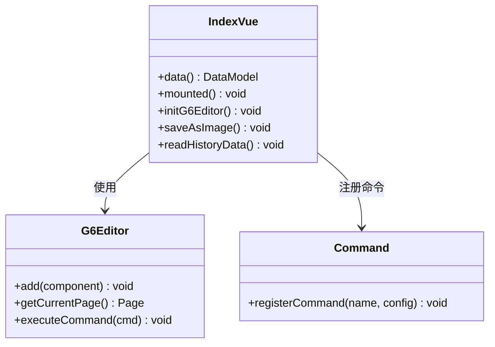

# 自定义组件扩展

<cite>
**本文档引用文件**  
- [index.vue](file://src/views/index.vue)
- [mixin.js](file://src/views/mixin.js)
- [g6-editor.md](file://doc/v1/g6-editor.md)
- [start-node.svg](file://src/assets/start-node.svg)
- [end-node.svg](file://src/assets/end-node.svg)
- [regular-node.svg](file://src/assets/regular-node.svg)
- [condition-node.svg](file://src/assets/condition-node.svg)
</cite>

## 目录
1. [自定义节点与边的注册机制](#自定义节点与边的注册机制)  
2. [ItemPanel与Toolbar组件扩展](#itempanel与toolbar组件扩展)  
3. [index.vue中组件集成实现](#indexvue中组件集成实现)  
4. [生命周期与G6 Editor实例协同](#生命周期与g6-editor实例协同)  
5. [可复用Vue组件封装](#可复用vue组件封装)  
6. [常见问题排查方案](#常见问题排查方案)

## 自定义节点与边的注册机制

通过 `G6.registerNode` 和 `G6.registerEdge` 方法可实现图形外观与交互行为的深度定制。`registerNode` 用于注册自定义节点类型，支持定义绘制逻辑、样式属性及交互响应；`registerEdge` 则用于注册自定义边类型，可自定义连线形状、箭头样式及路径算法。注册时需提供唯一类型名称、绘制函数及配置选项，绘制函数返回图形组对象，支持添加文本、矩形、路径等基础图形元素。

**Section sources**  
- [g6-editor.md](file://doc/v1/g6-editor.md#L612-L617)  
- [g6-editor.md](file://doc/v1/g6-editor.md#L618-L625)

## ItemPanel与Toolbar组件扩展

`ItemPanel` 组件通过HTML结构定义可拖拽元素，每个元素需包含 `data-type="node"` 属性及 `data-shape`、`data-size`、`data-label` 等元数据。通过 `draggable="false"` 禁止内部图片拖拽，确保拖拽行为由容器控制。`Toolbar` 组件通过 `data-command` 属性绑定内置命令，如 `save`、`undo`、`redo` 等，结合 `class="command"` 实现按钮功能映射。可通过Vue插槽机制动态注入自定义按钮，实现功能扩展。

```mermaid
flowchart TD
A["ItemPanel 元素"] --> B{包含 data-type="node"}
B --> C[定义 data-shape/data-size/data-label]
C --> D[设置 draggable="false"]
D --> E[拖拽至画布生成节点]
F["Toolbar 按钮"] --> G{data-command 绑定命令}
G --> H[执行对应操作]
H --> I[支持插槽注入自定义按钮]
```

**Diagram sources**  
- [index.vue](file://src/views/index.vue#L233-L281)  
- [g6-editor.md](file://doc/v1/g6-editor.md#L286-L319)

**Section sources**  
- [index.vue](file://src/views/index.vue#L233-L281)  
- [g6-editor.md](file://doc/v1/g6-editor.md#L286-L319)

## index.vue中组件集成实现

在 `index.vue` 中通过 `mounted` 钩子初始化G6 Editor实例，调用 `initG6Editor` 方法完成组件挂载。通过 `G6Editor.Command.registerCommand` 注册自定义命令（如 `save`），定义执行逻辑与快捷键。使用 `new G6Editor.Flow` 创建画布，配置对齐线、网格、快捷键等参数。通过 `flow.getGraph().edge` 设置默认边样式，使用 `new G6Editor.Itempannel`、`Toolbar`、`Detailpannel` 等构造UI组件并挂载至Editor实例。状态管理通过 `data` 定义表单模型，事件绑定通过 `@change` 触发属性更新。



**Diagram sources**  
- [index.vue](file://src/views/index.vue#L274-L324)  
- [index.vue](file://src/views/index.vue#L320-L370)

**Section sources**  
- [index.vue](file://src/views/index.vue#L233-L402)

## 生命周期与G6 Editor实例协同

组件生命周期与G6 Editor实例通过 `mounted` 钩子协同：在挂载后初始化Editor，创建Flow画布及各类UI组件并注册到Editor。通过 `currentPage.on("afteritemselected")` 监听节点选择事件，同步更新属性表单数据；通过 `afterchange` 监听画布变更，实现业务逻辑校验（如限制唯一开始/结束节点）。命令执行通过 `executeCommand` 包装操作，确保支持撤销/重做。销毁阶段由Editor统一管理，无需手动清理。

**Section sources**  
- [index.vue](file://src/views/index.vue#L366-L402)  
- [mixin.js](file://src/views/mixin.js#L0-L32)

## 可复用Vue组件封装

为提升模块化程度，可将 `ItemPanel`、`Toolbar` 等封装为独立Vue组件。通过 `props` 接收配置项，`emits` 定义事件接口，结合插槽支持内容定制。组件内部封装G6 Editor API调用，对外暴露简洁接口。例如 `CustomToolbar` 组件可接收按钮列表，动态渲染命令按钮；`CustomItemPanel` 可接收节点类型配置，生成可拖拽元素。通过 `provide/inject` 或Vuex共享Editor实例，避免层层传递。

## 常见问题排查方案

- **注册失败**：检查类型名称唯一性，确保注册时机在Editor初始化前；验证绘制函数返回有效图形对象。  
- **样式未生效**：确认 `data-shape` 与注册名称一致；检查CSS选择器优先级；验证SVG资源路径正确性。  
- **事件冒泡冲突**：在事件处理器中调用 `stopPropagation()` 阻止冒泡；使用 `capture` 阶段监听；避免在图形组内注册重复事件。  
- **拖拽失效**：确保元素包含 `class="getItem"`；检查 `container` ID与组件配置一致；验证DOM已渲染完成再初始化。

**Section sources**  
- [index.vue](file://src/views/index.vue#L366-L402)  
- [g6-editor.md](file://doc/v1/g6-editor.md#L233-L281)