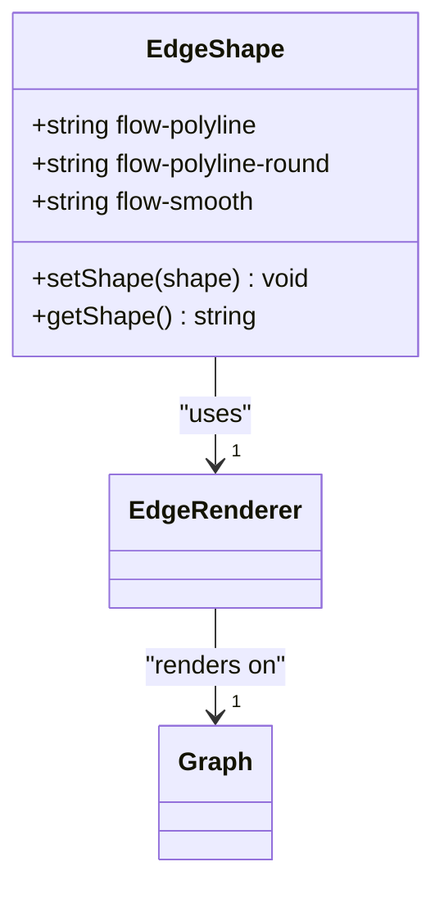
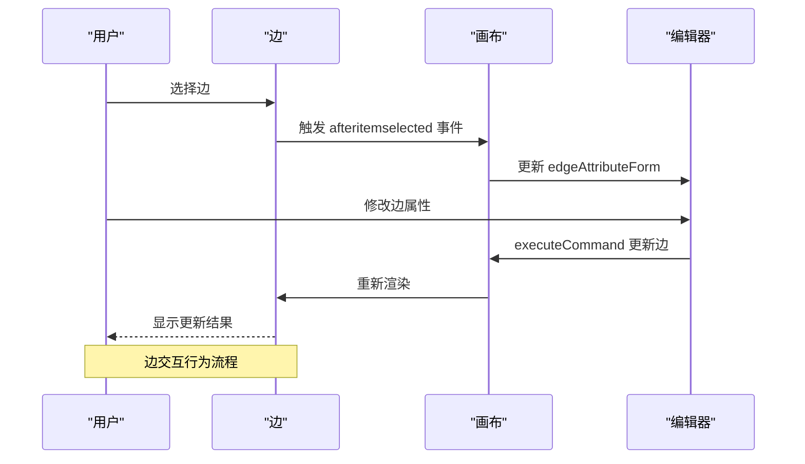
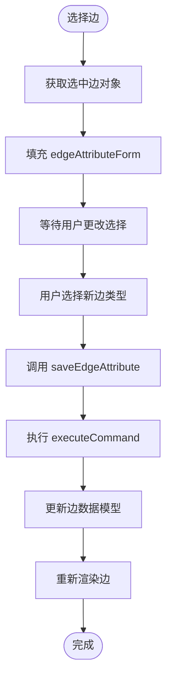

# 自定义边

<cite>
**本文档引用文件**  
- [index.vue](file://src/views/index.vue)
- [mixin.js](file://src/views/mixin.js)
- [g6-editor.md](file://doc/v1/g6-editor.md)
</cite>

## 目录
1. [简介](#简介)
2. [自定义边类型注册](#自定义边类型注册)
3. [边形状属性详解](#边形状属性详解)
4. [边交互行为扩展](#边交互行为扩展)
5. [默认边类型配置](#默认边类型配置)
6. [运行时动态切换](#运行时动态切换)
7. [常见问题调试指南](#常见问题调试指南)

## 简介
本文档深入解析如何在 G6Editor 中通过 `G6.registerEdge` 注册自定义边类型，实现折线、圆角折线、曲线等多种连接线样式。基于 `src/views/index.vue` 中 `flow-polyline` 和 `flow-smooth` 的配置，说明边的 `shape` 属性如何影响渲染结果。同时指导开发者扩展边的交互行为，如支持标签编辑、路径动画、动态颜色变化等。提供在 `G6Editor.Flow` 实例中设置默认边类型的完整配置方法，并结合 `edgeAttributeForm` 实现运行时动态切换。最后包含边类型注册失败、连接点错位、样式丢失等问题的调试指南。

**Section sources**
- [index.vue](file://src/views/index.vue#L0-L515)

## 自定义边类型注册
在 G6Editor 中，可以通过 `G6.registerEdge` 方法注册自定义边类型。该方法允许开发者定义边的绘制路径、样式和交互行为。注册的边类型可以在创建图实例时通过 `shape` 属性进行调用。

在 `G6Editor.Flow` 的上下文中，`registerEdge` 用于扩展流程图支持的边类型。注册时需要提供边的名称、绘图逻辑和默认样式配置。这些自定义边可以继承基础边的特性，同时添加特定的视觉效果和交互功能。

**Section sources**
- [g6-editor.md](file://doc/v1/g6-editor.md#L618-L625)

## 边形状属性详解
边的 `shape` 属性决定了连接线的视觉表现形式。在当前项目中，通过 `edgeAttributeForm` 的下拉菜单提供了三种预设边类型：

- **流程图折线** (`flow-polyline`): 使用直角转折的折线连接节点
- **流程图圆角折线** (`flow-polyline-round`): 在转折处添加圆角的折线
- **流程图曲线** (`flow-smooth`): 使用贝塞尔曲线平滑连接节点

这些边类型在 `src/views/index.vue` 中通过 `flow.getGraph().edge()` 方法设置默认值，并在用户选择时通过 `saveEdgeAttribute` 方法动态更新。`shape` 属性直接影响边的几何路径计算和视觉渲染效果。



**Diagram sources**
- [index.vue](file://src/views/index.vue#L344)
- [index.vue](file://src/views/index.vue#L149-L151)

**Section sources**
- [index.vue](file://src/views/index.vue#L149-L151)

## 边交互行为扩展
开发者可以通过扩展边的定义来实现丰富的交互行为。在 `mixin.js` 中，`saveEdgeAttribute` 方法展示了如何通过 `page.update()` 更新边的属性，这为实现动态交互提供了基础。

可扩展的交互行为包括：
- **标签编辑**: 允许用户双击边上的文本进行编辑
- **路径动画**: 在边创建或更新时添加过渡动画效果
- **动态颜色变化**: 根据边的状态（如激活、选中）动态改变颜色
- **交互反馈**: 鼠标悬停时显示控制点或调整路径

这些扩展行为可以通过监听 `afteritemselected` 等事件来实现，并结合 `executeCommand` 方法确保操作可撤销。



**Diagram sources**
- [mixin.js](file://src/views/mixin.js#L15-L32)
- [index.vue](file://src/views/index.vue#L400-L415)

**Section sources**
- [mixin.js](file://src/views/mixin.js#L15-L32)

## 默认边类型配置
在 `G6Editor.Flow` 实例初始化时，可以通过 `flow.getGraph().edge()` 方法设置默认边类型。在 `src/views/index.vue` 的 `initG6Editor` 方法中，设置了默认边形状为 `flow-polyline`：

```javascript
flow.getGraph().edge({
  shape: "flow-polyline"
});
```

此配置确保新创建的边使用指定的形状，为用户提供一致的视觉体验。默认配置应在流程图实例化后立即设置，以确保所有后续创建的边都遵循此规则。

**Section sources**
- [index.vue](file://src/views/index.vue#L344-L346)

## 运行时动态切换
通过 `edgeAttributeForm` 表单和 `saveEdgeAttribute` 方法，实现了边类型的运行时动态切换。当用户在属性栏中选择不同的边类型时，系统会自动更新选中边的 `shape` 属性。

实现机制如下：
1. 监听 `afteritemselected` 事件获取选中的边
2. 将边的当前 `shape` 值填充到 `edgeAttributeForm`
3. 用户更改选择时触发 `saveEdgeAttribute` 方法
4. 通过 `page.update()` 更新边的 `shape` 属性
5. 图形引擎重新渲染边

这种机制允许用户在不重新加载页面的情况下实时预览不同边类型的视觉效果。



**Diagram sources**
- [index.vue](file://src/views/index.vue#L400-L415)
- [mixin.js](file://src/views/mixin.js#L25-L32)

**Section sources**
- [index.vue](file://src/views/index.vue#L400-L415)
- [mixin.js](file://src/views/mixin.js#L25-L32)

## 常见问题调试指南
### 边类型注册失败
**现象**: 自定义边类型无法显示或报错
**解决方案**:
1. 确认 `G6.registerEdge` 调用时机正确
2. 检查边名称是否与其他组件冲突
3. 验证绘图函数返回有效的路径数据

### 连接点错位
**现象**: 边的起点或终点未正确连接到节点
**解决方案**:
1. 检查节点的 `anchorPoints` 配置
2. 确认边的 `sourceAnchor` 和 `targetAnchor` 设置正确
3. 验证节点尺寸变化时是否重新计算连接点

### 样式丢失
**现象**: 边的样式未按预期显示
**解决方案**:
1. 检查 `shape` 属性值是否拼写正确
2. 确认样式配置是否在注册时正确传递
3. 验证 CSS 类名或内联样式优先级

**Section sources**
- [g6-editor.md](file://doc/v1/g6-editor.md#L1020-L1024)
- [index.vue](file://src/views/index.vue#L344)
- [index.vue](file://src/views/index.vue#L411)