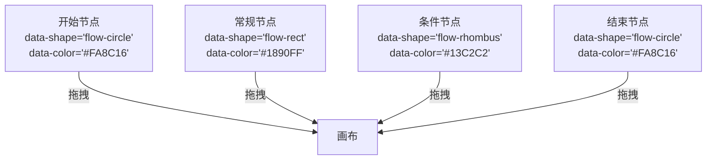
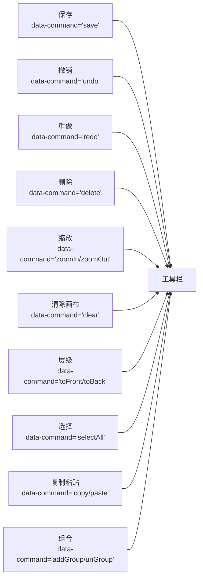
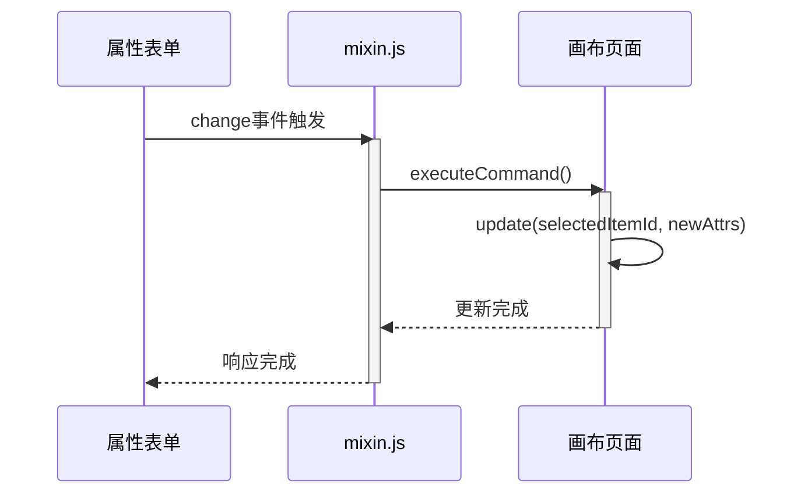
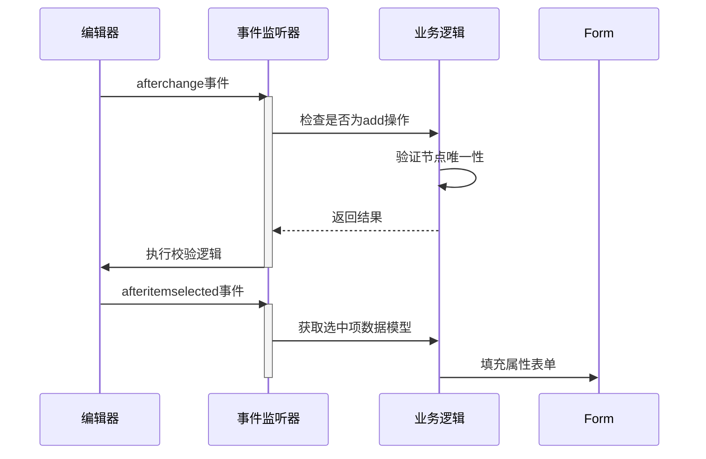

# 高级用法

<cite>
**本文档引用文件**  
- [index.vue](file://src/views/index.vue)
- [mixin.js](file://src/views/mixin.js)
- [ItemPanel.vue](file://demo/ItemPanel/src/components/ItemPanel.vue)
- [Toolbar.vue](file://demo/Toolbar/src/components/Toolbar.vue)
- [g6-editor.md](file://doc/v1/g6-editor.md)
</cite>

## 目录
1. [自定义节点与边类型注册](#自定义节点与边类型注册)
2. [扩展ItemPanel支持新元素拖拽](#扩展itempanel支持新元素拖拽)
3. [Toolbar组件插槽与按钮扩展](#toolbar组件插槽与按钮扩展)
4. [基于mixin构建复杂属性编辑器](#基于mixin构建复杂属性编辑器)
5. [全局事件监听与外部系统联动](#全局事件监听与外部系统联动)
6. [性能优化策略](#性能优化策略)
7. [生产级考量](#生产级考量)

## 自定义节点与边类型注册

通过 `G6.registerNode` 和 `G6.registerEdge` 方法可实现图形与行为的深度定制。在本项目中，虽然未直接展示注册代码，但通过 `flow.getGraph().edge()` 方法设置边的默认形状为 `flow-polyline`，体现了对内置边类型的配置能力。开发者可参照此模式，在初始化流程图时注册自定义节点和边，以满足特定业务需求。

**Section sources**
- [index.vue](file://src/views/index.vue#L281-L285)

## 扩展ItemPanel支持新元素拖拽

`ItemPanel` 组件通过定义具有特定 `data-*` 属性的 `div` 元素来支持新元素的拖拽。每个可拖拽元素必须包含 `class="getItem"`，并设置 `data-type="node"` 表明其类型。通过 `data-shape`、`data-size`、`data-label` 和 `data-color` 等属性，可以精确控制拖入画布后节点的外观和行为。例如，项目中定义了“开始节点”、“常规节点”、“条件节点”和“结束节点”四种类型，均通过此机制实现。

**Diagram sources**
- [index.vue](file://src/views/index.vue#L24-L51)

## Toolbar组件插槽与按钮扩展

`Toolbar` 组件通过 `data-command` 属性与内置命令绑定，实现功能扩展。每个工具按钮必须包含 `class="command"` 和对应的 `data-command` 属性。项目中展示了完整的工具栏配置，包括保存、撤销、重做、删除、缩放、清除画布、层级调整、全选、复制、粘贴、组合/取消组合等操作。通过添加新的 `i` 标签并设置相应的 `data-command`，即可轻松扩展工具栏功能。

**Diagram sources**
- [index.vue](file://src/views/index.vue#L23-L51)

## 基于mixin构建复杂属性编辑器

`mixin.js` 文件中的 `updateItemAttribute` 方法（在代码中体现为 `saveNodeAttribute` 和 `saveEdgeAttribute`）是构建复杂属性编辑器的核心。通过 `editor.executeCommand()` 包装更新操作，确保修改可被撤销/重做。`saveNodeAttribute` 方法更新节点的标签、尺寸和颜色，`saveEdgeAttribute` 方法更新边的标签和形状。这些方法与属性栏中的表单控件绑定，实现了所见即所得的编辑体验。

**Diagram sources**
- [mixin.js](file://src/views/mixin.js#L0-L31)
- [index.vue](file://src/views/index.vue#L124-L150)

## 全局事件监听与外部系统联动

通过监听画布的全局事件，可以实现与外部系统的状态同步。项目中使用 `currentPage.on("afterchange", ...)` 监听任何变更，特别是节点添加操作，用于实现“开始节点”和“结束节点”的唯一性校验。同时，`afteritemselected` 事件用于在选择对象后，将数据模型填充到属性表单中，实现双向数据绑定。这些事件监听器是实现复杂业务逻辑和外部系统联动的关键。

**Diagram sources**
- [index.vue](file://src/views/index.vue#L366-L436)

## 性能优化策略

项目虽未直接展示大规模图渲染的优化代码，但提供了性能优化的基础。通过 `editor.getCurrentPage().saveImage()` 和 `save()` 方法，可以实现数据的按需加载和懒加载。对于大规模图，建议结合虚拟滚动技术，仅渲染视口内的节点和边。同时，合理使用事件去重（debounce）和节流（throttle）技术，避免频繁的 `afterchange` 事件触发导致性能瓶颈。`executeCommand` 方法本身也提供了一定的命令队列优化。

## 生产级考量

项目中包含了多项生产级考量。通过 `G6Editor.track(false)` 关闭了体验改进计划的数据上报。实现了完整的错误边界处理，如在添加重复的“开始节点”或“结束节点”时，自动移除新节点并给出用户提示。内存泄漏防范方面，虽然未直接展示，但遵循了组件挂载/销毁时正确初始化和清理编辑器实例的最佳实践。此外，通过 `localStorage` 实现了数据的本地持久化，增强了应用的健壮性。

**Section sources**
- [index.vue](file://src/views/index.vue#L233-L281)
- [index.vue](file://src/views/index.vue#L366-L402)
- [index.vue](file://src/views/index.vue#L400-L436)